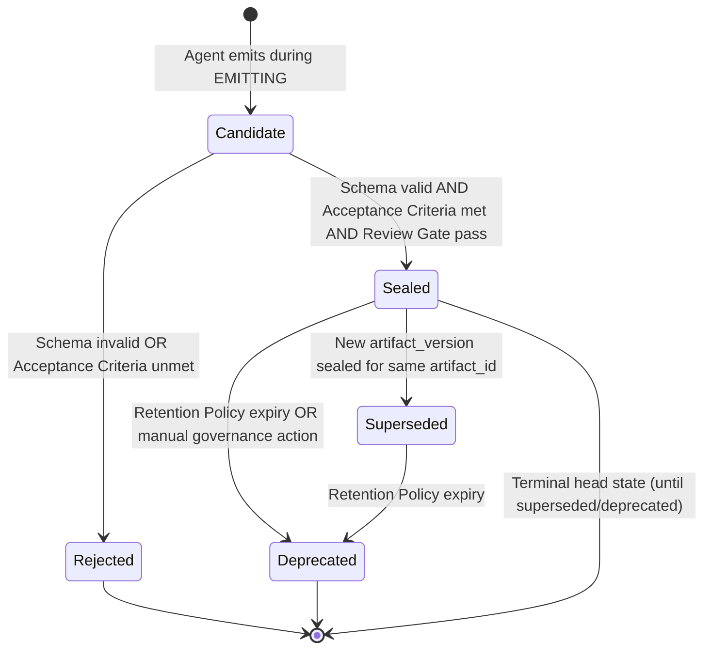
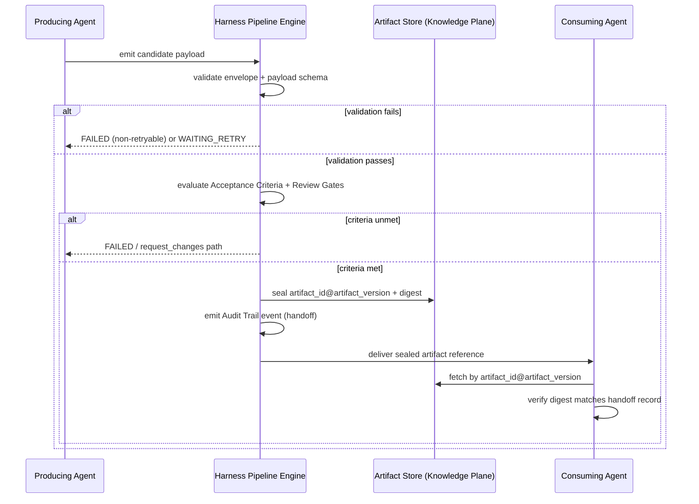

# Artifact Specifications

**Version:** 2.0.0
**Status:** Canonical — Binding
**Effective:** 2026-07-22
**Owner:** Chief Systems Architect
**Related:** [`/CONSTITUTION.md`](../CONSTITUTION.md) · [`/docs/ARCHITECTURE.md`](../docs/ARCHITECTURE.md) · [`/harness/HARNESS_SPECIFICATION.md`](../harness/HARNESS_SPECIFICATION.md) · [`/contracts`](../contracts) · [`/pipelines`](../pipelines) · [`/schemas`](../schemas)

---

## 1. Purpose

This document is the production handbook for **DYOGAS Artifacts** — the immutable deliverables that flow through the Knowledge Ingestion pipeline and every future Harness pipeline. It defines:

- What an artifact is and is not.
- The shared envelope every artifact shares.
- Directory layout, naming, versioning, lifecycle, and retention rules that apply uniformly across artifact types.
- The per-artifact specifications indexed below, each of which extends this document with type-specific meaning, decision rules, and examples.

Every pipeline stage in DYOGAS produces exactly one primary artifact type and consumes one or more upstream artifact types. Specs in this directory define **meaning**; `/schemas` defines **shape**; `/harness/HARNESS_SPECIFICATION.md` defines **how artifacts move**. This document does not redefine execution semantics — it exists so a human or agent can open one file and understand the full artifact contract without reverse-engineering the schema.

---

## 2. Definitions

| Term | Definition |
|------|------------|
| **Artifact** | A structured, schema-validated, versioned unit of pipeline output. The unit of exchange between Harness stages. |
| **Envelope** | The shared wrapper (`artifact_id`, `artifact_version`, `artifact_type`, `run_id`, `produced_by`, `created_at`, `digest`, `tenancy`, `schema_version`, `parents`, `payload`) defined in [`/schemas/common/artifact-envelope.schema.json`](../schemas/common/artifact-envelope.schema.json). |
| **Payload** | The artifact-type-specific body carried in `envelope.payload`, validated against the artifact's own schema in `/schemas/artifacts`. |
| **Candidate** | A not-yet-sealed artifact produced by an agent during `EMITTING`; mutable until the Harness accepts it. |
| **Sealed artifact / Immutable deliverable** | An accepted artifact instance identified by `artifact_id@artifact_version` plus a content `digest`. Once sealed, its content never changes. |
| **Artifact Version** | A semver string (`MAJOR.MINOR.PATCH`) scoped to one `artifact_id`. A new version is a new immutable snapshot, never an in-place edit. |
| **Digest** | A content-addressed hash of the sealed payload used for tamper-evidence and idempotent handoff. |
| **Provenance** | Traceable pointer(s) from a claim, node, edge, or chunk back to source evidence or an upstream artifact. |
| **Handoff** | The Harness-recorded transfer of a sealed artifact from a producer agent to a declared consumer agent along a named pipeline edge. |
| **Apply / Continue Token** | A single-use, version-bound token minted only on `HumanReviewDecision.outcome = approved`, authorizing exactly one downstream Knowledge Plane mutation. |
| **Knowledge Plane** | The local-first system of record (SoR) that artifacts ultimately update (directly for `Knowledge`, indirectly for `GraphUpdate`/`EmbeddingJob`/`MemoryUpdate`). |
| **Superseded** | The state of a sealed artifact version after a newer version of the same `artifact_id` is sealed. Superseded versions remain retrievable, never deleted, unless retention policy expiry applies. |
| **Retention Policy** | The rule set (referenced by `retention_policy_id` on `MemoryUpdate`, and implicitly on every artifact type) governing how long a sealed version, and its superseded predecessors, remain retrievable. |

---

## 3. Scope

### In scope
- Meaning, required content, lifecycle, and acceptance rules for the eight canonical artifact types produced by the Knowledge Ingestion pipeline: `ResearchReport`, `ValidationReport`, `Proposal`, `HumanReviewDecision`, `Knowledge`, `GraphUpdate`, `EmbeddingJob`, `MemoryUpdate`.
- Shared conventions: envelope usage, directory layout, naming, versioning, lifecycle states, retention defaults, validation layering.
- Cross-references from artifacts to producing/consuming Agent Contracts and pipeline stages.

### Out of scope (see authoritative source instead)
- Field-level JSON Schema definitions → [`/schemas/artifacts`](../schemas/artifacts) and [`/schemas/common`](../schemas/common).
- Agent obligations, pre/postconditions, retry ceilings → [`/contracts/agents`](../contracts/agents).
- Stage topology, handoff wiring, sequence/state diagrams for the pipeline as a whole → [`/pipelines/knowledge-ingestion.md`](../pipelines/knowledge-ingestion.md).
- Harness state machine, gates, audit event shape → [`/harness/HARNESS_SPECIFICATION.md`](../harness/HARNESS_SPECIFICATION.md).
- Application code, storage engines, database schemas, API surfaces — none exist in this repository by design (Constitution, Non-Goals).

---

## 4. Responsibilities

| Role | Responsibility |
|------|-----------------|
| **Producing Agent** | Emit a schema-valid candidate payload; populate all required provenance; never fabricate references; never self-seal. |
| **Harness Pipeline Engine** | Validate candidate against schema + Acceptance Criteria; compute digest; assign/seal `artifact_version`; record handoff in Audit Trail; reject non-conforming candidates explicitly. |
| **Consuming Agent** | Treat inbound artifacts as read-only; validate the input digest matches the declared handoff before acting; never mutate sealed history. |
| **Human Approver** | Own the only path that authorizes Knowledge Plane mutation for artifacts requiring approval (`HumanReviewDecision`); accountable for `approver.actor_id` on every non-pending outcome. |
| **Knowledge Platform Engineering** | Own artifact storage layout, retention enforcement, and schema evolution process for `/schemas/artifacts`. |
| **Trust & Control Team** | Own tenancy isolation, digest integrity, and audit retrievability across all artifact stores. |
| **Chief Systems Architect** | Final arbiter of artifact taxonomy changes; requires ADR for new artifact types or envelope changes (Constitution Art. VIII). |

---

## 5. Artifact Index

| Artifact | Type enum | Producer | Primary Consumer | Spec | Schema |
|----------|-----------|----------|-------------------|------|--------|
| Research Report | `ResearchReport` | Research Agent | Source Validation Agent | [research-report.md](./research-report.md) | [schema](../schemas/artifacts/research-report.schema.json) |
| Validation Report | `ValidationReport` | Source Validation Agent | Proposal Agent | [validation-report.md](./validation-report.md) | [schema](../schemas/artifacts/validation-report.schema.json) |
| Proposal | `Proposal` | Proposal Agent (also Learning Agent, `kind=lesson`) | Knowledge Review Agent / Human Approval Gate | [proposal.md](./proposal.md) | [schema](../schemas/artifacts/proposal.schema.json) |
| Human Review Decision | `HumanReviewDecision` | Knowledge Review Agent (package) + Human Approver (outcome) | Markdown Agent | [human-review-decision.md](./human-review-decision.md) | [schema](../schemas/artifacts/human-review-decision.schema.json) |
| Knowledge | `Knowledge` | Markdown Agent | Knowledge Graph Agent, Embedding Agent, Memory Agent, Knowledge Plane | [knowledge.md](./knowledge.md) | [schema](../schemas/artifacts/knowledge.schema.json) |
| Graph Update | `GraphUpdate` | Knowledge Graph Agent | Embedding Agent (optional), Knowledge Plane graph store | [graph-update.md](./graph-update.md) | [schema](../schemas/artifacts/graph-update.schema.json) |
| Embedding Job | `EmbeddingJob` | Embedding Agent | Memory Agent / vector index subsystem | [embedding-job.md](./embedding-job.md) | [schema](../schemas/artifacts/embedding-job.schema.json) |
| Memory Update | `MemoryUpdate` | Memory Agent | Audit / future recall | [memory-update.md](./memory-update.md) | [schema](../schemas/artifacts/memory-update.schema.json) |
| Task Plan | `TaskPlan` | Task Agent (supporting) | Execution Package emitter / Human Approval Gate | [task-plan.md](./task-plan.md) | [schema](../schemas/artifacts/task-plan.schema.json) |
| Decision Asset | `DecisionAsset` | Decision Asset Agent (supporting) | Human Approval Gate → Knowledge / Decision Graph | [decision-asset.md](./decision-asset.md) | [schema](../schemas/artifacts/decision-asset.schema.json) |

Envelope (shared by all): [`../schemas/common/artifact-envelope.schema.json`](../schemas/common/artifact-envelope.schema.json)

Canonical flow: `ResearchReport → ValidationReport → Proposal → HumanReviewDecision → Knowledge → GraphUpdate → EmbeddingJob → MemoryUpdate`. See [`/pipelines/knowledge-ingestion.md`](../pipelines/knowledge-ingestion.md).

---

## 6. Shared Envelope

Every artifact is a JSON document with this shape:

```json
{
  "artifact_id": "string, required, stable identity for this artifact lineage",
  "artifact_version": "MAJOR.MINOR.PATCH, required, one sealed snapshot",
  "artifact_type": "ResearchReport | ValidationReport | Proposal | HumanReviewDecision | Knowledge | GraphUpdate | EmbeddingJob | MemoryUpdate",
  "run_id": "string, required, pipeline run that produced this version",
  "produced_by": "string, required, agent id + contract version",
  "created_at": "RFC 3339 date-time, required",
  "digest": "string, required, content hash of payload, min length 8",
  "tenancy": { "tenant_id": "string, required", "workspace_id": "string, optional" },
  "schema_version": "string, required, payload schema version pinned at emission",
  "parents": [
    { "artifact_id": "string", "artifact_version": "string", "artifact_type": "string" }
  ],
  "payload": { "...": "artifact-type-specific body, see per-artifact schema" }
}
```

Rules:

1. `additionalProperties: false` at the envelope level — unknown top-level fields are rejected, not ignored.
2. `parents[]` is the authoritative lineage list; every input artifact consumed to produce this one must appear here in addition to any inline `*_ref` fields inside `payload`.
3. `digest` is computed over the canonicalized `payload` only, after field ordering normalization, so equivalent payloads produce equal digests regardless of producer implementation.
4. `schema_version` pins the exact payload schema version used at emission time; the Harness rejects a handoff if the consumer's pinned compatible range excludes it (Harness Spec §13).
5. Envelope fields are never placed inside `payload`, and payload fields are never duplicated at the envelope level except through explicit `*_ref` cross-references.

---

## 7. Directory Layout

Artifacts are conceptual Knowledge Plane records, not files in this specification repository. Implementations (outside this repo, per Constitution Non-Goals) MUST realize the following logical layout regardless of physical storage engine, so that any two conformant implementations are interoperable at the artifact-store boundary:

```
knowledge-plane/
├── artifacts/
│   ├── research-report/
│   │   └── {artifact_id}/
│   │       ├── 1.0.0.json
│   │       ├── 1.1.0.json
│   │       └── HEAD -> 1.1.0.json          (pointer to latest sealed version)
│   ├── validation-report/{artifact_id}/{version}.json
│   ├── proposal/{artifact_id}/{version}.json
│   ├── human-review-decision/{artifact_id}/{version}.json
│   ├── knowledge/{artifact_id}/{version}.json
│   ├── graph-update/{artifact_id}/{version}.json
│   ├── embedding-job/{artifact_id}/{version}.json
│   └── memory-update/{artifact_id}/{version}.json
├── runs/
│   └── {run_id}/
│       ├── manifest.json                    (pipeline_version, stage list, pinned schema versions)
│       └── handoffs/{stage}.json            (audit-linked handoff records for this run)
└── index/
    ├── by-run/{run_id}.json                 (all artifact_id@version emitted by a run)
    └── by-digest/{digest}.json              (reverse lookup for tamper checks)
```

Rules:

- One directory per `artifact_type` (kebab-case of the schema `title`), one subdirectory per `artifact_id`, one file per sealed `artifact_version`.
- `HEAD` (or the storage-engine equivalent, e.g., a `latest` pointer row) always resolves to the highest sealed semver for that `artifact_id`; it is metadata, not a new artifact.
- Superseded versions are never removed from their `{artifact_id}/` directory except by Retention Policy expiry (§10).
- Tenancy isolation is physical, not just logical: multi-tenant deployments MUST NOT share a `knowledge-plane/` root across `tenant_id` values.

---

## 8. Naming Convention

| Element | Convention | Example |
|---------|------------|---------|
| `artifact_id` prefix | Two–four lowercase letters identifying the type, hyphen, then a ULID | `rr-01J8Z...`, `vr-01J8Z...`, `pr-01J8Z...`, `hrd-01J8Z...`, `kn-01J8Z...`, `gu-01J8Z...`, `ej-01J8Z...`, `mu-01J8Z...` |
| Prefix table | `ResearchReport`→`rr-`, `ValidationReport`→`vr-`, `Proposal`→`pr-`, `HumanReviewDecision`→`hrd-`, `Knowledge`→`kn-`, `GraphUpdate`→`gu-`, `EmbeddingJob`→`ej-`, `MemoryUpdate`→`mu-` | — |
| `run_id` | `run-` + ULID, one per pipeline execution, stable across all stages of that run | `run-01J8ZC9K2QYV8P5N7T3XABCDEF` |
| `citation_key` / `evidence_id` | Producer-assigned short slug, unique within its parent artifact | `ev-014`, `cit-yt-042` |
| File name (per §7) | Exact `artifact_version` string + `.json` | `1.2.0.json` |
| `produced_by` | `{agent-name}@{contract_version}` | `research-agent@1.0.0` |

Rules:

1. `artifact_id` is immutable for the life of the lineage; it never encodes a version.
2. IDs are generated by the producing agent at candidate creation and are treated as opaque strings by all downstream consumers — no parsing of embedded semantics beyond the type prefix for human readability.
3. Two artifacts of different types must never share an `artifact_id` value (prefix collision is a Harness defect).

---

## 9. Versioning

1. `artifact_version` follows `MAJOR.MINOR.PATCH` (envelope regex `^[0-9]+\.[0-9]+\.[0-9]+$`).
2. First sealed version of any `artifact_id` is `1.0.0`.
3. **PATCH** — non-substantive correction (typo, formatting) that does not change acceptance-relevant meaning. Rare, since artifacts are otherwise immutable; requires the same producer contract and identical `parents[]`.
4. **MINOR** — additive correction or supersession that preserves the same lineage and pipeline position (e.g., a re-validation covering the same research with an updated rubric).
5. **MAJOR** — the artifact is materially different in scope, input lineage, or conclusion (e.g., a `Proposal` rewritten after `request_changes` against new `ValidationReport` parents).
6. A new version never edits a previous version's file or digest. The Harness seals a new file; `HEAD` advances; the old version becomes **Superseded** but remains permanently retrievable (subject to §10).
7. Every artifact schema itself is independently versioned (`schema_version` in the envelope); artifact **instances** and artifact **schemas** version independently — a `1.0.0` schema can validate many sealed instance versions.
8. Runs pin the payload schema version in use at `CREATED` (Harness Spec §13); mid-run schema upgrades never retroactively apply to artifacts already sealed in that run.

---

## 10. Lifecycle



| State | Meaning | Who acts |
|-------|---------|----------|
| `Candidate` | Producer-emitted, not yet validated; mutable | Producing Agent |
| `Rejected` | Failed schema validation or Acceptance Criteria; never sealed; no digest assigned | Harness Pipeline Engine |
| `Sealed` | Immutable deliverable; has `artifact_id@artifact_version` + `digest`; consumable by declared downstream consumers | Harness Pipeline Engine |
| `Superseded` | A newer sealed version of the same `artifact_id` exists; this version stays retrievable for audit/lineage but is no longer `HEAD` | Harness (automatic on new seal) |
| `Deprecated` | Retention window elapsed or governance action taken; retrievable only through archival/audit path, no longer resolvable by normal consumer lookups | Knowledge Platform Engineering / Trust & Control |

Rules:

- `Rejected` candidates are never assigned an `artifact_version` and never appear in `/index/by-digest`.
- Transition into `Sealed` is the only point at which an artifact becomes eligible for Handoff (Harness Spec §6).
- `Deprecated` is a visibility state, not a deletion — Constitution Article X (local-first ownership) and Article VII (Decision Log) both require retrievability for audit unless an explicit, human-approved erasure request applies (see `MemoryUpdate` `op=forget`, which governs *memory*, not sealed artifact history).

---

## 11. Retention Policy

| Artifact | Default retention (sealed + superseded) | Notes |
|----------|-------------------------------------------|-------|
| `ResearchReport` | 400 days from `created_at`, or life of any `Knowledge` it contributed to, whichever is longer | Working evidence pack; retained for provenance replay even after acceptance decisions age out |
| `ValidationReport` | 400 days, or life of any `Knowledge` it contributed to | Same rationale as `ResearchReport` |
| `Proposal` | Indefinite while any descendant `Knowledge` remains in the Knowledge Plane; else 730 days | Decision record — Constitution Art. VII requires durable rationale |
| `HumanReviewDecision` | Indefinite | Attributable human decision record; never purged while the org exists — this is the audit anchor for Human Approval (Constitution Art. III) |
| `Knowledge` | Indefinite (local-first SoR, Constitution Art. X) | Owned by user/org; deletion only via explicit, policy-governed erasure workflow outside artifact retention |
| `GraphUpdate` | Life of the graph store snapshot it contributed to; superseded deltas retained ≥180 days for replay | Graph is derived, not SoR (per Knowledge Graph Agent contract) |
| `EmbeddingJob` | Life of the vector index generation it populated; superseded jobs retained ≥90 days | Index metadata, not SoR — safe to prune more aggressively than text artifacts |
| `MemoryUpdate` | Governed by `retention_policy_id` on the record itself, minimum 365 days for audit | `forget` operations retain the *transaction record* (this artifact) even when the underlying memory content is purged |

Rules:

1. Retention is additive to, not a substitute for, the Audit Trail (Harness Spec §12), which is append-only and retained per Trust & Control policy independent of artifact body retention.
2. No artifact type may be purged while it is the sole provenance source for a live `Knowledge` record.
3. Retention shortening requires a Decision Log entry (Constitution Art. VII); retention lengthening never requires approval.
4. Cross-tenant retention settings must never be inferred from another tenant's configuration — each `tenant_id` has an explicit retention configuration.

---

## 12. Validation

Validation is layered; an artifact must pass every layer to reach `Sealed`:

1. **Envelope validation** — conforms to `/schemas/common/artifact-envelope.schema.json`; `artifact_type` matches the payload schema in use; `tenancy.tenant_id` resolvable.
2. **Payload schema validation** — conforms to the artifact's own schema in `/schemas/artifacts/*.schema.json` at the pinned `schema_version`.
3. **Referential validation** — every `*_ref`, `parents[]` entry, `citation_key`, `evidence_id`, and provenance pointer resolves to an existing sealed artifact or evidence item; no dangling or fabricated references.
4. **Contract postcondition validation** — the producing Agent Contract's postconditions (`/contracts/agents/*.md`) are satisfied (e.g., "no fabricated source ids," "citations resolve to accepted sources only").
5. **Acceptance Criteria / Exit Criteria validation** — the pipeline stage's declared Exit Criteria in `/pipelines/knowledge-ingestion.md` are satisfied.
6. **Review Gate validation** — automated Review Gate checks (Harness Spec §10): schema validity, contract postconditions, Exit Criteria, policy/egress constraints, required provenance fields, no undeclared artifact types.
7. **Human Approval Gate validation** — for artifacts on or downstream of a stage requiring human approval, a valid, non-expired, single-use, version-bound `apply_token` must be present and verified before any Knowledge Plane mutation proceeds.

Failure at any layer routes to the artifact's `Failure Cases` (see per-artifact spec) and never silently coerces or auto-repairs a payload.

---

## 13. Workflow (Cross-Artifact)



Every per-artifact spec in this directory instantiates this generic workflow with its specific producer, consumer, and validation rules.

---

## 14. Decision Rules (Cross-Artifact)

| Situation | Rule |
|-----------|------|
| Candidate references an artifact that does not resolve | Reject; `SCHEMA_INVALID` or type-specific fabrication failure code — never silently drop the reference |
| Two candidates for the same `artifact_id` race | Harness serializes seal; second seal becomes the next semver, not a conflict overwrite |
| Consumer receives a digest mismatch | Treat as `INPUT_DIGEST_MISMATCH`; fail the invocation; never proceed on unverified input |
| Retention policy would purge an artifact still referenced by a live `Knowledge` | Retention rule loses; artifact is retained until the reference is gone |
| Cross-tenant reference detected in `parents[]` or any `*_ref` | Fail closed; tenancy violation is non-retryable |
| Human Approval Gate outcome is anything other than `approved` | No `apply_token` is issued under any circumstance; downstream Knowledge Plane mutation stages must reject a missing/absent token |

---

## 15. Examples

A minimal, schema-shaped envelope skeleton common to all artifacts (see each per-artifact spec for the full, type-specific payload):

```json
{
  "artifact_id": "kn-01J8ZC9K2QYV8P5N7T3XKX5R2M",
  "artifact_version": "1.0.0",
  "artifact_type": "Knowledge",
  "run_id": "run-01J8ZC9K2QYV8P5N7T3XABCDEF",
  "produced_by": "markdown-agent@1.0.0",
  "created_at": "2026-07-22T09:15:00Z",
  "digest": "sha256:4f2c9a7e1b0d6c3a8e5f2d1c0b9a8e7f6d5c4b3a2f1e0d9c8b7a6f5e4d3c2b1a",
  "tenancy": { "tenant_id": "tn-acme", "workspace_id": "ws-research" },
  "schema_version": "1.0.0",
  "parents": [
    { "artifact_id": "pr-01J8ZC7H9M1QW2E3R4T5Y6U7I8", "artifact_version": "1.0.0", "artifact_type": "Proposal" },
    { "artifact_id": "hrd-01J8ZC8G0N2X3C4V5B6N7M8K9L", "artifact_version": "1.0.0", "artifact_type": "HumanReviewDecision" }
  ],
  "payload": { "...": "see /artifacts/knowledge.md §13 for the full Knowledge payload example" }
}
```

---

## 16. Acceptance Criteria (Cross-Artifact Minimum)

Every sealed artifact, regardless of type, satisfies:

- [ ] Validates against `/schemas/common/artifact-envelope.schema.json`.
- [ ] Payload validates against the pinned `schema_version` of its type-specific schema.
- [ ] Carries `artifact_id`, `artifact_version`, `produced_by`, `run_id`, `created_at`, `digest`.
- [ ] `tenancy.tenant_id` matches the run's tenancy; no cross-tenant leakage in `parents[]` or `*_ref` fields.
- [ ] Provenance sufficient for its type (see per-artifact spec §"Acceptance Criteria").
- [ ] No fabricated sources, citations, or references.
- [ ] Recorded in the Audit Trail with a handoff event.

---

## 17. Failure Cases (Cross-Artifact)

| Failure | Trigger | Outcome |
|---------|---------|---------|
| `SCHEMA_INVALID` | Envelope or payload fails schema validation | Non-retryable; `FAILED` |
| `INPUT_DIGEST_MISMATCH` | Declared parent digest does not match stored artifact | Non-retryable; `FAILED`; escalate as possible tamper |
| `TENANCY_VIOLATION` | Cross-tenant reference or storage root mismatch | Non-retryable; `FAILED`; Trust & Control incident |
| `PROVENANCE_MISSING` / `FABRICATION_RISK` | Required provenance absent or unresolvable | Non-retryable; `FAILED` |
| `TOKEN_INVALID` | Missing, expired, reused, or version-mismatched `apply_token` where required | Non-retryable; `FAILED`; no Knowledge Plane mutation occurs |
| `RETENTION_VIOLATION` | Attempted purge of an artifact still referenced by live `Knowledge` | Purge blocked; Decision Log entry required to override |

---

## 18. Best Practices

- Always populate `parents[]` even when a `*_ref` field inside `payload` already names the same artifact — redundancy here is intentional lineage duplication, not schema noise.
- Treat `artifact_id` as a stable handle for cross-linking in human-facing docs, dashboards, and notifications; never re-derive it from content.
- Prefer MINOR version bumps for corrections that keep the same lineage and downstream validity; reserve MAJOR for anything that would change a downstream consumer's decision.
- Compute and verify digests at every hop, not just at seal time — cheap verification prevents expensive silent drift.
- Keep evidence/citation identifiers (`evidence_id`, `citation_key`) stable across the pipeline so a `Knowledge` claim can be traced all the way back to the original `ResearchReport` item in one lookup chain.

---

## 19. Anti-Patterns

- **Editing sealed history.** Never patch a sealed file in place, even to "fix a typo" — use a new PATCH/MINOR version.
- **Side-channel notes.** Passing free-text "context" between agents outside the declared artifact payload (Harness Spec §6.4 forbids this).
- **Self-sealing.** An agent asserting its own output is "final" without Harness validation and Review Gate pass.
- **Silent coercion.** Auto-repairing an invalid payload to make it schema-valid instead of failing the invocation.
- **Borrowed provenance.** Citing an evidence id that was `rejected` in the `ValidationReport` as if it were `accepted`.
- **Token reuse.** Applying the same `apply_token` to more than one downstream mutation, or reusing it after a version bump of its bound subject.
- **Retention shortcuts.** Deleting superseded versions "to save space" without a Decision Log entry and confirming no live `Knowledge` depends on them.

---

## 20. References

- [`/CONSTITUTION.md`](../CONSTITUTION.md) — Articles I, III, IV, VII, X, XIII
- [`/docs/ARCHITECTURE.md`](../docs/ARCHITECTURE.md) — planes and hard boundaries
- [`/harness/HARNESS_SPECIFICATION.md`](../harness/HARNESS_SPECIFICATION.md) — §5 Artifact Flow, §6 Handoff Rules, §11 Acceptance Criteria, §12 Audit Trail, §13 Versioning
- [`/pipelines/knowledge-ingestion.md`](../pipelines/knowledge-ingestion.md) — stage topology and per-stage exit criteria
- [`/contracts/README.md`](../contracts/README.md) — per-agent obligations
- [`/schemas/README.md`](../schemas/README.md) — schema tree overview
- [`/schemas/common/artifact-envelope.schema.json`](../schemas/common/artifact-envelope.schema.json)

**End of Artifacts Index v2.0.0**
