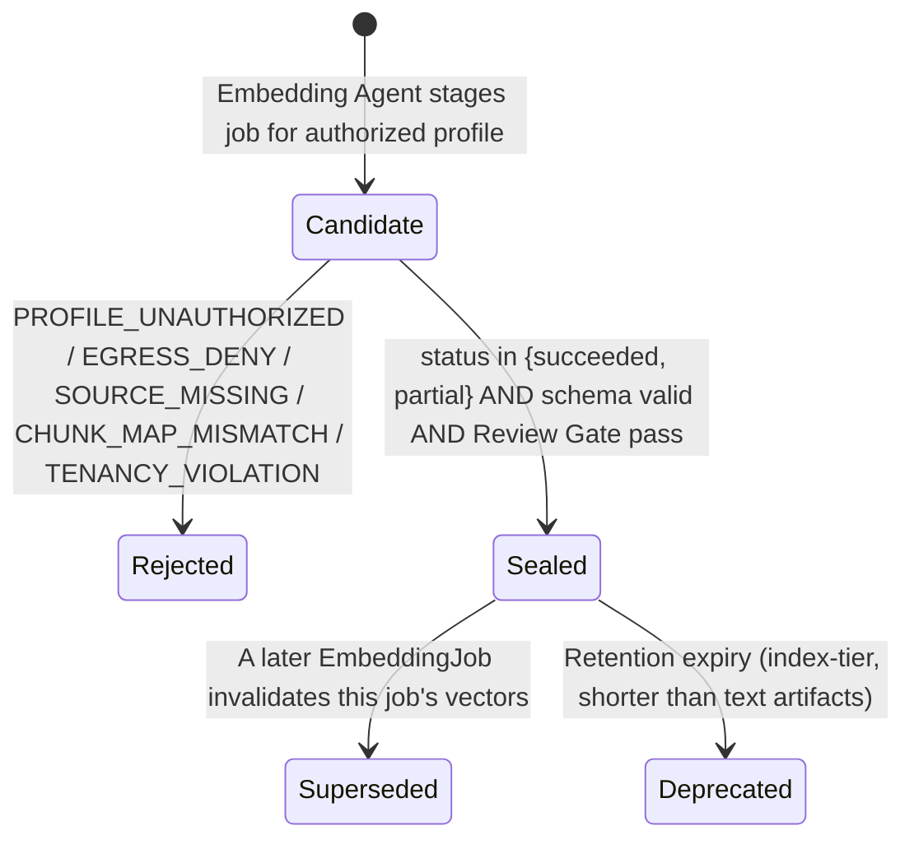
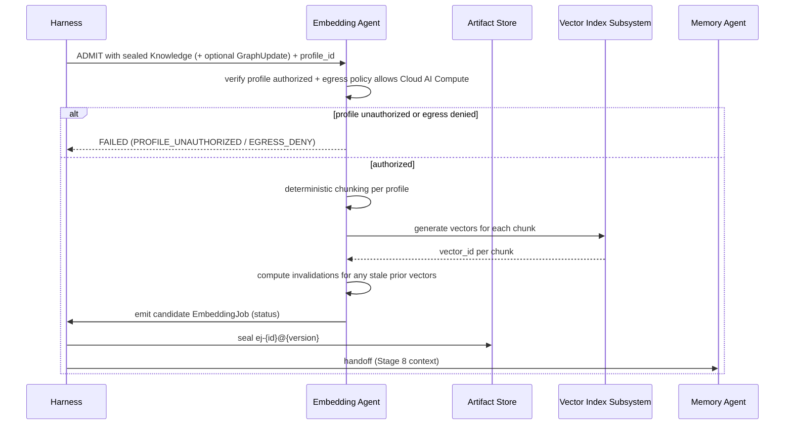

# Artifact: Embedding Job

**Version:** 2.0.0
**Status:** Canonical — Binding
**Artifact Type:** `EmbeddingJob`
**Schema:** [`/schemas/artifacts/embedding-job.schema.json`](../schemas/artifacts/embedding-job.schema.json)
**Envelope:** [`/schemas/common/artifact-envelope.schema.json`](../schemas/common/artifact-envelope.schema.json)
**Producer:** Embedding Agent — [contract](../contracts/agents/embedding-agent.md)
**Consumer:** Memory Agent / vector index subsystem (not SoR)
**Pipeline Stage:** Stage 7 — Embedding ([`/pipelines/knowledge-ingestion.md`](../pipelines/knowledge-ingestion.md#stage-7--embedding))
**Related:** [`/artifacts/knowledge.md`](./knowledge.md) · [`/artifacts/graph-update.md`](./graph-update.md) · [`/artifacts/memory-update.md`](./memory-update.md)

---

## 1. Purpose

An `EmbeddingJob` is the declarative record of an embedding run over approved `Knowledge` (and optionally `GraphUpdate`) content. It exists to make vector index construction auditable, reproducible, and explicitly non-authoritative: **vectors are indexes, never a system of record.**

---

## 2. Definitions

| Term | Definition |
|------|------------|
| `source_refs[]` | ≥1 reference (`artifact_id`, `artifact_version`, `artifact_type`) to the sealed source artifact(s) embedded — primary is `Knowledge`, optional is `GraphUpdate`. |
| `profile_id` | Identifier of the authorized embedding profile (model, dimensionality, chunking strategy) used for this job. |
| `chunk_map[]` | Deterministic mapping of `chunk_id` → `source_artifact_id` + `span` + optional `vector_id`. |
| `status` | `queued` \| `succeeded` \| `failed` \| `partial`. |
| `invalidations[]` | List of `{ vector_id, reason }` entries marking prior vectors as stale/replaced by this job. |
| **Embedding profile** | A governed, versioned configuration (model id, dimensions, chunking rules, egress policy) — never chosen ad hoc by the agent at runtime. |

---

## 3. Scope

### In scope
- Declaring exactly which sealed artifacts were embedded, under which profile, with a deterministic chunk map.
- Explicit success/failure/partial status and invalidation of superseded vectors.

### Out of scope
- Storing the actual vector values (the job record references `vector_id`s; the vectors themselves live in the vector index subsystem, not in this artifact).
- Asserting embedded content is authoritative — the Embedding Agent contract explicitly forbids "content SoR claim in index metadata."
- Choosing an embedding profile without authorization — profile authorization is a precondition, not a runtime decision by the agent.

---

## 4. Responsibilities

| Actor | Responsibility |
|-------|-----------------|
| Embedding Agent | Use only an authorized `profile_id`; produce a deterministic `chunk_map[]` for the given profile; record provenance-complete invalidations when replacing stale vectors; never claim the index is a content SoR. |
| Harness | Validate schema; verify Egress/Policy Gate allows Cloud AI Compute for the declared profile; seal on acceptance; route to Memory Agent / index subsystem. |
| Memory Agent (consumer) | Treat `EmbeddingJob` as one of several inputs to memory transactions; never treat vector presence as a substitute for `Knowledge` provenance. |
| Trust & Control Team | Own egress policy enforcement for Cloud AI Compute embedding calls. |

---

## 5. Directory Layout

```
knowledge-plane/artifacts/embedding-job/{artifact_id}/{artifact_version}.json
knowledge-plane/artifacts/embedding-job/{artifact_id}/HEAD -> {artifact_version}.json
knowledge-plane/index/{tenant_id}/{workspace_id}/vectors/{vector_id}   (vector index subsystem; not an artifact)
```

`artifact_id` prefix: `ej-`.

---

## 6. Naming Convention

- `artifact_id`: `ej-{ULID}`.
- `profile_id`: `embed-profile-{model-slug}-{version}`, e.g. `embed-profile-text-embed-v3-1.0.0`.
- `chunk_map[].chunk_id`: `{source_artifact_id}#chunk-{n}`, stable for a given profile + source version pair so re-embeds with an unchanged source and profile produce identical chunk ids.
- `vector_id`: opaque identifier assigned by the vector index subsystem; recorded here for traceability, never parsed for meaning.

---

## 7. Versioning

- `1.0.0` — first embedding job for a given `source_refs` + `profile_id` combination.
- **New `EmbeddingJob` per re-embed** — a re-embed (new source version, new profile version, or manual re-index) always emits a **new job artifact** (Embedding Agent contract: "re-embeds emit new job artifacts"); it does not mutate a prior job's `chunk_map[]` in place.
- A new job's `invalidations[]` explicitly names the `vector_id`s it replaces from the prior job.

---

## 8. Lifecycle



Note: `status=failed` candidates are still sealed (the job record itself is valid even though the embedding run did not succeed) so that failure is auditable — see §15 for the distinction between a rejected *candidate* and a sealed job with `status=failed`.

---

## 9. Retention Policy

Life of the vector index generation the job populated; superseded jobs retained ≥90 days. Index metadata, not SoR — safe to prune more aggressively than `Knowledge`/`Proposal`/`HumanReviewDecision`. See [`/artifacts/README.md#11-retention-policy`](./README.md#11-retention-policy).

---

## 10. Workflow



---

## 11. Decision Rules

| Situation | Rule |
|-----------|------|
| `Knowledge` source superseded mid-job | Fail the in-flight job (`SOURCE_MISSING` or restart per Rebase failure mode) rather than embed a stale version silently |
| Chunking produces a different chunk count than the profile's deterministic rule predicts | `CHUNK_MAP_MISMATCH`; fail closed, do not reconcile heuristically |
| Partial success (some chunks embedded, some failed) | Seal with `status=partial`; list only the successfully produced entries in `chunk_map[]` with `vector_id`, and surface the gap via Notification/Audit, never silently claim full success |
| Re-embed triggered by a profile upgrade | New job; `invalidations[]` names every vector_id from the profile being retired |
| Egress policy denies the profile for this tenancy at job time (changed since authorization) | `EGRESS_DENY`; fail closed even if the profile was previously authorized |

---

## 12. Validation

1. Envelope validation.
2. Payload validates against [`embedding-job.schema.json`](../schemas/artifacts/embedding-job.schema.json): `source_refs[]` (`minItems: 1`), `profile_id`, `chunk_map[]`, `status`, `invalidations[]` all required.
3. Every `chunk_map[].source_artifact_id` resolves to one of `source_refs[]`.
4. `profile_id` resolves to an authorized, egress-policy-cleared profile for the run's tenancy.
5. `status=succeeded` requires `chunk_map[]` complete for all declared sources; `status=partial` requires the gap to be explicitly identifiable (e.g., via audit cross-reference); `status=failed` requires an empty or partial `chunk_map[]` consistent with what actually completed.
6. Embedding Agent contract postconditions hold.

---

## 13. Examples

### 13.1 Full sealed artifact (`status=succeeded`)

```json
{
  "artifact_id": "ej-01J8ZC3D4E5F6G7H8I9J0K1L2M",
  "artifact_version": "1.0.0",
  "artifact_type": "EmbeddingJob",
  "run_id": "run-01J8Z0X9W8V7U6T5S4R3Q2P1O0",
  "produced_by": "embedding-agent@1.0.0",
  "created_at": "2026-07-22T11:20:47Z",
  "digest": "sha256:7f8091234567890123456789012345678901567f809123456789012345678",
  "tenancy": { "tenant_id": "tn-acme", "workspace_id": "ws-research" },
  "schema_version": "1.0.0",
  "parents": [
    { "artifact_id": "kn-01J8Z9X0Y1Z2A3B4C5D6E7F8G9", "artifact_version": "1.0.0", "artifact_type": "Knowledge" }
  ],
  "payload": {
    "source_refs": [
      { "artifact_id": "kn-01J8Z9X0Y1Z2A3B4C5D6E7F8G9", "artifact_version": "1.0.0", "artifact_type": "Knowledge" }
    ],
    "profile_id": "embed-profile-text-embed-v3-1.0.0",
    "chunk_map": [
      { "chunk_id": "kn-01J8Z9X0Y1Z2A3B4C5D6E7F8G9#chunk-0", "source_artifact_id": "kn-01J8Z9X0Y1Z2A3B4C5D6E7F8G9", "span": "## Guideline", "vector_id": "vec-01J8ZC4E5F6G7H8I9J0K1L2M3N" },
      { "chunk_id": "kn-01J8Z9X0Y1Z2A3B4C5D6E7F8G9#chunk-1", "source_artifact_id": "kn-01J8Z9X0Y1Z2A3B4C5D6E7F8G9", "span": "## Rationale", "vector_id": "vec-01J8ZC5F6G7H8I9J0K1L2M3N4O" },
      { "chunk_id": "kn-01J8Z9X0Y1Z2A3B4C5D6E7F8G9#chunk-2", "source_artifact_id": "kn-01J8Z9X0Y1Z2A3B4C5D6E7F8G9", "span": "## Defaults", "vector_id": "vec-01J8ZC6G7H8I9J0K1L2M3N4O5P" }
    ],
    "status": "succeeded",
    "invalidations": []
  }
}
```

### 13.2 Re-embed with invalidations (`status=partial`)

```json
{
  "artifact_id": "ej-01J8ZD4E5F6G7H8I9J0K1L2M3N",
  "artifact_version": "1.0.0",
  "artifact_type": "EmbeddingJob",
  "run_id": "run-01J8ZD3D2C1B0A9Z8Y7X6W5V4U",
  "produced_by": "embedding-agent@1.0.0",
  "created_at": "2026-07-22T11:40:02Z",
  "digest": "sha256:80912345678901234567890123456789016780912345678901234567890123",
  "tenancy": { "tenant_id": "tn-acme", "workspace_id": "ws-research" },
  "schema_version": "1.0.0",
  "parents": [
    { "artifact_id": "kn-01J8Z9X0Y1Z2A3B4C5D6E7F8G9", "artifact_version": "1.1.0", "artifact_type": "Knowledge" }
  ],
  "payload": {
    "source_refs": [
      { "artifact_id": "kn-01J8Z9X0Y1Z2A3B4C5D6E7F8G9", "artifact_version": "1.1.0", "artifact_type": "Knowledge" }
    ],
    "profile_id": "embed-profile-text-embed-v3-1.0.0",
    "chunk_map": [
      { "chunk_id": "kn-01J8Z9X0Y1Z2A3B4C5D6E7F8G9#chunk-0", "source_artifact_id": "kn-01J8Z9X0Y1Z2A3B4C5D6E7F8G9", "span": "## Guideline", "vector_id": "vec-01J8ZD5F6G7H8I9J0K1L2M3N4O" }
    ],
    "status": "partial",
    "invalidations": [
      { "vector_id": "vec-01J8ZC4E5F6G7H8I9J0K1L2M3N", "reason": "Source Knowledge revised to v1.1.0; chunk-0 content changed." },
      { "vector_id": "vec-01J8ZC5F6G7H8I9J0K1L2M3N4O", "reason": "Source Knowledge revised to v1.1.0; chunk-1 (Rationale) pending re-embed, not yet completed this job." }
    ]
  }
}
```

---

## 14. Acceptance Criteria

- [ ] Schema-valid against `embedding-job.schema.json` and the shared envelope.
- [ ] `profile_id` authorized for the run's tenancy; egress policy satisfied.
- [ ] `chunk_map[]` complete and consistent with `status`.
- [ ] `invalidations[]` populated for every vector this job replaces.
- [ ] Tenancy correct throughout.
- [ ] Review Gate pass.

---

## 15. Failure Cases

| Code | Trigger | Outcome |
|------|---------|---------|
| `PROFILE_UNAUTHORIZED` | `profile_id` not authorized for this tenancy/context | Non-retryable; `FAILED` (candidate rejected before sealing) |
| `EGRESS_DENY` | Egress/Policy Gate blocks Cloud AI Compute for this profile | Non-retryable; `FAILED` |
| `SOURCE_MISSING` | Declared `source_refs[]` artifact not resolvable/sealed | Non-retryable; `FAILED` |
| `CHUNK_MAP_MISMATCH` | Chunking output inconsistent with the profile's deterministic rule | Non-retryable; `FAILED` |
| `TENANCY_VIOLATION` | Cross-tenant source or index write | Non-retryable; `FAILED`; Trust & Control incident |
| Rate limit / compute timeout | Retryable per contract (max 3, backoff) | `WAITING_RETRY` → `RUNNING` |
| Partial completion after retries exhausted | Seal with `status=partial`, not silently treated as `succeeded` | Sealed; downstream must check `status` |

---

## 16. Best Practices

- Keep `chunk_id` deterministic and reproducible for the same source+profile pair — this is what makes re-embed diffing (`invalidations[]`) tractable.
- Always populate `invalidations[]` on a re-embed, even when the old vectors would eventually be garbage-collected anyway — explicit invalidation is cheaper to audit than implicit expiry.
- Prefer `status=partial` with an honest, incomplete `chunk_map[]` over blocking the whole job on one failed chunk.
- Track egress volume per `profile_id` as a standing Trust & Control metric, not just at job-authorization time.

---

## 17. Anti-Patterns

- Claiming `status=succeeded` when any declared source chunk failed to embed.
- Treating `vector_id` presence as proof that the underlying `Knowledge` claim is still valid — vectors do not expire when text is edited unless this artifact's `invalidations[]` says so.
- Choosing a different, more convenient embedding profile at runtime because the authorized one is slow, without a new authorization.
- Letting the index metadata carry an implicit "this is the truth" signal (e.g., duplicating full claim text as if authoritative) — the Embedding Agent contract forbids this explicitly.

---

## 18. References

- [`/contracts/agents/embedding-agent.md`](../contracts/agents/embedding-agent.md)
- [`/pipelines/knowledge-ingestion.md`](../pipelines/knowledge-ingestion.md#stage-7--embedding)
- [`/schemas/artifacts/embedding-job.schema.json`](../schemas/artifacts/embedding-job.schema.json)
- [`/artifacts/knowledge.md`](./knowledge.md) · [`/artifacts/graph-update.md`](./graph-update.md) (upstream)
- [`/artifacts/memory-update.md`](./memory-update.md) (downstream)

**End of Artifact Spec: Embedding Job v2.0.0**
