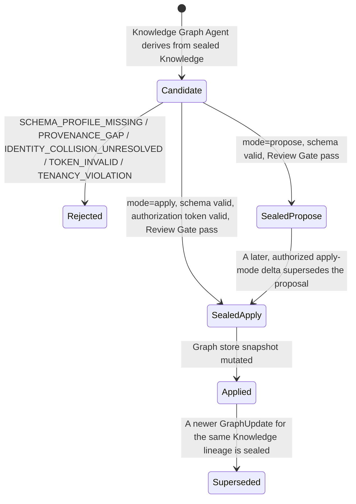
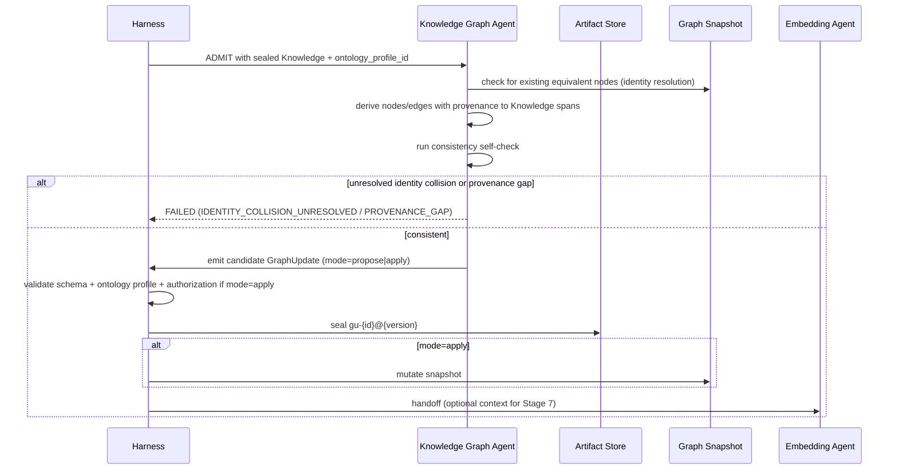

# Artifact: Graph Update

**Version:** 2.0.0
**Status:** Canonical — Binding
**Artifact Type:** `GraphUpdate`
**Schema:** [`/schemas/artifacts/graph-update.schema.json`](../schemas/artifacts/graph-update.schema.json)
**Envelope:** [`/schemas/common/artifact-envelope.schema.json`](../schemas/common/artifact-envelope.schema.json)
**Producer:** Knowledge Graph Agent — [contract](../contracts/agents/knowledge-graph-agent.md)
**Consumers:** Embedding Agent (optional), Knowledge Plane graph store
**Pipeline Stage:** Stage 6 — Graph ([`/pipelines/knowledge-ingestion.md`](../pipelines/knowledge-ingestion.md#stage-6--graph))
**Related:** [`/artifacts/knowledge.md`](./knowledge.md) · [`/artifacts/embedding-job.md`](./embedding-job.md)

---

## 1. Purpose

A `GraphUpdate` is the proposed or authorized delta to the knowledge graph derived from a sealed `Knowledge` artifact. It exists so that structured relationships (entities, claims, cross-references) can be queried and traversed without treating the graph as a second, competing system of record — the graph is always **derived**, never authoritative over the text it comes from.

---

## 2. Definitions

| Term | Definition |
|------|------------|
| `knowledge_ref` | Pointer (`artifact_id`, `artifact_version`) to the sealed `Knowledge` this delta derives from. |
| `ontology_profile_id` | Identifier of the governed ontology/schema profile used to type nodes and relations. |
| `nodes[]` | Graph nodes, each with `node_id`, `label`, optional `types[]`, and required `provenance[]` (pointers back to `Knowledge` spans/claims). |
| `edges[]` | Graph edges, each with `edge_id`, `from`, `to`, `relation`, and required `provenance[]` (`minItems: 1` — every edge must be traceable). |
| `consistency_report` | `{ ok: boolean, issues: string[] }` — the agent's own self-check against ontology and identity-collision rules before emission. |
| `mode` | `propose` (delta staged for review before graph mutation) \| `apply` (delta authorized to mutate the live graph store). |
| **Identity collision** | Two nodes across deltas that appear to represent the same real-world entity under different `node_id`s; must be resolved deterministically or escalated, never silently merged without a rule. |

---

## 3. Scope

### In scope
- Deriving nodes/edges strictly from a single sealed `Knowledge` artifact's content.
- Self-reporting consistency issues (`consistency_report`) before the Harness even runs its own Review Gate.
- Declaring whether the delta is a proposal (`propose`) or an authorized mutation (`apply`).

### Out of scope
- Originating new facts not present in the referenced `Knowledge` — the graph never adds information the text SoR does not have.
- Acting as a parallel system of record — Knowledge Graph Agent contract explicitly states "graph is not a text SoR substitute."
- Applying a delta in `apply` mode without the authorization token that policy requires for that mutation class.

---

## 4. Responsibilities

| Actor | Responsibility |
|-------|-----------------|
| Knowledge Graph Agent | Derive nodes/edges only from the referenced `Knowledge`; attach provenance to every node and edge; run its own consistency self-check; resolve or escalate identity collisions per declared rules; never self-authorize `apply` mode without a valid token when policy requires one. |
| Harness | Validate schema; verify ontology profile resolution; verify `apply` mode has a valid authorization token when required by policy; seal on acceptance; route to graph store and/or Embedding Agent. |
| Embedding Agent (optional consumer) | May use `GraphUpdate` as auxiliary context for chunk relationships; never treats it as a required input. |
| Knowledge Platform Engineering | Own the ontology profile registry and graph store consistency guarantees. |

---

## 5. Directory Layout

```
knowledge-plane/artifacts/graph-update/{artifact_id}/{artifact_version}.json
knowledge-plane/artifacts/graph-update/{artifact_id}/HEAD -> {artifact_version}.json
knowledge-plane/graph/{tenant_id}/{workspace_id}/snapshot/current   (materialized graph store, mutated only by mode=apply deltas)
```

`artifact_id` prefix: `gu-`.

---

## 6. Naming Convention

- `artifact_id`: `gu-{ULID}`.
- `ontology_profile_id`: `ontology-{slug}-{version}`, e.g. `ontology-general-1.0.0`.
- `nodes[].node_id` / `edges[].edge_id`: stable within the graph store namespace — the agent MUST check the existing graph snapshot for an existing equivalent node before minting a new `node_id`, per its identity-collision rules, rather than always minting fresh ids.

---

## 7. Versioning

- `1.0.0` — first delta derived from a given `Knowledge` version.
- **New `GraphUpdate` artifact per `Knowledge` version** — because `knowledge_ref` pins an exact `Knowledge` version, a new `Knowledge` version always yields a new `GraphUpdate` lineage (or a MINOR bump within the same lineage if the implementation's ontology profile treats successive knowledge revisions as one continuous delta stream — Knowledge Platform Engineering documents which convention a given ontology profile uses).
- Conflicting deltas are never merged in place; a resolving delta is a new sealed `GraphUpdate` that explicitly supersedes and documents the resolution in `consistency_report.issues`.

---

## 8. Lifecycle



---

## 9. Retention Policy

Life of the graph store snapshot the delta contributed to; superseded deltas retained ≥180 days for replay and audit. The graph is derived, not SoR — it may be rebuilt from sealed `Knowledge` history if ever necessary, which is why retention here is shorter than for `Knowledge` itself. See [`/artifacts/README.md#11-retention-policy`](./README.md#11-retention-policy).

---

## 10. Workflow



---

## 11. Decision Rules

| Situation | Rule |
|-----------|------|
| A node/edge cannot be traced to any `Knowledge` span | Excluded; `PROVENANCE_GAP` if it was material to the delta's purpose |
| Two nodes appear to represent the same entity | Resolve deterministically per ontology profile's identity rules, or escalate `IDENTITY_COLLISION_UNRESOLVED` — never silently merge without a documented rule |
| Policy requires authorization for `apply` mode and no token is present | Fail `TOKEN_INVALID`; the delta may still be sealed in `propose` mode instead |
| Ontology profile does not define a type used by an extracted entity | `SCHEMA_PROFILE_MISSING`; do not invent an ad hoc type |
| `consistency_report.ok = false` | Delta may still be sealed only in `propose` mode with `issues[]` populated; never in `apply` mode |

---

## 12. Validation

1. Envelope validation.
2. Payload validates against [`graph-update.schema.json`](../schemas/artifacts/graph-update.schema.json): `knowledge_ref`, `ontology_profile_id`, `nodes[]`, `edges[]`, `consistency_report`, `mode` all required.
3. Every `nodes[].provenance[]` and `edges[].provenance[]` (`minItems: 1` on edges) resolves to the referenced `Knowledge` artifact's content.
4. `mode=apply` requires a valid authorization token per policy before the Harness permits the graph store mutation.
5. `consistency_report.ok=true` required for `mode=apply`; `false` is only sealable under `mode=propose`.
6. Knowledge Graph Agent contract postconditions hold.

---

## 13. Examples

### 13.1 Full sealed artifact (`mode=propose`)

```json
{
  "artifact_id": "gu-01J8ZA1B2C3D4E5F6G7H8I9J0K",
  "artifact_version": "1.0.0",
  "artifact_type": "GraphUpdate",
  "run_id": "run-01J8Z0X9W8V7U6T5S4R3Q2P1O0",
  "produced_by": "knowledge-graph-agent@1.0.0",
  "created_at": "2026-07-22T11:05:33Z",
  "digest": "sha256:5d6e7f80912345678901234567890123456789035d6e7f8091234567890123",
  "tenancy": { "tenant_id": "tn-acme", "workspace_id": "ws-research" },
  "schema_version": "1.0.0",
  "parents": [
    { "artifact_id": "kn-01J8Z9X0Y1Z2A3B4C5D6E7F8G9", "artifact_version": "1.0.0", "artifact_type": "Knowledge" }
  ],
  "payload": {
    "knowledge_ref": { "artifact_id": "kn-01J8Z9X0Y1Z2A3B4C5D6E7F8G9", "artifact_version": "1.0.0" },
    "ontology_profile_id": "ontology-general-1.0.0",
    "nodes": [
      { "node_id": "n-retry-backoff-guideline", "label": "Retry Backoff Guideline", "types": ["Guideline"], "provenance": ["kn-01J8Z9X0Y1Z2A3B4C5D6E7F8G9#title"] },
      { "node_id": "n-jittered-exponential-backoff", "label": "Jittered Exponential Backoff", "types": ["Technique"], "provenance": ["kn-01J8Z9X0Y1Z2A3B4C5D6E7F8G9#claim-01"] }
    ],
    "edges": [
      { "edge_id": "e-guideline-recommends-technique", "from": "n-retry-backoff-guideline", "to": "n-jittered-exponential-backoff", "relation": "recommends", "provenance": ["kn-01J8Z9X0Y1Z2A3B4C5D6E7F8G9#claim-01"] }
    ],
    "consistency_report": { "ok": true, "issues": [] },
    "mode": "propose"
  }
}
```

### 13.2 `mode=apply` with a flagged, resolved collision

```json
{
  "artifact_id": "gu-01J8ZB2C3D4E5F6G7H8I9J0K1L",
  "artifact_version": "1.0.0",
  "artifact_type": "GraphUpdate",
  "run_id": "run-01J8ZB1B0A9Z8Y7X6W5V4U3T2S",
  "produced_by": "knowledge-graph-agent@1.0.0",
  "created_at": "2026-07-22T11:12:09Z",
  "digest": "sha256:6e7f809123456789012345678901234567890466e7f8091234567890123456",
  "tenancy": { "tenant_id": "tn-acme", "workspace_id": "ws-research" },
  "schema_version": "1.0.0",
  "parents": [
    { "artifact_id": "kn-01J8ZB0A9Z8Y7X6W5V4U3T2S1R", "artifact_version": "1.0.0", "artifact_type": "Knowledge" }
  ],
  "payload": {
    "knowledge_ref": { "artifact_id": "kn-01J8ZB0A9Z8Y7X6W5V4U3T2S1R", "artifact_version": "1.0.0" },
    "ontology_profile_id": "ontology-general-1.0.0",
    "nodes": [
      { "node_id": "n-jittered-exponential-backoff", "label": "Jittered Exponential Backoff", "types": ["Technique"], "provenance": ["kn-01J8ZB0A9Z8Y7X6W5V4U3T2S1R#claim-01"] }
    ],
    "edges": [],
    "consistency_report": { "ok": true, "issues": ["Resolved identity collision with prior node n-jitter-backoff-v1 per ontology-general-1.0.0 canonicalization rule R-04; reused existing node_id."] },
    "mode": "apply"
  }
}
```

---

## 14. Acceptance Criteria

- [ ] Schema-valid against `graph-update.schema.json` and the shared envelope.
- [ ] Every node and edge carries resolvable provenance to the referenced `Knowledge`.
- [ ] Ontology/schema profile satisfied — zero undeclared types/relations.
- [ ] `apply` mode has a valid authorization token when policy requires one.
- [ ] `consistency_report` present and `ok=true` for any `apply`-mode seal.
- [ ] Review Gate pass.

---

## 15. Failure Cases

| Code | Trigger | Outcome |
|------|---------|---------|
| `SCHEMA_PROFILE_MISSING` | `ontology_profile_id` unresolved or entity/relation type undeclared | Non-retryable; `FAILED` |
| `PROVENANCE_GAP` | A node/edge lacks resolvable provenance to the `Knowledge` source | Non-retryable; `FAILED` |
| `IDENTITY_COLLISION_UNRESOLVED` | Two entities plausibly the same, no deterministic resolution rule fires | Non-retryable; escalate to human/governance path |
| `TOKEN_INVALID` | `mode=apply` without required authorization | Non-retryable; `FAILED`; delta may be resubmitted as `propose` |
| `TENANCY_VIOLATION` | Cross-tenant node/edge reference | Non-retryable; `FAILED`; Trust & Control incident |
| Transient store lock | Retryable per contract (max 3, backoff) | `WAITING_RETRY` → `RUNNING` |

---

## 16. Best Practices

- Always check the existing graph snapshot for an equivalent node before minting a new `node_id` — cheap identity resolution up front avoids expensive collision cleanup later.
- Keep `provenance[]` pointers span-specific (e.g., `#claim-01`) rather than whole-document, so graph consumers can jump straight to the supporting text.
- Default to `propose` mode whenever the ontology profile's identity rules are ambiguous; reserve `apply` for high-confidence deltas.
- Record every non-trivial resolution decision in `consistency_report.issues`, even when `ok=true` — it is cheap documentation that pays off during incident review.

---

## 17. Anti-Patterns

- Extracting an entity or relation that "seems implied" by the `Knowledge` text but has no specific span to point to.
- Auto-merging two nodes because their labels look similar, without an ontology-defined identity rule.
- Sealing `mode=apply` "to save a round trip" when the consistency self-check reported issues.
- Treating the graph as a place to add facts the source `Knowledge` doesn't state, even if "obviously true" from context.

---

## 18. References

- [`/contracts/agents/knowledge-graph-agent.md`](../contracts/agents/knowledge-graph-agent.md)
- [`/pipelines/knowledge-ingestion.md`](../pipelines/knowledge-ingestion.md#stage-6--graph)
- [`/schemas/artifacts/graph-update.schema.json`](../schemas/artifacts/graph-update.schema.json)
- [`/artifacts/knowledge.md`](./knowledge.md) (upstream)
- [`/artifacts/embedding-job.md`](./embedding-job.md) (downstream/optional consumer)

**End of Artifact Spec: Graph Update v2.0.0**
