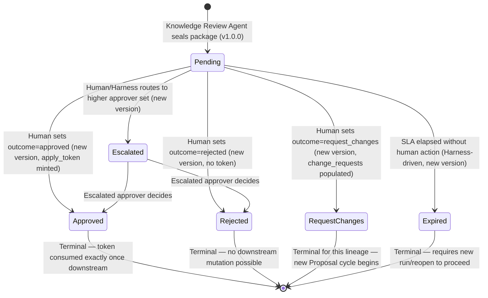

# Artifact: Human Review Decision

**Version:** 2.0.0
**Status:** Canonical — Binding
**Artifact Type:** `HumanReviewDecision`
**Schema:** [`/schemas/artifacts/human-review-decision.schema.json`](../schemas/artifacts/human-review-decision.schema.json)
**Envelope:** [`/schemas/common/artifact-envelope.schema.json`](../schemas/common/artifact-envelope.schema.json)
**Producers:** Knowledge Review Agent (pending package) — [contract](../contracts/agents/knowledge-review-agent.md); **Human Approver** (final outcome — the only human-authored field set in this entire pipeline)
**Consumer:** Markdown Agent — [contract](../contracts/agents/markdown-agent.md); Notification Agent for pending/critical states
**Pipeline Stage:** Stage 4 — Human Review ([`/pipelines/knowledge-ingestion.md`](../pipelines/knowledge-ingestion.md#stage-4--human-review))
**Related:** [`/artifacts/proposal.md`](./proposal.md) · [`/artifacts/knowledge.md`](./knowledge.md)

---

## 1. Purpose

`HumanReviewDecision` is the constitutional gate artifact (Article III, Article XIII) that converts a `Proposal` into an attributable, authorized instruction to proceed — or not. It is the **only** artifact type in the pipeline whose final, non-`pending` state is authored by a human, and it is the sole source of the `apply_token` that unlocks the Markdown stage's Knowledge Plane mutation.

---

## 2. Definitions

| Term | Definition |
|------|------------|
| `subject_refs[]` | ≥1 reference to the artifact(s) under review (typically the sealed `Proposal`, optionally a draft `Knowledge`), each with `artifact_id`, `artifact_version`, `artifact_type`. |
| `outcome` | `pending` \| `approved` \| `rejected` \| `request_changes` \| `expired` \| `escalated`. |
| `checklist_id` | Identifier of the governed review checklist applied. |
| `review_findings[]` | Structured findings, each with `code`, `severity` (`low`\|`medium`\|`high`\|`critical`), `message`. Populated by the Knowledge Review Agent; may be augmented by the human. |
| `approver` | `{ actor_id, decided_at }` — required whenever `outcome != pending`. The attributable identity anchor for the whole decision. |
| `apply_token` | Single-use, version-bound token; **required** when `outcome = approved`; **forbidden** when `outcome = rejected`. |
| `change_requests[]` | Free-text list of specific changes required, populated when `outcome = request_changes`. |

---

## 3. Scope

### In scope
- Recording the automated review package (`review_findings[]`, `checklist_id`) prepared by the Knowledge Review Agent.
- Recording the human's final, attributable outcome and — when approved — minting the single-use `apply_token`.
- Enforcing that rejected/expired outcomes never carry an apply token.

### Out of scope
- Authoring the Markdown/Knowledge content itself (Markdown Agent's job, Stage 5).
- Automated self-approval — the Knowledge Review Agent contract explicitly forbids minting its own token; only a human `approver` may set `outcome=approved`.
- Re-litigating upstream Proposal/Validation content — this stage judges the *package as presented*, not re-deriving evidence.

---

## 4. Responsibilities

| Actor | Responsibility |
|-------|-----------------|
| Knowledge Review Agent | Apply `checklist_id` fully; flag conflicts/duplicates when detectable; leave `outcome=pending` until a human acts; never mint `apply_token`. |
| Human Approver | Read the package; render one terminal outcome; if approving, confirm checklist completeness and let the Harness mint the token bound to `approver.actor_id` and the subject's exact version. |
| Harness | Enforce token issuance rules (`approved` ⇒ token present; `rejected` ⇒ token absent); enforce token single-use and version-binding at every downstream consumption attempt; expire pending decisions per policy SLA. |
| Notification Agent | Inform relevant humans of `pending` and `critical`-severity states without inventing urgency not present in the record. |
| Markdown Agent (consumer) | Verify token validity and binding before drafting; refuse to proceed on anything but `outcome=approved` with a valid token. |

---

## 5. Directory Layout

```
knowledge-plane/artifacts/human-review-decision/{artifact_id}/{artifact_version}.json
knowledge-plane/artifacts/human-review-decision/{artifact_id}/HEAD -> {artifact_version}.json
```

`artifact_id` prefix: `hrd-`.

---

## 6. Naming Convention

- `artifact_id`: `hrd-{ULID}`, minted when the Knowledge Review Agent creates the initial `pending` package (not when the human later decides).
- `checklist_id`: `checklist-{slug}-{version}`, e.g. `checklist-knowledge-approval-1.0.0`.
- `review_findings[].code`: short uppercase-snake code, e.g. `DUPLICATE_CANDIDATE`, `SCOPE_CREEP`, `CITATION_WEAK`.

---

## 7. Versioning

- `1.0.0` (`outcome=pending`) — the initial package sealed by the Knowledge Review Agent, awaiting human action.
- **The same `artifact_id`, new version** — the human's terminal decision (`approved`/`rejected`/`request_changes`/`expired`/`escalated`) is sealed as a **new version of the same lineage** (`1.1.0` typically), preserving the full pending→decided history under one `artifact_id`.
- `request_changes` never mutates the sealed `Proposal`; it produces a **new `Proposal` version** upstream and, correspondingly, a fresh `HumanReviewDecision` lineage for the re-submitted proposal.
- `escalated` produces a new version with `outcome=escalated`; a subsequent terminal decision from the escalated approver set is yet another new version in the same lineage.

---

## 8. Lifecycle



---

## 9. Retention Policy

Indefinite. This is the audit anchor for every Knowledge Plane mutation authorized under Constitution Article III; it is never purged, and its retention cannot be shortened without an ADR plus Decision Log entry (Constitution Article VIII, Article VII).

---

## 10. Workflow

```mermaid
sequenceDiagram
    participant Harness
    participant Review as Knowledge Review Agent
    participant Notify as Notification Agent
    participant Human as Human Approver
    participant Store as Artifact Store
    participant Markdown as Markdown Agent

    Harness->>Review: ADMIT with sealed Proposal + checklist_id
    Review->>Review: apply checklist; flag conflicts/duplicates
    Review->>Harness: emit candidate HumanReviewDecision (outcome=pending)
    Harness->>Store: seal hrd-{id}@1.0.0
    Harness->>Notify: notify pending review (and any critical findings)
    Notify->>Human: deliver review package
    Human->>Harness: render outcome (approved / rejected / request_changes / escalated)
    alt outcome = approved
        Harness->>Harness: verify checklist complete
        Harness->>Harness: mint single-use apply_token bound to Proposal artifact_id@version
        Harness->>Store: seal hrd-{id}@1.1.0 (outcome=approved, approver, apply_token)
        Harness->>Markdown: handoff sealed decision — Stage 5 begins
    else outcome = rejected
        Harness->>Store: seal hrd-{id}@1.1.0 (outcome=rejected, approver, no token)
        Harness->>Harness: fail run closed — no downstream handoff
    else outcome = request_changes
        Harness->>Store: seal hrd-{id}@1.1.0 (outcome=request_changes, change_requests)
        Harness->>Harness: return control to Proposal stage, new run segment
    end
```

---

## 11. Decision Rules

| Situation | Rule |
|-----------|------|
| Checklist incomplete at human decision time | No `approved` outcome permitted; either continue review or `request_changes`/`escalated` |
| Any `review_findings[]` entry has `severity=critical` and is unresolved | Cannot reach `approved` without an explicit resolution note; default path is `escalated` |
| SLA window elapses with `outcome=pending` | Harness transitions to `expired`; no human action after expiry can retroactively approve — a new package must be created |
| `outcome=rejected` | `apply_token` **must** be absent (schema-enforced via `allOf`/`if`/`then`) |
| `outcome=approved` | `approver` and `apply_token` **must** both be present (schema-enforced) |
| Human attempts to approve their own upstream Proposal (self-approval) | Forbidden by Constitution Article III/Harness Spec §9.3; identity check blocks the action |

---

## 12. Validation

1. Envelope validation.
2. Payload validates against [`human-review-decision.schema.json`](../schemas/artifacts/human-review-decision.schema.json): `subject_refs[]` (`minItems: 1`), `outcome`, `checklist_id`, `review_findings[]` required.
3. Conditional schema rules: `outcome=approved` ⇒ `approver` + `apply_token` required; `outcome=rejected` ⇒ `apply_token` forbidden.
4. `approver.actor_id` resolves to an authenticated human identity (Trust & Control) for any non-`pending` outcome.
5. `apply_token`, when present, is single-use and bound to the exact `subject_refs[]` `artifact_id@artifact_version`.
6. Knowledge Review Agent contract postconditions hold for the initial `pending` package.

---

## 13. Examples

### 13.1 Pending package (v1.0.0)

```json
{
  "artifact_id": "hrd-01J8Z7U8V9W0X1Y2Z3A4B5C6D7",
  "artifact_version": "1.0.0",
  "artifact_type": "HumanReviewDecision",
  "run_id": "run-01J8Z0X9W8V7U6T5S4R3Q2P1O0",
  "produced_by": "knowledge-review-agent@1.0.0",
  "created_at": "2026-07-22T09:05:00Z",
  "digest": "sha256:1829a3b4c5d6e7f8091234567890123456789012345678901829a3b4c5d6e7",
  "tenancy": { "tenant_id": "tn-acme", "workspace_id": "ws-research" },
  "schema_version": "1.0.0",
  "parents": [
    { "artifact_id": "pr-01J8Z5S6T7U8V9W0X1Y2Z3A4B5", "artifact_version": "1.0.0", "artifact_type": "Proposal" }
  ],
  "payload": {
    "subject_refs": [
      { "artifact_id": "pr-01J8Z5S6T7U8V9W0X1Y2Z3A4B5", "artifact_version": "1.0.0", "artifact_type": "Proposal" }
    ],
    "outcome": "pending",
    "checklist_id": "checklist-knowledge-approval-1.0.0",
    "review_findings": [
      { "code": "CITATION_WEAK", "severity": "low", "message": "cit-02 is a vendor blog, not a spec; acceptable but note for reviewer." }
    ]
  }
}
```

### 13.2 Approved decision (v1.1.0, same lineage)

```json
{
  "artifact_id": "hrd-01J8Z7U8V9W0X1Y2Z3A4B5C6D7",
  "artifact_version": "1.1.0",
  "artifact_type": "HumanReviewDecision",
  "run_id": "run-01J8Z0X9W8V7U6T5S4R3Q2P1O0",
  "produced_by": "harness@human-approval-gate",
  "created_at": "2026-07-22T10:30:22Z",
  "digest": "sha256:29a3b4c5d6e7f80912345678901234567890123456789029a3b4c5d6e7f809",
  "tenancy": { "tenant_id": "tn-acme", "workspace_id": "ws-research" },
  "schema_version": "1.0.0",
  "parents": [
    { "artifact_id": "pr-01J8Z5S6T7U8V9W0X1Y2Z3A4B5", "artifact_version": "1.0.0", "artifact_type": "Proposal" },
    { "artifact_id": "hrd-01J8Z7U8V9W0X1Y2Z3A4B5C6D7", "artifact_version": "1.0.0", "artifact_type": "HumanReviewDecision" }
  ],
  "payload": {
    "subject_refs": [
      { "artifact_id": "pr-01J8Z5S6T7U8V9W0X1Y2Z3A4B5", "artifact_version": "1.0.0", "artifact_type": "Proposal" }
    ],
    "outcome": "approved",
    "checklist_id": "checklist-knowledge-approval-1.0.0",
    "review_findings": [
      { "code": "CITATION_WEAK", "severity": "low", "message": "cit-02 is a vendor blog, not a spec; acceptable but note for reviewer." }
    ],
    "approver": { "actor_id": "user:jdoe@acme.example", "decided_at": "2026-07-22T10:30:00Z" },
    "apply_token": "at_01J8Z7V9W0X1Y2Z3A4B5C6D7E8.single-use.bound=pr-01J8Z5S6T7U8V9W0X1Y2Z3A4B5@1.0.0"
  }
}
```

### 13.3 Rejected decision

```json
{
  "artifact_id": "hrd-01J8Z8W9X0Y1Z2A3B4C5D6E7F8",
  "artifact_version": "1.1.0",
  "artifact_type": "HumanReviewDecision",
  "run_id": "run-01J8Z8V8U7T6S5R4Q3P2O1N0M9",
  "produced_by": "harness@human-approval-gate",
  "created_at": "2026-07-22T11:00:00Z",
  "digest": "sha256:3b4c5d6e7f80912345678901234567890123456789013b4c5d6e7f80912345",
  "tenancy": { "tenant_id": "tn-acme", "workspace_id": "ws-ops" },
  "schema_version": "1.0.0",
  "parents": [
    { "artifact_id": "pr-01J8Z8U7T6S5R4Q3P2O1N0M9L8", "artifact_version": "1.0.0", "artifact_type": "Proposal" }
  ],
  "payload": {
    "subject_refs": [
      { "artifact_id": "pr-01J8Z8U7T6S5R4Q3P2O1N0M9L8", "artifact_version": "1.0.0", "artifact_type": "Proposal" }
    ],
    "outcome": "rejected",
    "checklist_id": "checklist-knowledge-approval-1.0.0",
    "review_findings": [
      { "code": "SCOPE_CREEP", "severity": "high", "message": "Proposal expands beyond the stated pain into unrelated infrastructure changes." }
    ],
    "approver": { "actor_id": "user:asmith@acme.example", "decided_at": "2026-07-22T10:59:40Z" }
  }
}
```

---

## 14. Acceptance Criteria

- [ ] Schema-valid against `human-review-decision.schema.json` and the shared envelope.
- [ ] `approved` ⇒ `approver` and `apply_token` present; token bound to exact subject `artifact_id@version`.
- [ ] `rejected`/`expired` ⇒ no `apply_token` present.
- [ ] Actor identity present on every non-`pending` outcome.
- [ ] `checklist_id` resolves to a governed checklist; coverage complete or blockers explicitly listed.
- [ ] Review Gate pass; Human Approval Gate semantics (Harness Spec §9) honored exactly.

---

## 15. Failure Cases

| Code | Trigger | Outcome |
|------|---------|---------|
| `CHECKLIST_INCOMPLETE` | Human attempts `approved` with an incomplete checklist | Rejected by Harness before seal; human must complete or choose another outcome |
| `INPUT_DIGEST_MISMATCH` | Referenced `Proposal` digest does not match stored sealed artifact | Non-retryable; `FAILED` |
| `UNRESOLVED_CRITICAL_CONFLICT` | Critical-severity finding unresolved at decision time | Non-retryable for `approved`; route to `escalated` |
| `POLICY_DENY` | Approver identity lacks authorization scope for this artifact's tenancy/class | Non-retryable; `FAILED`; Trust & Control incident |
| `TOKEN_INVALID` (downstream) | A consumer presents an expired, reused, or version-mismatched token | Non-retryable at consumption; no mutation occurs |

---

## 16. Best Practices

- Route every `critical` finding to `escalated` by default rather than trusting a single approver's judgment call under time pressure.
- Keep `change_requests[]` specific and actionable — "improve this" is not a change request; "cite a primary source for claim 2" is.
- Notify on `pending` promptly; approval latency is a tracked success metric for the Knowledge Review Agent and for pipeline health generally.
- Treat `expired` as a normal, expected outcome for stale reviews, not an error condition — build SLA reminders instead of punitive escalation for routine expiry.

---

## 17. Anti-Patterns

- "LGTM by default" — approving without reading findings (explicitly forbidden, Constitution Article III.4).
- Minting or attempting to mint an `apply_token` from the Knowledge Review Agent itself (contract-forbidden; only the Human Approval Gate mints tokens).
- Reusing an `apply_token` across two different Markdown-stage attempts, or after the bound `Proposal` version has been superseded.
- Treating `request_changes` as an in-place edit — always a new `Proposal` version and a new decision lineage for the resubmission.

---

## 18. References

- [`/contracts/agents/knowledge-review-agent.md`](../contracts/agents/knowledge-review-agent.md)
- [`/contracts/agents/markdown-agent.md`](../contracts/agents/markdown-agent.md)
- [`/contracts/agents/notification-agent.md`](../contracts/agents/notification-agent.md)
- [`/harness/HARNESS_SPECIFICATION.md`](../harness/HARNESS_SPECIFICATION.md) — §9 Human Approval Gates
- [`/pipelines/knowledge-ingestion.md`](../pipelines/knowledge-ingestion.md#stage-4--human-review)
- [`/schemas/artifacts/human-review-decision.schema.json`](../schemas/artifacts/human-review-decision.schema.json)
- [`/CONSTITUTION.md`](../CONSTITUTION.md) — Article III
- [`/artifacts/proposal.md`](./proposal.md) (upstream)
- [`/artifacts/knowledge.md`](./knowledge.md) (downstream)

**End of Artifact Spec: Human Review Decision v2.0.0**
