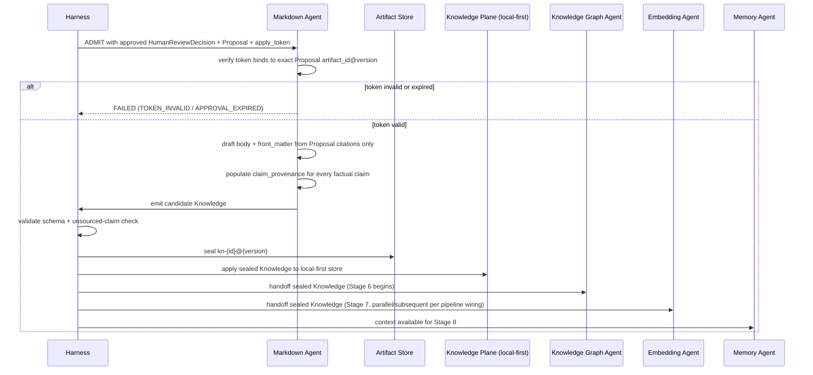

# Artifact: Knowledge

**Version:** 2.0.0
**Status:** Canonical — Binding
**Artifact Type:** `Knowledge`
**Schema:** [`/schemas/artifacts/knowledge.schema.json`](../schemas/artifacts/knowledge.schema.json)
**Envelope:** [`/schemas/common/artifact-envelope.schema.json`](../schemas/common/artifact-envelope.schema.json)
**Producer:** Markdown Agent — [contract](../contracts/agents/markdown-agent.md)
**Consumers:** Knowledge Graph Agent, Embedding Agent, Memory Agent, Knowledge Plane apply path
**Pipeline Stage:** Stage 5 — Markdown ([`/pipelines/knowledge-ingestion.md`](../pipelines/knowledge-ingestion.md#stage-5--markdown))
**Related:** [`/artifacts/human-review-decision.md`](./human-review-decision.md) · [`/artifacts/graph-update.md`](./graph-update.md) · [`/artifacts/embedding-job.md`](./embedding-job.md)

---

## 1. Purpose

`Knowledge` is the review-ready, approval-authorized knowledge unit that ultimately lands in the local-first Knowledge Plane system of record. It is the pivot artifact of the entire pipeline: everything upstream (Research → Validation → Proposal → Human Review) exists to produce a trustworthy `Knowledge` unit, and everything downstream (Graph, Embedding, Memory) exists to derive value from it. It is content-bearing, human-readable, and — under strict policy — every claim in it traces back to a citation.

---

## 2. Definitions

| Term | Definition |
|------|------------|
| `title` | Non-empty human-readable title for the knowledge unit. |
| `format` | Content format; currently constrained to `markdown` by schema (`enum: ["markdown"]`). |
| `body` | The Markdown content itself. |
| `front_matter` | Structured metadata object (tags, category, audience, etc.) — free-form object per schema, governed by the Markdown Agent's template. |
| `claim_provenance[]` | Array mapping each `claim_id` in the body to the `citation_keys[]` that support it, with an optional `span_hint` (e.g., a heading or paragraph locator) for traceability. |
| `proposal_ref` | Pointer (`artifact_id`, `artifact_version`) to the sealed `Proposal` this knowledge was drafted from. |
| `approval_ref` | Pointer (`artifact_id`, `artifact_version`, `outcome: "approved"`) to the `HumanReviewDecision` that authorized this draft. |
| **Strict policy** | The default posture (Constitution Article IV, IX) under which every factual claim in `body` must have a corresponding `claim_provenance[]` entry; unsourced claims are non-conformant. |

---

## 3. Scope

### In scope
- The final Markdown content, its structured front matter, and full claim-level provenance.
- The linkage back to the exact `Proposal` and `HumanReviewDecision` that authorized this exact content.

### Out of scope
- Deriving graph structure (Stage 6's job) or embeddings (Stage 7's job) — `Knowledge` is the *source*, not the derived index.
- Inventing facts not present in the approved `Proposal`'s citation set — the Markdown Agent authors and normalizes, it does not research or validate.
- Direct Knowledge Plane apply without a valid token — sealing this artifact and *applying* it to the SoR are related but distinct Harness-governed steps.

---

## 4. Responsibilities

| Actor | Responsibility |
|-------|-----------------|
| Markdown Agent | Verify token validity/binding before drafting; author faithfully from the approved `Proposal`'s citations; populate `claim_provenance[]` for every factual claim; never invent content. |
| Harness | Validate the `apply_token` against the `HumanReviewDecision`; validate schema; seal artifact only via Harness (never agent self-seal); route to Graph/Embedding/Memory consumers and the Knowledge Plane apply path. |
| Knowledge Graph Agent, Embedding Agent, Memory Agent (consumers) | Treat `Knowledge` as the authoritative source text; derive without altering it; carry provenance back to specific `Knowledge` spans in their own outputs. |
| Knowledge Platform Engineering | Own the local-first storage apply mechanism and its consistency with the sealed artifact record. |

---

## 5. Directory Layout

```
knowledge-plane/artifacts/knowledge/{artifact_id}/{artifact_version}.json
knowledge-plane/artifacts/knowledge/{artifact_id}/HEAD -> {artifact_version}.json
knowledge-plane/sor/{tenant_id}/{workspace_id}/{artifact_id}.md   (applied, human-readable projection of HEAD)
```

`artifact_id` prefix: `kn-`. The `sor/` projection is a read-optimized rendering of the sealed artifact's `body` + `front_matter`; the sealed JSON under `artifacts/knowledge/` remains the system of record for provenance and lineage — the Markdown rendering is derived, never edited directly.

---

## 6. Naming Convention

- `artifact_id`: `kn-{ULID}`.
- `claim_provenance[].claim_id`: short slug unique within the document, e.g. `claim-01`, referenced nowhere else except this array (not embedded as visible markup in `body`, to keep the rendered document clean — mapping is by `span_hint`, e.g., a heading anchor or paragraph index).
- `citation_keys[]`: must match `citation_key` values from the referenced `Proposal.citations[]` exactly.
- `front_matter.slug` (if used by the template): kebab-case, stable for the life of the `artifact_id`.

---

## 7. Versioning

- `1.0.0` — first sealed knowledge unit for a given approved `Proposal`.
- **MINOR** — a subsequent, separately human-approved edit (new `Proposal` + `HumanReviewDecision` cycle) that revises content while preserving the same topic/title identity and `artifact_id`.
- **MAJOR** — a substantial rewrite changing the unit's scope or conclusions, still under the same `artifact_id` if it is understood as "the same knowledge unit, revised," or a new `artifact_id` if it is genuinely a different knowledge unit — Knowledge Platform Engineering governs this distinction per template.
- Every version, including the first, requires its own `proposal_ref` and `approval_ref` — there is no such thing as an unapproved `Knowledge` version.

---

## 8. Lifecycle

```mermaid
stateDiagram-v2
    [*] --> Candidate: Markdown Agent drafts from approved Proposal + valid token
    Candidate --> Rejected: TOKEN_INVALID / TEMPLATE_MISSING / UNSOURCED_CLAIM / APPROVAL_EXPIRED / SCHEMA_INVALID
    Candidate --> Sealed: Schema valid AND claims sourced AND Review Gate pass
    Sealed --> Applied: Knowledge Plane apply path commits to local-first SoR
    Applied --> Superseded: New Knowledge version sealed and applied for the same artifact_id
    Sealed --> Deprecated: Retention/erasure workflow (rare; local-first ownership governs, see §9)
```

---

## 9. Retention Policy

Indefinite — `Knowledge` is the local-first system of record owned by the user/organization (Constitution Article X). It is never purged by pipeline retention policy. Deletion, if ever required, occurs only through an explicit, policy-governed erasure workflow outside the scope of artifact retention rules, and must not be silently triggered by pipeline mechanics.

---

## 10. Workflow



---

## 11. Decision Rules

| Situation | Rule |
|-----------|------|
| A claim in `body` has no matching `claim_provenance[]` entry | Under strict policy, this is `UNSOURCED_CLAIM` — non-conformant, fail closed |
| `approval_ref.outcome` is anything other than `approved` | Reject at admission — never draft from a non-approved decision |
| Template/front-matter schema for the knowledge category is unresolved | `TEMPLATE_MISSING`; fail closed rather than freelance a structure |
| Approved token's window has elapsed before drafting completes | `APPROVAL_EXPIRED`; require a fresh approval cycle |
| Minor wording normalization (e.g., fixing a typo introduced by the agent, not the source) | Permitted without new citations, but still requires a new sealed version — no post-seal in-place edits |

---

## 12. Validation

1. Envelope validation.
2. Payload validates against [`knowledge.schema.json`](../schemas/artifacts/knowledge.schema.json): `title`, `format` (`markdown`), `body`, `front_matter`, `claim_provenance[]`, `proposal_ref`, `approval_ref` all required.
3. `approval_ref.outcome` is the literal constant `"approved"` (schema-enforced `const`).
4. `proposal_ref` resolves to the sealed `Proposal` that `approval_ref`'s `HumanReviewDecision.subject_refs[]` names.
5. Every `claim_provenance[].citation_keys[]` entry resolves to a `citation_key` in the referenced `Proposal.citations[]`.
6. No unsourced factual claims under strict policy.
7. Tenancy set and consistent across `proposal_ref`, `approval_ref`, and the artifact's own envelope.
8. Markdown Agent contract postconditions hold.

---

## 13. Examples

### 13.1 Full sealed artifact

```json
{
  "artifact_id": "kn-01J8Z9X0Y1Z2A3B4C5D6E7F8G9",
  "artifact_version": "1.0.0",
  "artifact_type": "Knowledge",
  "run_id": "run-01J8Z0X9W8V7U6T5S4R3Q2P1O0",
  "produced_by": "markdown-agent@1.0.0",
  "created_at": "2026-07-22T10:45:12Z",
  "digest": "sha256:4c5d6e7f809123456789012345678901234567890234c5d6e7f8091234567",
  "tenancy": { "tenant_id": "tn-acme", "workspace_id": "ws-research" },
  "schema_version": "1.0.0",
  "parents": [
    { "artifact_id": "pr-01J8Z5S6T7U8V9W0X1Y2Z3A4B5", "artifact_version": "1.0.0", "artifact_type": "Proposal" },
    { "artifact_id": "hrd-01J8Z7U8V9W0X1Y2Z3A4B5C6D7", "artifact_version": "1.1.0", "artifact_type": "HumanReviewDecision" }
  ],
  "payload": {
    "title": "Retry Backoff Guideline: Jittered Exponential Backoff Defaults",
    "format": "markdown",
    "body": "## Guideline\n\nAll agent-to-agent retries SHOULD use jittered exponential backoff with a capped ceiling per failure class.\n\n## Rationale\n\nJittered exponential backoff avoids thundering-herd retry storms after transient failures [claim-01]. This pattern is corroborated by cloud provider architecture guidance recommending capped exponential backoff with full jitter for distributed retries [claim-02].\n\n## Defaults\n\n| Failure class | Max attempts | Base delay | Jitter |\n|---|---|---|---|\n| Transient network | 3 | 200ms | full |\n| Rate limit | 3 | 500ms | full |\n",
    "front_matter": {
      "category": "engineering-guideline",
      "tags": ["retry", "resilience", "backoff"],
      "audience": "engineering",
      "slug": "retry-backoff-guideline"
    },
    "claim_provenance": [
      { "claim_id": "claim-01", "citation_keys": ["cit-01"], "span_hint": "## Rationale, paragraph 1, sentence 1" },
      { "claim_id": "claim-02", "citation_keys": ["cit-02"], "span_hint": "## Rationale, paragraph 1, sentence 2" }
    ],
    "proposal_ref": { "artifact_id": "pr-01J8Z5S6T7U8V9W0X1Y2Z3A4B5", "artifact_version": "1.0.0" },
    "approval_ref": { "artifact_id": "hrd-01J8Z7U8V9W0X1Y2Z3A4B5C6D7", "artifact_version": "1.1.0", "outcome": "approved" }
  }
}
```

---

## 14. Acceptance Criteria

- [ ] Schema-valid against `knowledge.schema.json` and the shared envelope.
- [ ] `approval_ref.outcome = "approved"`.
- [ ] `proposal_ref` and `approval_ref` resolve to sealed artifacts consistent with each other (the decision's `subject_refs[]` includes the referenced proposal).
- [ ] Every factual claim has a `claim_provenance[]` entry under strict policy.
- [ ] `tenancy` set and consistent with upstream artifacts.
- [ ] Sealed only via Harness — never agent self-seal.
- [ ] Review Gate pass.

---

## 15. Failure Cases

| Code | Trigger | Outcome |
|------|---------|---------|
| `TOKEN_INVALID` | Missing, reused, expired, or version-mismatched `apply_token` | Non-retryable; `FAILED`; no draft attempted |
| `TEMPLATE_MISSING` | No resolvable front-matter template/schema for the declared category | Non-retryable; `FAILED` |
| `UNSOURCED_CLAIM` | A factual claim lacks a `claim_provenance[]` entry under strict policy | Non-retryable; `FAILED` |
| `APPROVAL_EXPIRED` | The bound `HumanReviewDecision` approval window elapsed before drafting completed | Non-retryable; `FAILED`; require fresh approval cycle |
| `SCHEMA_INVALID` | Payload fails schema validation | Non-retryable; `FAILED` |
| Transient compute | Retryable per contract (max 2, backoff) | `WAITING_RETRY` → `RUNNING` |

---

## 16. Best Practices

- Keep `body` faithful to the approved `Proposal` — this stage normalizes and formats, it does not add new claims, examples, or caveats beyond what citations support.
- Use `span_hint` values that survive minor copy edits (heading + ordinal position) rather than exact character offsets that break on the next revision.
- Keep `front_matter` schema-stable per category so downstream Graph/Embedding consumers can rely on consistent metadata shape.
- Prefer smaller, single-topic `Knowledge` units over sprawling documents — smaller units produce cleaner `GraphUpdate` and `EmbeddingJob` chunking.

---

## 17. Anti-Patterns

- Adding a caveat, example, or elaboration not present in the approved `Proposal`'s citations, "because it's obviously true" — obvious is not sourced.
- Embedding citation markers directly and irregularly in `body` text without a corresponding `claim_provenance[]` entry.
- Treating the `sor/` Markdown projection (§5) as directly editable — all edits must flow through a new pipeline cycle and a new sealed version.
- Skipping the token-expiry check because "the approval was clearly still valid in spirit."

---

## 18. References

- [`/contracts/agents/markdown-agent.md`](../contracts/agents/markdown-agent.md)
- [`/pipelines/knowledge-ingestion.md`](../pipelines/knowledge-ingestion.md#stage-5--markdown)
- [`/schemas/artifacts/knowledge.schema.json`](../schemas/artifacts/knowledge.schema.json)
- [`/CONSTITUTION.md`](../CONSTITUTION.md) — Article IV, Article X
- [`/artifacts/human-review-decision.md`](./human-review-decision.md) (upstream)
- [`/artifacts/graph-update.md`](./graph-update.md) · [`/artifacts/embedding-job.md`](./embedding-job.md) · [`/artifacts/memory-update.md`](./memory-update.md) (downstream)

**End of Artifact Spec: Knowledge v2.0.0**
