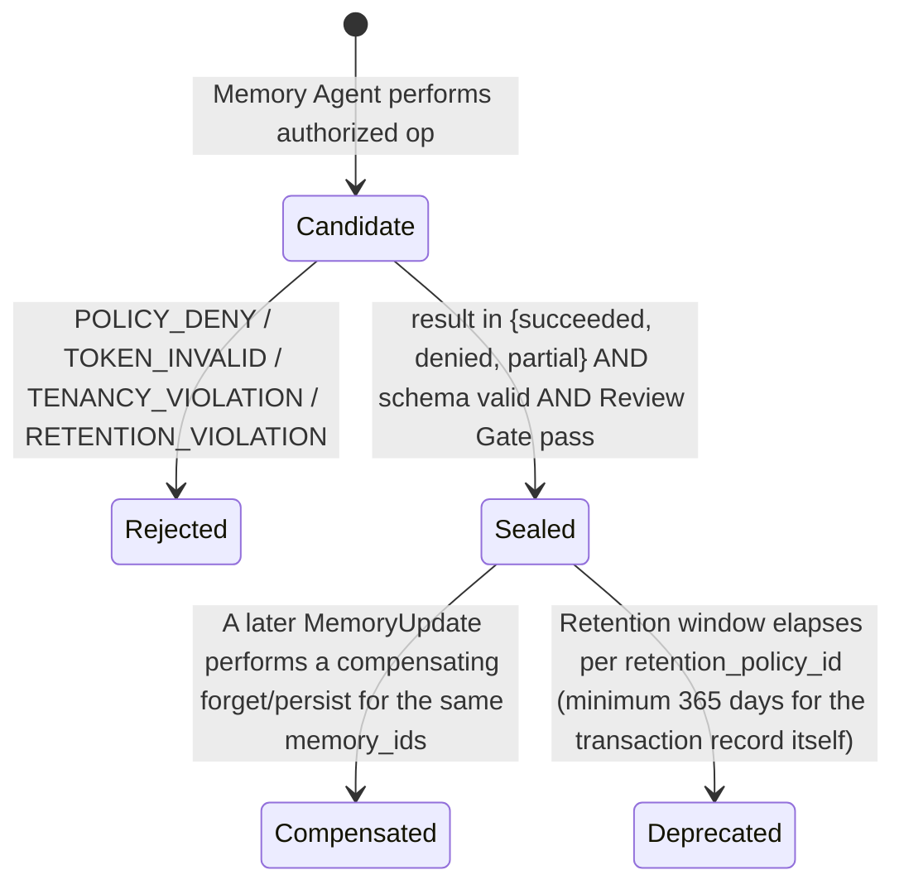

# Artifact: Memory Update

**Version:** 2.0.0
**Status:** Canonical — Binding
**Artifact Type:** `MemoryUpdate`
**Schema:** [`/schemas/artifacts/memory-update.schema.json`](../schemas/artifacts/memory-update.schema.json)
**Envelope:** [`/schemas/common/artifact-envelope.schema.json`](../schemas/common/artifact-envelope.schema.json)
**Producer:** Memory Agent — [contract](../contracts/agents/memory-agent.md)
**Consumer:** Audit / subsequent runs (recall); never a parallel knowledge SoR
**Pipeline Stage:** Stage 8 — Memory ([`/pipelines/knowledge-ingestion.md`](../pipelines/knowledge-ingestion.md#stage-8--memory))
**Related:** [`/artifacts/knowledge.md`](./knowledge.md) · [`/artifacts/embedding-job.md`](./embedding-job.md)

---

## 1. Purpose

A `MemoryUpdate` is the sealed result of one authorized memory transaction for a pipeline run — `stage`, `persist`, `forget`, `seal`, or `recall`. It exists to make working-vs-durable memory transitions explicit and auditable, and to guarantee there is never a covert, per-agent durable store operating outside Harness governance. This is the final artifact in the canonical pipeline; it closes the run's Audit Trail.

---

## 2. Definitions

| Term | Definition |
|------|------------|
| `op` | The memory operation performed: `stage` \| `persist` \| `forget` \| `seal` \| `recall`. |
| `result` | Outcome enum: `succeeded` \| `denied` \| `partial`. |
| `memory_ids[]` | Identifiers of the memory records affected by this operation. |
| `retention_policy_id` | Identifier of the governed retention policy applied to this transaction. |
| `source_refs[]` | Upstream artifacts this memory transaction is grounded in (typically sealed `Knowledge` + `EmbeddingJob`, optionally `GraphUpdate`). |
| `denial_reason` | Populated when `result=denied`; explains exactly why the transaction did not proceed. |
| `incomplete_forget_ids[]` | Populated when a `forget` operation could not fully complete; names the specific `memory_ids` still outstanding. |
| **Working memory** | Ephemeral context released at the end of an agent invocation unless a Memory stage transaction explicitly persists it (Harness Spec §3, "Release" phase). |
| **Durable memory** | Memory retained beyond a single invocation under an explicit `persist` transaction, governed by `retention_policy_id`. |

---

## 3. Scope

### In scope
- Explicit, attributable record of a memory operation's authorization, scope, and result.
- Honest reporting of partial `forget` operations — never claiming full erasure when some records remain.
- Grounding every persisted memory in traceable `source_refs[]`.

### Out of scope
- Storing the memory content itself — this artifact records the *transaction*, not a duplicate payload of the knowledge (that would violate "no duplicate SoR created in memory layer," a Memory Agent contract postcondition).
- Authorizing Knowledge Plane mutation — that authority belongs exclusively to `HumanReviewDecision`; a `MemoryUpdate` never substitutes for it.
- Creating a second, parallel place to look up "the truth" — `Knowledge` remains the sole text SoR regardless of what memory operations occur around it.

---

## 4. Responsibilities

| Actor | Responsibility |
|-------|-----------------|
| Memory Agent | Perform only authorized ops (`stage`/`persist`/`forget`/`seal` as allowed by the stage); require a valid apply/continue token for material persist operations when policy demands it; report partial forgets honestly; never create a duplicate SoR. |
| Harness | Validate schema; verify token/tenancy/retention preconditions; seal on acceptance; emit the run's closing Audit Trail event. |
| Trust & Control Team | Own retention policy definitions (`retention_policy_id`) and audit retrievability guarantees for memory transactions. |
| Downstream runs / recall consumers | Treat `memory_ids[]` as opaque handles into the memory subsystem, resolved only through authorized recall operations — never inferred or guessed. |

---

## 5. Directory Layout

```
knowledge-plane/artifacts/memory-update/{artifact_id}/{artifact_version}.json
knowledge-plane/artifacts/memory-update/{artifact_id}/HEAD -> {artifact_version}.json
knowledge-plane/memory/{tenant_id}/{workspace_id}/{memory_id}   (memory subsystem; not an artifact; referenced by memory_ids[])
```

`artifact_id` prefix: `mu-`.

---

## 6. Naming Convention

- `artifact_id`: `mu-{ULID}`.
- `retention_policy_id`: `retention-{slug}-{version}`, e.g. `retention-run-context-90d-1.0.0`.
- `memory_ids[]`: opaque identifiers assigned by the memory subsystem; never parsed for embedded meaning by consumers.

---

## 7. Versioning

- `1.0.0` — first sealed record of a given memory transaction.
- **New `MemoryUpdate` per transaction** — the Memory Agent contract states "compensating forget/persist = new Memory Update"; a compensating action is always a **new artifact**, never an edit to the original transaction record.
- There is no MINOR/MAJOR distinction in practice for this artifact type beyond the first seal — each transaction is a discrete, one-shot record; corrections are compensating transactions, not version bumps of the same record.

---

## 8. Lifecycle



Note: as with `EmbeddingJob`, a `result=denied` outcome is still a *sealed*, valid artifact — the denial itself is the auditable fact.

---

## 9. Retention Policy

Governed by `retention_policy_id` on the record itself, with a floor of 365 days for the transaction record regardless of what policy governs the underlying memory content — `forget` operations retain the *fact that a forget occurred and its completeness*, even after the memory content itself is purged. See [`/artifacts/README.md#11-retention-policy`](./README.md#11-retention-policy).

---

## 10. Workflow

```mermaid
sequenceDiagram
    participant Harness
    participant Memory as Memory Agent
    participant Store as Artifact Store
    participant MemSubsys as Memory Subsystem

    Harness->>Memory: ADMIT with op request + source_refs + (apply_token if persist requires it)
    Memory->>Memory: verify op allowed by stage; verify token if required
    alt token invalid, policy deny, or tenancy mismatch
        Memory-->>Harness: FAILED (TOKEN_INVALID / POLICY_DENY / TENANCY_VIOLATION)
    else authorized
        Memory->>MemSubsys: execute op (stage/persist/forget/seal/recall)
        MemSubsys-->>Memory: result + affected memory_ids (+ incomplete_forget_ids if partial)
        Memory->>Harness: emit candidate MemoryUpdate
        Harness->>Store: seal mu-{id}@{version}
        Harness->>Harness: emit run-closing Audit Trail event
    end
```

---

## 11. Decision Rules

| Situation | Rule |
|-----------|------|
| `persist` of material knowledge-linked memory without a required token | `TOKEN_INVALID`; deny — never persist "just this once" |
| `forget` cannot remove every targeted record (e.g., replicated cache not yet expired) | Seal with `result=partial` and populate `incomplete_forget_ids[]`; never report `succeeded` | 
| Retention policy for the transaction record conflicts with a shorter policy on the underlying memory | The transaction record's own floor (365 days, §9) always wins for audit purposes, independent of the underlying content's retention |
| `recall` requested outside the authorized scope of the requesting run/tenant | `POLICY_DENY` / `TENANCY_VIOLATION`; fail closed |
| Duplicate persist attempted for content already durably stored | Detect and report `result=succeeded` idempotently without creating a second parallel record |

---

## 12. Validation

1. Envelope validation.
2. Payload validates against [`memory-update.schema.json`](../schemas/artifacts/memory-update.schema.json): `op`, `result`, `memory_ids[]`, `retention_policy_id`, `source_refs[]` all required.
3. `result=partial` requires `incomplete_forget_ids[]` populated when `op=forget`.
4. `result=denied` requires `denial_reason` populated.
5. `retention_policy_id` resolves to a governed policy.
6. Memory Agent contract postconditions hold (transaction result explicit; no duplicate SoR; audit event emitted).

---

## 13. Examples

### 13.1 Successful persist (run-closing)

```json
{
  "artifact_id": "mu-01J8ZE5F6G7H8I9J0K1L2M3N4O",
  "artifact_version": "1.0.0",
  "artifact_type": "MemoryUpdate",
  "run_id": "run-01J8Z0X9W8V7U6T5S4R3Q2P1O0",
  "produced_by": "memory-agent@1.0.0",
  "created_at": "2026-07-22T11:55:18Z",
  "digest": "sha256:912345678901234567890123456789012345678912345678901234567890ab",
  "tenancy": { "tenant_id": "tn-acme", "workspace_id": "ws-research" },
  "schema_version": "1.0.0",
  "parents": [
    { "artifact_id": "kn-01J8Z9X0Y1Z2A3B4C5D6E7F8G9", "artifact_version": "1.0.0", "artifact_type": "Knowledge" },
    { "artifact_id": "ej-01J8ZC3D4E5F6G7H8I9J0K1L2M", "artifact_version": "1.0.0", "artifact_type": "EmbeddingJob" }
  ],
  "payload": {
    "op": "persist",
    "result": "succeeded",
    "memory_ids": ["mem-01J8ZE6G7H8I9J0K1L2M3N4O5P"],
    "retention_policy_id": "retention-knowledge-linked-indefinite-1.0.0",
    "source_refs": [
      { "artifact_id": "kn-01J8Z9X0Y1Z2A3B4C5D6E7F8G9", "artifact_version": "1.0.0", "artifact_type": "Knowledge" },
      { "artifact_id": "ej-01J8ZC3D4E5F6G7H8I9J0K1L2M", "artifact_version": "1.0.0", "artifact_type": "EmbeddingJob" }
    ]
  }
}
```

### 13.2 Partial forget (honest incomplete report)

```json
{
  "artifact_id": "mu-01J8ZF6G7H8I9J0K1L2M3N4O5P",
  "artifact_version": "1.0.0",
  "artifact_type": "MemoryUpdate",
  "run_id": "run-01J8ZF5F4E3D2C1B0A9Z8Y7X6W",
  "produced_by": "memory-agent@1.0.0",
  "created_at": "2026-07-22T12:10:00Z",
  "digest": "sha256:2345678901234567890123456789012345678923456789012345678901abcd",
  "tenancy": { "tenant_id": "tn-acme", "workspace_id": "ws-legal" },
  "schema_version": "1.0.0",
  "parents": [],
  "payload": {
    "op": "forget",
    "result": "partial",
    "memory_ids": ["mem-01J8ZF7H8I9J0K1L2M3N4O5P6Q"],
    "retention_policy_id": "retention-erasure-request-1.0.0",
    "source_refs": [],
    "incomplete_forget_ids": ["mem-01J8ZF7H8I9J0K1L2M3N4O5P6Q-replica-eu-west"]
  }
}
```

### 13.3 Denied persist (missing token)

```json
{
  "artifact_id": "mu-01J8ZG7H8I9J0K1L2M3N4O5P6Q",
  "artifact_version": "1.0.0",
  "artifact_type": "MemoryUpdate",
  "run_id": "run-01J8ZG6G5F4E3D2C1B0A9Z8Y7X",
  "produced_by": "memory-agent@1.0.0",
  "created_at": "2026-07-22T12:15:30Z",
  "digest": "sha256:3456789012345678901234567890123456789034567890123456789012bcde",
  "tenancy": { "tenant_id": "tn-acme", "workspace_id": "ws-ops" },
  "schema_version": "1.0.0",
  "parents": [],
  "payload": {
    "op": "persist",
    "result": "denied",
    "memory_ids": [],
    "retention_policy_id": "retention-knowledge-linked-indefinite-1.0.0",
    "source_refs": [],
    "denial_reason": "TOKEN_INVALID: material persist attempted without a valid apply/continue token bound to the subject Knowledge version."
  }
}
```

---

## 14. Acceptance Criteria

- [ ] Schema-valid against `memory-update.schema.json` and the shared envelope.
- [ ] Policy outcome explicit (`succeeded`/`denied`/`partial`), never ambiguous.
- [ ] Partial forget flagged via `incomplete_forget_ids[]`; never reported as full success.
- [ ] Token validated when required for `persist`.
- [ ] Tenancy intact across `source_refs[]` and `memory_ids[]`.
- [ ] Review Gate pass; run-closing Audit Trail event emitted.

---

## 15. Failure Cases

| Code | Trigger | Outcome |
|------|---------|---------|
| `POLICY_DENY` | Operation not permitted by policy for this tenancy/context | Sealed with `result=denied` + `denial_reason` (not a pipeline crash — an explicit, auditable denial) |
| `TOKEN_INVALID` | Missing/expired/reused token for a persist requiring one | Sealed with `result=denied` + `denial_reason` |
| `TENANCY_VIOLATION` | Cross-tenant memory reference | Non-retryable; `FAILED`; Trust & Control incident |
| `FORGET_PARTIAL` | Forget could not remove every targeted record | Sealed with `result=partial` + `incomplete_forget_ids[]`; escalate for follow-up, do not retry blindly |
| `RETENTION_VIOLATION` | Requested retention shorter than policy floor, or attempted early purge of a still-referenced record | Non-retryable; `FAILED` |
| Transient lock | Retryable per contract (max 3, backoff) | `WAITING_RETRY` → `RUNNING` |

---

## 16. Best Practices

- Always close a pipeline run with a `MemoryUpdate`, even when the op is a no-op `stage` — the run's Audit Trail is incomplete without an explicit closing record.
- Report `partial` forgets immediately and specifically; do not wait for a "clean" full-forget result before sealing — the artifact records the *attempt and its actual outcome*, not the eventual desired state.
- Keep `source_refs[]` minimal but sufficient — enough to justify why a persist happened, without duplicating content.
- Treat `denial_reason` as a first-class diagnostic string; write it for a human incident reviewer, not just a machine code.

---

## 17. Anti-Patterns

- Claiming `result=succeeded` for a `forget` operation with any outstanding `incomplete_forget_ids`.
- Persisting durable memory content that duplicates `Knowledge` body text "for convenience" — this is exactly the "duplicate SoR in memory layer" the Memory Agent contract forbids.
- Silently retrying a denied persist without addressing the underlying token/policy issue.
- Treating this artifact as a place to stash arbitrary run notes — it records transactions, not commentary.

---

## 18. References

- [`/contracts/agents/memory-agent.md`](../contracts/agents/memory-agent.md)
- [`/pipelines/knowledge-ingestion.md`](../pipelines/knowledge-ingestion.md#stage-8--memory)
- [`/schemas/artifacts/memory-update.schema.json`](../schemas/artifacts/memory-update.schema.json)
- [`/harness/HARNESS_SPECIFICATION.md`](../harness/HARNESS_SPECIFICATION.md) — §12 Audit Trail
- [`/artifacts/knowledge.md`](./knowledge.md) · [`/artifacts/embedding-job.md`](./embedding-job.md) (upstream)

**End of Artifact Spec: Memory Update v2.0.0**
