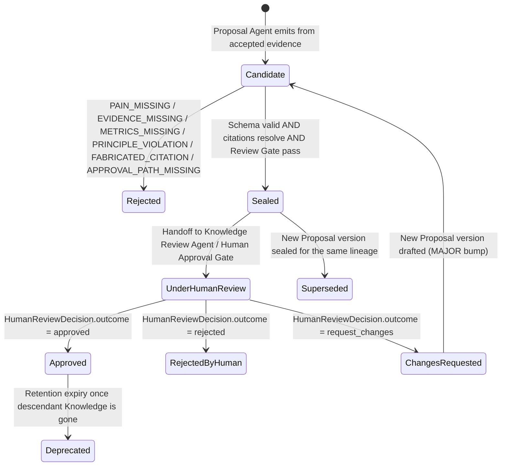

# Artifact: Proposal

**Version:** 2.0.0
**Status:** Canonical — Binding
**Artifact Type:** `Proposal`
**Schema:** [`/schemas/artifacts/proposal.schema.json`](../schemas/artifacts/proposal.schema.json)
**Envelope:** [`/schemas/common/artifact-envelope.schema.json`](../schemas/common/artifact-envelope.schema.json)
**Producers:** Proposal Agent — [contract](../contracts/agents/proposal-agent.md); Learning Agent (`kind=lesson`) — [contract](../contracts/agents/learning-agent.md)
**Consumers:** Knowledge Review Agent, Human Approval Gate — [contract](../contracts/agents/knowledge-review-agent.md); Markdown Agent — [contract](../contracts/agents/markdown-agent.md)
**Pipeline Stage:** Stage 3 — Proposal ([`/pipelines/knowledge-ingestion.md`](../pipelines/knowledge-ingestion.md#stage-3--proposal))
**Related:** [`/artifacts/validation-report.md`](./validation-report.md) · [`/artifacts/human-review-decision.md`](./human-review-decision.md)

---

## 1. Purpose

A `Proposal` converts validated evidence into **decision-ready options** addressing a stated pain (Constitution Article XII). It is the artifact a human approver actually reads at the Human Review gate. It never self-approves, and it never cites anything the Validation stage did not accept.

---

## 2. Definitions

| Term | Definition |
|------|------------|
| `kind` | `knowledge` (standard proposal feeding the ingestion pipeline) \| `lesson` (Learning Agent output feeding the same review path) \| `other`. |
| `pain_statement` | Required non-empty statement of who hurts and how — the Article XII litmus test. |
| `options[]` | ≥1 candidate option, each with `option_id`, `summary`, `tradeoffs`, optional `recommended` flag. |
| `success_metrics[]` | ≥1 measurable metric that would indicate the proposal succeeded if adopted. |
| `non_goals[]` | Explicit statement of what this proposal does **not** attempt — bounds scope creep at review time. |
| `citations[]` | Links from proposal claims to `evidence_id`s, each with a `citation_key`, the source `evidence_id`, and an optional `pointer`. |
| `requires_human_approval` | Boolean; `true` whenever adoption would authorize a downstream Knowledge Plane (SoR) mutation. |
| `validation_report_ref` | Pointer (`artifact_id`, `artifact_version`) to the sealed `ValidationReport` this proposal draws from. |
| `risks[]` | Optional free-text list of risks the proposal itself introduces if adopted. |

---

## 3. Scope

### In scope
- Framing a pain and proposing ≥1 option to address it, each with honest trade-offs.
- Measurable success criteria and explicit non-goals.
- Citing only `accepted` evidence from the referenced `ValidationReport`.
- Declaring whether adoption requires human approval.

### Out of scope
- Discovery or credibility judgment (Stages 1–2's job).
- Authoring the final Markdown knowledge unit (Stage 5's job — Markdown Agent drafts from an *approved* Proposal, it does not invent content).
- Self-approval — a `Proposal` is never itself an approval record; that is `HumanReviewDecision`'s exclusive role.

---

## 4. Responsibilities

| Actor | Responsibility |
|-------|-----------------|
| Proposal Agent / Learning Agent | Ground every option in `accepted` validation results; state pain, metrics, non-goals honestly; set `requires_human_approval` correctly; never fabricate a citation. |
| Harness | Validate schema and citation resolution against the referenced `ValidationReport`; seal on acceptance; route to Knowledge Review Agent / Human Approval Gate. |
| Knowledge Review Agent (consumer, Stage 4) | Package findings for human review without altering the sealed `Proposal`. |
| Human Approver (consumer, Stage 4) | Read the proposal as the primary decision surface; approve/reject/request_changes based on its content. |

---

## 5. Directory Layout

```
knowledge-plane/artifacts/proposal/{artifact_id}/{artifact_version}.json
knowledge-plane/artifacts/proposal/{artifact_id}/HEAD -> {artifact_version}.json
```

`artifact_id` prefix: `pr-`.

---

## 6. Naming Convention

- `artifact_id`: `pr-{ULID}`.
- `options[].option_id`: short slug unique within the proposal, e.g. `opt-a`, `opt-b`.
- `citations[].citation_key`: short slug unique within the proposal, e.g. `cit-01`; maps 1:1 to a `citations[].evidence_id` that must exist as an `accepted` result in the referenced `ValidationReport`.

---

## 7. Versioning

- `1.0.0` — first sealed proposal for a given pain/evidence combination.
- **MINOR** — an edit that keeps the same evidence lineage and pain framing but refines options/metrics/non-goals (e.g., responding to a Knowledge Review finding pre-approval, before the sealed candidate is submitted to the Human Approval Gate).
- **MAJOR** — a `request_changes` outcome from Human Review produces a *new* `Proposal` version with updated content; it never mutates the rejected/changed-requested sealed version in place (Harness Spec §9.2, Pipeline Stage 4 rule).
- A `rejected` outcome does not produce a new `Proposal` version automatically — a fresh proposal requires a new pipeline segment with updated inputs if pursued again.

---

## 8. Lifecycle



---

## 9. Retention Policy

Indefinite while any descendant `Knowledge` remains in the Knowledge Plane; otherwise 730 days from `created_at`. Rejected/expired proposals retain their full record indefinitely as part of the Decision Log per Constitution Article VII — retention here governs the *artifact body*, not the audit trail, which is separately append-only and retained per Trust & Control policy.

---

## 10. Workflow

```mermaid
sequenceDiagram
    participant Harness
    participant Proposal as Proposal Agent
    participant Store as Artifact Store
    participant Review as Knowledge Review Agent
    participant Human as Human Approver

    Harness->>Proposal: ADMIT with sealed ValidationReport + pain statement
    Proposal->>Store: fetch ValidationReport; filter to accepted evidence
    alt zero accepted evidence, no empty-evidence policy path
        Proposal-->>Harness: FAILED (EVIDENCE_MISSING)
    else evidence sufficient
        Proposal->>Proposal: draft options, tradeoffs, metrics, non_goals, citations
        Proposal->>Harness: emit candidate Proposal
        Harness->>Harness: validate schema + citation resolution + principle litmus
        Harness->>Store: seal pr-{id}@{version}
        Harness->>Review: handoff sealed Proposal (Stage 4 begins)
        Review->>Human: present package for approval
    end
```

---

## 11. Decision Rules

| Situation | Rule |
|-----------|------|
| Zero `accepted` evidence in referenced `ValidationReport` | Fail (`EVIDENCE_MISSING`) unless an explicit, policy-declared empty-evidence path applies (e.g., a proposal type that may proceed on first-principles reasoning with `requires_human_approval=true` and explicit disclosure) |
| A citation's `evidence_id` was `rejected` or `needs_human` in the `ValidationReport` | Forbidden — `FABRICATED_CITATION`-class failure; only `accepted` items may be cited |
| Proposal would authorize any SoR mutation if adopted | `requires_human_approval` **must** be `true` |
| Multiple viable options | Mark at most the genuinely preferred one(s) `recommended: true`; never mark all options recommended to avoid taking a position |
| Option lacks a measurable trade-off | Not schema-invalid by itself, but a Review Gate finding; strengthen before Human Review |

---

## 12. Validation

1. Envelope validation.
2. Payload validates against [`proposal.schema.json`](../schemas/artifacts/proposal.schema.json): `kind`, `pain_statement`, `options[]` (`minItems: 1`), `success_metrics[]` (`minItems: 1`), `non_goals[]`, `citations[]`, `requires_human_approval`, `validation_report_ref` all required.
3. Every `citations[].evidence_id` resolves to an `accepted` entry in the referenced `ValidationReport.results[]`.
4. `validation_report_ref` resolves to a sealed `ValidationReport`.
5. No Constitution or Product Principles violation detectable by policy checks (Article XII pain litmus, Article IX security-by-default, etc.).
6. Proposal Agent (or Learning Agent for `kind=lesson`) contract postconditions hold.

---

## 13. Examples

### 13.1 Full sealed artifact (standard `knowledge` proposal)

```json
{
  "artifact_id": "pr-01J8Z5S6T7U8V9W0X1Y2Z3A4B5",
  "artifact_version": "1.0.0",
  "artifact_type": "Proposal",
  "run_id": "run-01J8Z0X9W8V7U6T5S4R3Q2P1O0",
  "produced_by": "proposal-agent@1.0.0",
  "created_at": "2026-07-22T08:45:19Z",
  "digest": "sha256:f6071829a3b4c5d6e7f80912345678901234567890f01234567890abcdef",
  "tenancy": { "tenant_id": "tn-acme", "workspace_id": "ws-research" },
  "schema_version": "1.0.0",
  "parents": [
    { "artifact_id": "vr-01J8Z3P4Q5R6S7T8U9V0W1X2Y3", "artifact_version": "1.0.0", "artifact_type": "ValidationReport" }
  ],
  "payload": {
    "kind": "knowledge",
    "pain_statement": "Engineers building multi-agent retry logic re-derive backoff parameters from scratch each time, causing inconsistent, sometimes retry-storm-prone behavior across services.",
    "options": [
      {
        "option_id": "opt-a",
        "summary": "Publish a canonical jittered exponential backoff guideline with default ceilings per failure class.",
        "tradeoffs": "Low implementation cost; requires periodic review as failure taxonomy evolves.",
        "recommended": true
      },
      {
        "option_id": "opt-b",
        "summary": "Build a shared retry library instead of a guideline.",
        "tradeoffs": "Higher consistency but introduces a new dependency and maintenance burden; out of scope for a documentation-only knowledge unit.",
        "recommended": false
      }
    ],
    "success_metrics": [
      "Reduction in retry-storm incident reports citing missing backoff/jitter within 2 quarters.",
      "≥80% of new retry implementations reference the published guideline in code review within 1 quarter."
    ],
    "non_goals": [
      "Does not mandate a specific retry library or SDK.",
      "Does not cover distributed rate-limiting policy, only backoff/jitter guidance."
    ],
    "citations": [
      { "citation_key": "cit-01", "evidence_id": "ev-001", "pointer": "https://github.com/example-org/resilience-patterns/blob/8f3c2a1/docs/backoff.md" },
      { "citation_key": "cit-02", "evidence_id": "ev-002", "pointer": "https://aws.amazon.com/builders-library/timeouts-retries-and-backoff-with-jitter/" }
    ],
    "requires_human_approval": true,
    "validation_report_ref": {
      "artifact_id": "vr-01J8Z3P4Q5R6S7T8U9V0W1X2Y3",
      "artifact_version": "1.0.0"
    },
    "risks": [
      "Guideline could become stale if published without a review cadence."
    ]
  }
}
```

### 13.2 Lesson proposal (`kind=lesson`, Learning Agent)

```json
{
  "artifact_id": "pr-01J8Z6T7U8V9W0X1Y2Z3A4B5C6",
  "artifact_version": "1.0.0",
  "artifact_type": "Proposal",
  "run_id": "run-01J8Z6S6R5Q4P3O2N1M0L9K8J7",
  "produced_by": "learning-agent@1.0.0",
  "created_at": "2026-07-22T09:02:57Z",
  "digest": "sha256:071829a3b4c5d6e7f8091234567890123456789071234567890abcdefa1b2",
  "tenancy": { "tenant_id": "tn-acme", "workspace_id": "ws-ops" },
  "schema_version": "1.0.0",
  "parents": [
    { "artifact_id": "vr-01J8Z6R5Q4P3O2N1M0L9K8J7I6", "artifact_version": "1.0.0", "artifact_type": "ValidationReport" }
  ],
  "payload": {
    "kind": "lesson",
    "pain_statement": "Three consecutive incident postmortems show Embedding stage re-embed storms following bulk Knowledge edits, causing egress cost spikes.",
    "options": [
      {
        "option_id": "opt-a",
        "summary": "Adopt a debounce window before triggering re-embed jobs on rapid successive Knowledge versions.",
        "tradeoffs": "Slightly delays index freshness; materially reduces redundant Cloud AI Compute egress.",
        "recommended": true
      }
    ],
    "success_metrics": [
      "Re-embed job count per Knowledge edit burst reduced by ≥60% within 1 quarter."
    ],
    "non_goals": [
      "Does not change the Embedding Agent's chunking algorithm."
    ],
    "citations": [
      { "citation_key": "cit-01", "evidence_id": "ev-201", "pointer": "run-audit://run-01J8Z5.../incident-report-2026-07-15" }
    ],
    "requires_human_approval": true,
    "validation_report_ref": {
      "artifact_id": "vr-01J8Z6R5Q4P3O2N1M0L9K8J7I6",
      "artifact_version": "1.0.0"
    }
  }
}
```

---

## 14. Acceptance Criteria

- [ ] Schema-valid against `proposal.schema.json` and the shared envelope.
- [ ] `pain_statement` non-empty and states who hurts and how.
- [ ] `success_metrics[]` non-empty and measurable.
- [ ] `non_goals[]` present.
- [ ] Every citation resolves to an `accepted` evidence id in the referenced `ValidationReport`.
- [ ] `requires_human_approval` correctly reflects whether adoption authorizes an SoR mutation.
- [ ] No Constitution/Product Principles violation.
- [ ] Review Gate pass.

---

## 15. Failure Cases

| Code | Trigger | Outcome |
|------|---------|---------|
| `PAIN_MISSING` | Empty or missing `pain_statement` | Non-retryable; `FAILED` |
| `EVIDENCE_MISSING` | Zero `accepted` evidence and no valid empty-evidence path | Non-retryable; `FAILED` |
| `METRICS_MISSING` | Empty `success_metrics[]` | Non-retryable; `FAILED` |
| `PRINCIPLE_VIOLATION` | Fails Constitution/Product Principles litmus (e.g., Article XII pain test) | Non-retryable; `FAILED` |
| `FABRICATED_CITATION` | Citation references a non-`accepted` or nonexistent evidence id | Non-retryable; `FAILED` |
| `APPROVAL_PATH_MISSING` | Proposal would authorize SoR mutation but `requires_human_approval` is unset/false | Non-retryable; `FAILED` |
| Transient compute | Retryable per contract (max 2, backoff) | `WAITING_RETRY` → `RUNNING` |

---

## 16. Best Practices

- Write `pain_statement` in terms of a specific, identifiable hurting party — vague "users may benefit" language fails the Article XII litmus in spirit even if it passes schema validation.
- Keep `options[]` genuinely distinct — near-duplicate options with cosmetic differences waste a human approver's review budget.
- State `non_goals[]` aggressively; the tighter the scope, the faster and more confident the Human Review.
- Cross-check every `citation_key` against the `ValidationReport` before emission — a `FABRICATED_CITATION` failure this late in the pipeline is expensive to unwind.

---

## 17. Anti-Patterns

- Marking every option `recommended: true` to dodge taking a position.
- Padding `success_metrics[]` with unmeasurable aspirations ("improve developer happiness") instead of countable signals.
- Reusing a prior proposal's citations without re-checking they are still `accepted` in the *current* `ValidationReport` lineage.
- Setting `requires_human_approval=false` to skip review for a proposal that is, in substance, going to authorize a Knowledge Plane write via the downstream Markdown stage.

---

## 18. References

- [`/contracts/agents/proposal-agent.md`](../contracts/agents/proposal-agent.md)
- [`/contracts/agents/learning-agent.md`](../contracts/agents/learning-agent.md)
- [`/pipelines/knowledge-ingestion.md`](../pipelines/knowledge-ingestion.md#stage-3--proposal)
- [`/schemas/artifacts/proposal.schema.json`](../schemas/artifacts/proposal.schema.json)
- [`/CONSTITUTION.md`](../CONSTITUTION.md) — Article XII
- [`/artifacts/validation-report.md`](./validation-report.md) (upstream)
- [`/artifacts/human-review-decision.md`](./human-review-decision.md) (downstream)

**End of Artifact Spec: Proposal v2.0.0**
