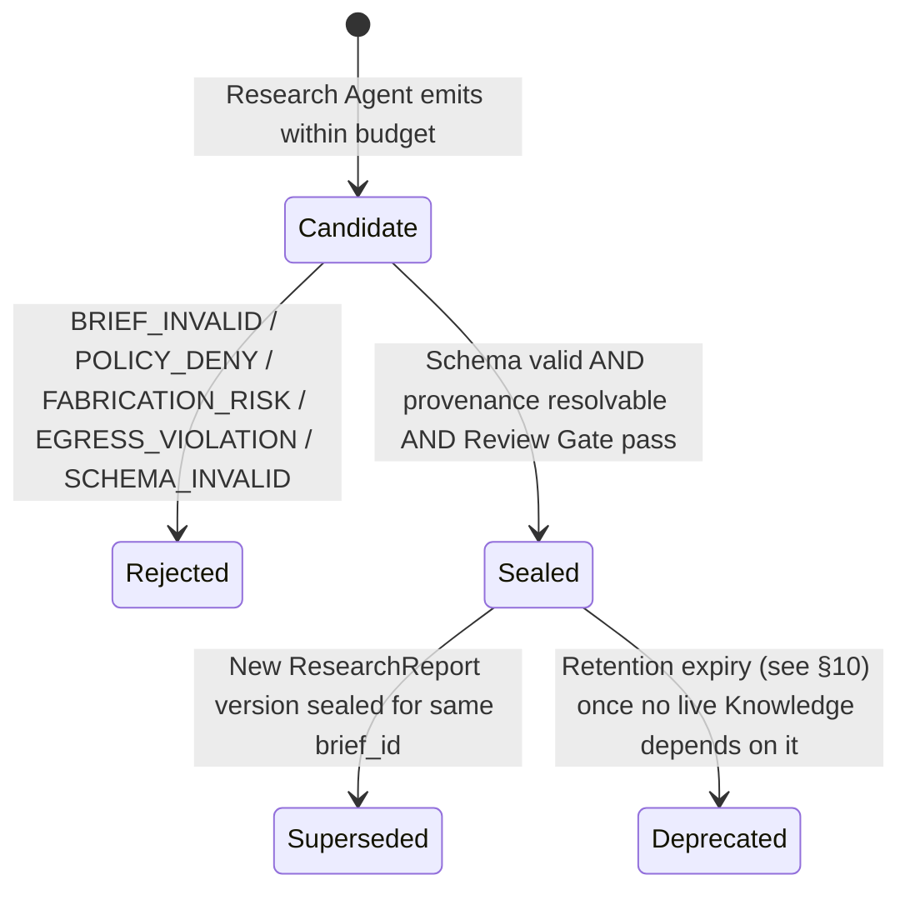
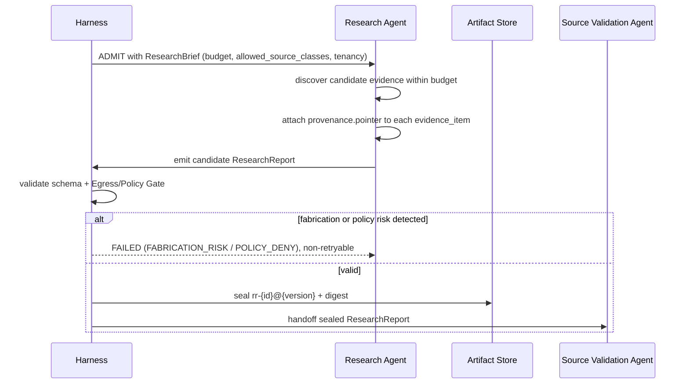

# Artifact: Research Report

**Version:** 2.0.0
**Status:** Canonical — Binding
**Artifact Type:** `ResearchReport`
**Schema:** [`/schemas/artifacts/research-report.schema.json`](../schemas/artifacts/research-report.schema.json)
**Envelope:** [`/schemas/common/artifact-envelope.schema.json`](../schemas/common/artifact-envelope.schema.json)
**Producer:** Research Agent — [contract](../contracts/agents/research-agent.md)
**Consumer:** Source Validation Agent — [contract](../contracts/agents/source-validation-agent.md)
**Pipeline Stage:** Stage 1 — Research ([`/pipelines/knowledge-ingestion.md`](../pipelines/knowledge-ingestion.md#stage-1--research))
**Related:** [`/artifacts/README.md`](./README.md) · [`/artifacts/validation-report.md`](./validation-report.md)

---

## 1. Purpose

A `ResearchReport` is the immutable output of the Research stage: a pack of **candidate evidence** collected in response to a `ResearchBrief`. It exists to give the Source Validation Agent something concrete, provenance-bearing, and bounded to judge — nothing more. It deliberately stops short of asserting truth, ranking sources, or recommending action.

---

## 2. Definitions

| Term | Definition |
|------|------------|
| `ResearchBrief` | The run-bootstrap input to the Research stage: `question`, `scope`, `constraints`, `allowed_source_classes`, `budget`, `run_id`, `tenancy`. Not a sealed Knowledge Plane artifact. |
| `brief_ref` | Pointer from the report back to the brief it answers (`brief_id`, `question`). |
| `evidence_item` | One candidate piece of evidence: an `evidence_id`, a `source_class`, a `provenance.pointer`, and optional `title`, `excerpt`, `signal_tier`. |
| `source_class` | Category of origin: `youtube`, `github`, `reddit`, `web`, `other`. Drives downstream policy/egress and rubric weighting. |
| `signal_tier` | Producer's own confidence label for an item: `primary`, `secondary`, `community`, `unknown`. Advisory only — not a validation verdict. |
| `coverage_gaps` | Explicit statements of what the brief asked for that the report could not answer, given budget/policy/availability limits. |
| `open_questions` | Follow-up questions surfaced during research that the brief did not anticipate. |
| `provenance.pointer` | A resolvable locator (URL, repo path + commit, or other retrievable reference) for the evidence item. Never a fabricated or inferred pointer. |

---

## 3. Scope

### In scope
- Discovery and collection of candidate evidence across `allowed_source_classes`.
- Explicit statement of what could not be covered (`coverage_gaps`) and what remains unresolved (`open_questions`).
- Provenance capture sufficient for independent verification by the next stage.

### Out of scope
- **Credibility judgment** — belongs to `ValidationReport` (Stage 2).
- **Recommendation or synthesis** — belongs to `Proposal` (Stage 3). A `ResearchReport` containing a recommendation section is non-conformant (Research Agent contract postcondition).
- **Knowledge Plane writes** — the Research Agent never authorizes SoR mutation.

---

## 4. Responsibilities

| Actor | Responsibility |
|-------|-----------------|
| Research Agent | Discover evidence within `budget`; attach resolvable provenance to every item; declare gaps and open questions honestly; never fabricate a pointer to hit a coverage target. |
| Harness | Validate schema; enforce Egress/Policy Gate for declared `allowed_source_classes`; seal on acceptance; record handoff to Source Validation Agent. |
| Source Validation Agent (consumer) | Treat every item as **unverified**; apply rubric independently; never assume `signal_tier` implies acceptance. |

---

## 5. Directory Layout

```
knowledge-plane/artifacts/research-report/{artifact_id}/{artifact_version}.json
knowledge-plane/artifacts/research-report/{artifact_id}/HEAD -> {artifact_version}.json
```

`artifact_id` prefix: `rr-` (see [`/artifacts/README.md`](./README.md#8-naming-convention)).

---

## 6. Naming Convention

- `artifact_id`: `rr-{ULID}`, assigned by the Research Agent at candidate creation.
- `evidence_id`: producer-assigned slug unique within the report, e.g. `ev-001`, `ev-github-014`. Stable across the pipeline — the same `evidence_id` string is what `ValidationReport.results[].evidence_id` and, transitively, `Knowledge.claim_provenance[].citation_keys` will reference by chain.
- `brief_ref.brief_id`: `brief-{ULID}`, generated at run bootstrap, not itself a sealed artifact.

---

## 7. Versioning

- `1.0.0` — first sealed report for a given `brief_id`.
- **MINOR** — same brief, additional evidence gathered after a `coverage_gaps` follow-up (e.g., a re-run with expanded `allowed_source_classes`); `parents[]` includes the prior `ResearchReport` version.
- **MAJOR** — materially different brief scope or question re-framing (rare; typically a new `brief_id` instead).
- Corrections never patch a sealed report; a factual correction produces a new version with updated `evidence_items[]` and an explicit note in `open_questions` about what changed and why.

---

## 8. Lifecycle



---

## 9. Retention Policy

400 days from `created_at`, **or** the life of any `Knowledge` artifact whose provenance chain traces back to this report — whichever is longer. See [`/artifacts/README.md#11-retention-policy`](./README.md#11-retention-policy). Superseded versions are retained for the same window as the current `HEAD`.

---

## 10. Workflow



---

## 11. Decision Rules

| Situation | Rule |
|-----------|------|
| Budget exhausted with zero usable evidence | Emit an explicit empty pack with populated `coverage_gaps` — do not fabricate items to appear complete; this is a valid, sealable report, not a failure by default (see Failure Cases for the exception) |
| Source class outside `allowed_source_classes` found | Exclude the item entirely; note the exclusion in `open_questions` if material |
| `provenance.pointer` cannot be independently resolved | Drop the item — a candidate evidence item is never included without a resolvable pointer |
| Ambiguous `signal_tier` | Use `unknown`; never guess `primary` to appear stronger |
| Duplicate content from two source classes | Include both with distinct `evidence_id`s; let the Source Validation Agent's rubric decide precedence |

---

## 12. Validation

1. Envelope validation (see [`/artifacts/README.md#12-validation`](./README.md#12-validation)).
2. Payload validates against [`research-report.schema.json`](../schemas/artifacts/research-report.schema.json): `brief_ref`, `evidence_items[]`, `coverage_gaps[]`, `open_questions[]` all required (empty arrays are valid for the latter three).
3. Every `evidence_items[].provenance.pointer` resolves.
4. No `evidence_items[].source_class` outside the brief's `allowed_source_classes`.
5. No recommendation/synthesis section present in the payload (contract postcondition).
6. Research Agent contract postconditions (`/contracts/agents/research-agent.md`) hold in full.

---

## 13. Examples

### 13.1 Full sealed artifact (envelope + payload)

```json
{
  "artifact_id": "rr-01J8Z1A2B3C4D5E6F7G8H9J0K1",
  "artifact_version": "1.0.0",
  "artifact_type": "ResearchReport",
  "run_id": "run-01J8Z0X9W8V7U6T5S4R3Q2P1O0",
  "produced_by": "research-agent@1.0.0",
  "created_at": "2026-07-22T08:02:11Z",
  "digest": "sha256:a1b2c3d4e5f60718293a4b5c6d7e8f9012345678901234567890abcdef01234",
  "tenancy": { "tenant_id": "tn-acme", "workspace_id": "ws-research" },
  "schema_version": "1.0.0",
  "parents": [],
  "payload": {
    "brief_ref": {
      "brief_id": "brief-01J8Z0W7V6U5T4S3R2Q1P0O9N8",
      "question": "What are the current best practices for retry backoff in multi-agent pipelines?"
    },
    "evidence_items": [
      {
        "evidence_id": "ev-001",
        "source_class": "github",
        "title": "exponential-backoff: reference implementation and rationale",
        "excerpt": "Jittered exponential backoff avoids thundering-herd retries after transient failures.",
        "provenance": {
          "pointer": "https://github.com/example-org/resilience-patterns/blob/8f3c2a1/docs/backoff.md",
          "retrieved_at": "2026-07-22T07:41:03Z"
        },
        "signal_tier": "primary"
      },
      {
        "evidence_id": "ev-002",
        "source_class": "web",
        "title": "AWS Architecture Blog — Timeouts, retries, and backoff with jitter",
        "excerpt": "Recommends capped exponential backoff with full jitter for distributed retries.",
        "provenance": {
          "pointer": "https://aws.amazon.com/builders-library/timeouts-retries-and-backoff-with-jitter/",
          "retrieved_at": "2026-07-22T07:44:29Z"
        },
        "signal_tier": "primary"
      },
      {
        "evidence_id": "ev-003",
        "source_class": "reddit",
        "title": "r/programming discussion thread on retry storms",
        "excerpt": "Community anecdotes on retry storms causing cascading outages without jitter.",
        "provenance": {
          "pointer": "https://reddit.com/r/programming/comments/abc123/retry_storms/",
          "retrieved_at": "2026-07-22T07:50:12Z"
        },
        "signal_tier": "community"
      }
    ],
    "coverage_gaps": [
      "No primary evidence found for retry behavior specific to gRPC streaming APIs within budget."
    ],
    "open_questions": [
      "Should retry ceilings differ between compute-bound and I/O-bound agent invocations?"
    ]
  }
}
```

### 13.2 Explicit empty pack (valid, not a failure)

```json
{
  "artifact_id": "rr-01J8Z2M3N4O5P6Q7R8S9T0U1V2",
  "artifact_version": "1.0.0",
  "artifact_type": "ResearchReport",
  "run_id": "run-01J8Z2L2K1J0I9H8G7F6E5D4C3",
  "produced_by": "research-agent@1.0.0",
  "created_at": "2026-07-22T08:10:44Z",
  "digest": "sha256:b2c3d4e5f6071829a3b4c5d6e7f809123456789012345678901bcdef012345",
  "tenancy": { "tenant_id": "tn-acme", "workspace_id": "ws-research" },
  "schema_version": "1.0.0",
  "parents": [],
  "payload": {
    "brief_ref": {
      "brief_id": "brief-01J8Z2K1J0I9H8G7F6E5D4C3B2",
      "question": "What is Acme Corp's internal Q3 2031 roadmap for feature X?"
    },
    "evidence_items": [],
    "coverage_gaps": [
      "Question requires access to a private, unindexed internal source outside allowed_source_classes.",
      "Budget exhausted after exhausting all public source classes with zero relevant hits."
    ],
    "open_questions": [
      "Should the brief be re-scoped to permit an internal-document source class in a follow-up run?"
    ]
  }
}
```

---

## 14. Acceptance Criteria

- [ ] Schema-valid against `research-report.schema.json` and the shared envelope.
- [ ] Every evidence item carries a resolvable `provenance.pointer`; zero fabricated pointers.
- [ ] `coverage_gaps[]` is non-empty whenever the brief's scope was not fully addressed.
- [ ] No recommendation, synthesis, or acceptance-judgment content present.
- [ ] Budget respected — no evidence collection beyond the declared `budget`.
- [ ] Review Gate pass (Harness Spec §10).

---

## 15. Failure Cases

| Code | Trigger | Outcome |
|------|---------|---------|
| `BRIEF_INVALID` | `ResearchBrief` missing required fields or unresolvable `tenancy` | Non-retryable; `FAILED` |
| `POLICY_DENY` | Egress/Policy Gate denies a declared source class | Non-retryable; `FAILED` |
| `BUDGET_EXHAUSTED_EMPTY` | Budget exhausted **and** the agent attempts to pad the report with unresolvable or low-confidence filler to appear complete | Non-retryable; `FAILED` — note: an honest empty pack with populated `coverage_gaps` (§13.2) is *not* this failure; this failure is specifically about padding/fabrication under pressure |
| `FABRICATION_RISK` | A provenance pointer cannot be independently resolved or was synthesized | Non-retryable; `FAILED` |
| `EGRESS_VIOLATION` | Retrieval attempted against a source outside policy/egress allowance | Non-retryable; `FAILED`; Trust & Control incident if repeated |
| `SCHEMA_INVALID` | Payload fails schema validation | Non-retryable; `FAILED` |
| Transient fetch/rate-limit | Retryable per Research Agent contract (max 3, exponential backoff) | `WAITING_RETRY` → `RUNNING` |

---

## 16. Best Practices

- Prefer fewer, well-provenanced items over many low-confidence ones — the Source Validation Agent's rubric penalizes unresolvable provenance harder than it penalizes low coverage.
- Populate `signal_tier` honestly; it is advisory, but a pattern of mislabeling erodes downstream trust-tier calibration.
- Write `coverage_gaps` and `open_questions` as if a human reviewer will read them directly — because Notification Agent and Human Approver dashboards eventually do.
- Keep `evidence_id` values short, stable, and referenced nowhere else in free text — they are the join key for the entire downstream provenance chain.

---

## 17. Anti-Patterns

- Inventing a plausible-looking URL or file path to "fill" an evidence item.
- Including a recommendation ("we should adopt X") — that is the Proposal Agent's job, and doing it here contaminates separation of concerns and fails the postcondition check.
- Silently dropping a source class not because it's out of policy, but because it was inconvenient to fetch — this belongs in `coverage_gaps`, not omission.
- Reusing an `evidence_id` across two different reports for unrelated content — breaks lineage assumptions in downstream artifacts.

---

## 18. References

- [`/contracts/agents/research-agent.md`](../contracts/agents/research-agent.md)
- [`/pipelines/knowledge-ingestion.md`](../pipelines/knowledge-ingestion.md#stage-1--research)
- [`/schemas/artifacts/research-report.schema.json`](../schemas/artifacts/research-report.schema.json)
- [`/artifacts/README.md`](./README.md)
- [`/artifacts/validation-report.md`](./validation-report.md) (downstream consumer artifact)

**End of Artifact Spec: Research Report v2.0.0**
