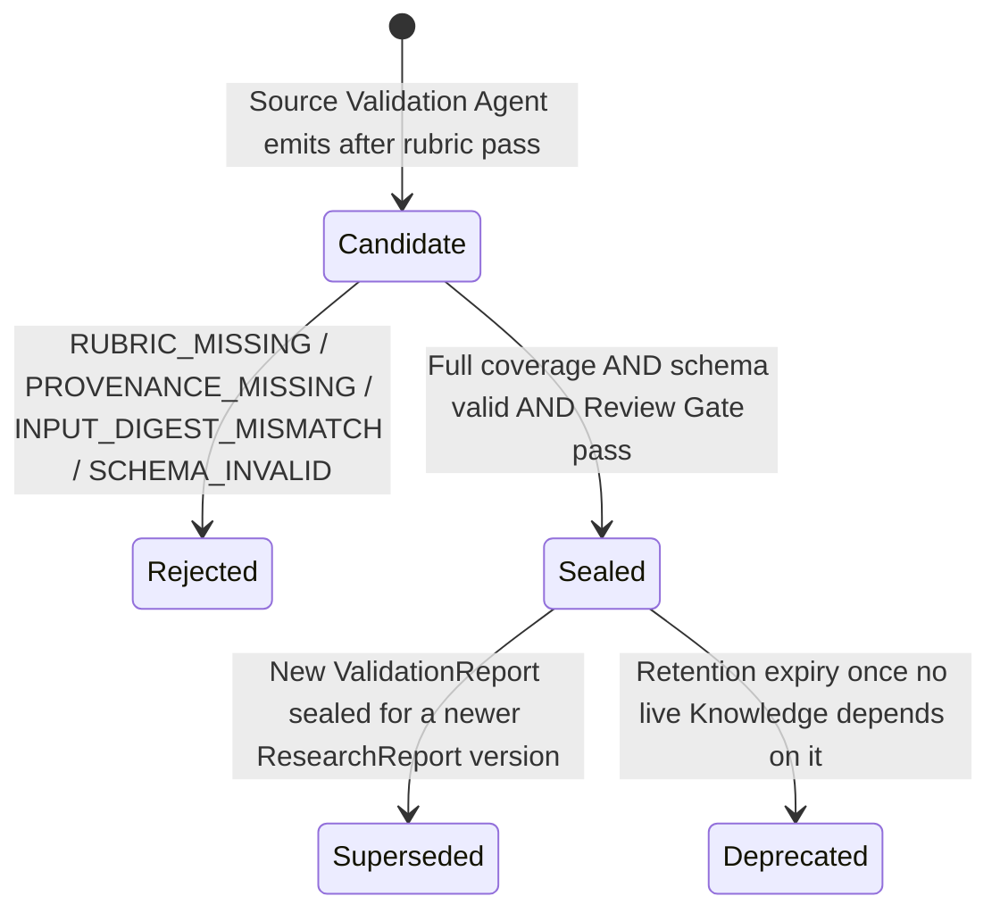
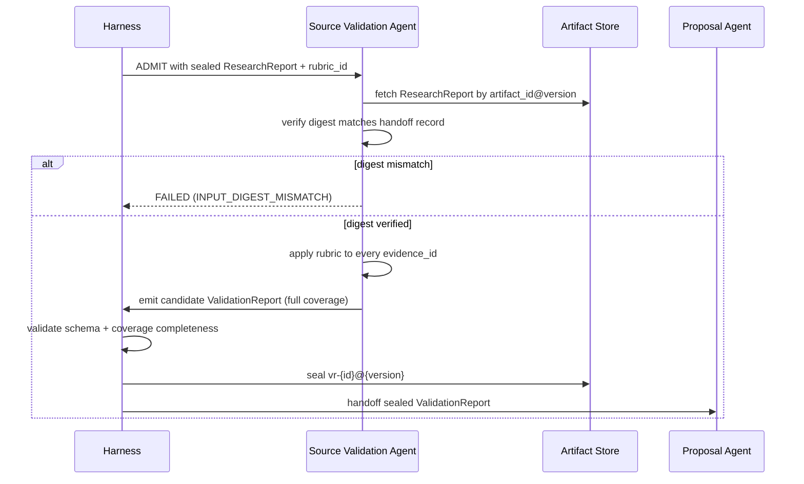

# Artifact: Validation Report

**Version:** 2.0.0
**Status:** Canonical — Binding
**Artifact Type:** `ValidationReport`
**Schema:** [`/schemas/artifacts/validation-report.schema.json`](../schemas/artifacts/validation-report.schema.json)
**Envelope:** [`/schemas/common/artifact-envelope.schema.json`](../schemas/common/artifact-envelope.schema.json)
**Producer:** Source Validation Agent — [contract](../contracts/agents/source-validation-agent.md)
**Consumer:** Proposal Agent — [contract](../contracts/agents/proposal-agent.md)
**Pipeline Stage:** Stage 2 — Validation ([`/pipelines/knowledge-ingestion.md`](../pipelines/knowledge-ingestion.md#stage-2--validation))
**Related:** [`/artifacts/research-report.md`](./research-report.md) · [`/artifacts/proposal.md`](./proposal.md)

---

## 1. Purpose

A `ValidationReport` is the immutable, per-source acceptance judgment applied against a sealed `ResearchReport`. It is the single point in the pipeline where credibility, provenance fitness, and safety are judged — separated deliberately from both collection (Research) and recommendation (Proposal). No evidence item may reach a `Proposal` without first passing through this gate.

---

## 2. Definitions

| Term | Definition |
|------|------------|
| `research_report_ref` | Pointer (`artifact_id`, `artifact_version`, `digest`) to the exact sealed `ResearchReport` under judgment. |
| `rubric_id` | Identifier of the `ValidationRubric` applied — the versioned, declared criteria set used to reach each verdict. |
| `results[]` | One entry per input `evidence_id`, each carrying `status`, `rationale`, `trust_tier`, and optional `risk_flags[]`. |
| `status` | Verdict enum: `accepted` \| `rejected` \| `needs_human`. |
| `trust_tier` | Calibrated confidence enum: `high` \| `medium` \| `low` \| `untrusted`. Independent from the producer's advisory `signal_tier` on the source `ResearchReport`. |
| `needs_human` | Verdict for high-impact ambiguity that the rubric cannot resolve automatically; escalates rather than guesses. |
| `risk_flags[]` | Free-text markers (e.g., `"outdated"`, `"conflicting-with-ev-004"`, `"paywalled-unverifiable"`) attached to a result for downstream transparency. |

---

## 3. Scope

### In scope
- A verdict for **every** `evidence_id` present in the input `ResearchReport` — full coverage, no silent omissions.
- Rationale for every non-`accepted` verdict.
- Escalation of ambiguous, high-impact items to `needs_human` rather than forced binary acceptance/rejection.

### Out of scope
- Discovering new evidence (belongs to Research, Stage 1).
- Synthesizing recommendations or trade-offs from accepted evidence (belongs to Proposal, Stage 3).
- Overriding a rejected item because it would be "convenient" for the proposal — that decision belongs to a human, via `needs_human`, never to silent promotion.

---

## 4. Responsibilities

| Actor | Responsibility |
|-------|-----------------|
| Source Validation Agent | Apply the declared rubric consistently; cover 100% of input evidence ids; write a rationale for every non-accept; escalate ambiguity rather than force a verdict. |
| Harness | Verify input `research_report_ref.digest` matches the sealed `ResearchReport` before admitting the invocation; validate schema; seal on acceptance. |
| Proposal Agent (consumer) | Cite only `accepted` evidence ids; treat `needs_human` items as unusable until a human resolves them via a separate escalation path; never cite `rejected` items. |

---

## 5. Directory Layout

```
knowledge-plane/artifacts/validation-report/{artifact_id}/{artifact_version}.json
knowledge-plane/artifacts/validation-report/{artifact_id}/HEAD -> {artifact_version}.json
```

`artifact_id` prefix: `vr-`.

---

## 6. Naming Convention

- `artifact_id`: `vr-{ULID}`.
- `rubric_id`: `rubric-{slug}-{version}`, e.g. `rubric-general-source-credibility-1.2.0`. Rubrics are governed content, versioned independently of this artifact.
- `results[].evidence_id`: **must exactly match** an `evidence_id` from the referenced `ResearchReport` — no renaming, no reformatting.

---

## 7. Versioning

- `1.0.0` — first validation pass over a given sealed `ResearchReport` version.
- **New `ValidationReport` (not a version bump of the old one)** — re-validation of a **new** `ResearchReport` version always produces a *new* `ValidationReport` artifact lineage (new `artifact_id`), because `research_report_ref` is immutable-scoped per report version.
- **MINOR** on the same `artifact_id` — a rubric update that re-scores the same input report without changing evidence coverage (e.g., a `needs_human` item resolved after human input arrives, if policy allows re-emission under the same lineage rather than a fresh id — implementation MUST choose one convention per rubric and document it in the rubric's own governance record).
- **MAJOR** — rare; a wholesale rubric replacement materially changing verdict criteria for the same input.

---

## 8. Lifecycle



---

## 9. Retention Policy

400 days from `created_at`, or the life of any `Knowledge` artifact tracing provenance through this report — whichever is longer. See [`/artifacts/README.md#11-retention-policy`](./README.md#11-retention-policy).

---

## 10. Workflow



---

## 11. Decision Rules

| Situation | Rule |
|-----------|------|
| Evidence item provenance unresolvable at validation time (link now dead) | `rejected`, rationale states unresolvable provenance; never silently drop the entry |
| Two evidence items conflict materially | Flag both with `risk_flags`; do not unilaterally pick a winner unless rubric explicitly ranks source classes for this conflict type; otherwise escalate `needs_human` |
| High-impact claim (safety, legal, financial) with any ambiguity | `needs_human`, regardless of how confident the rubric heuristic is |
| Evidence class disallowed by policy at validation time (policy changed since research) | `rejected`, rationale cites policy change |
| All evidence items rejected | Valid, sealable `ValidationReport` — the Proposal stage handles zero-accepted-evidence via its own precondition/failure path, not by this stage inventing an acceptance |

---

## 12. Validation

1. Envelope validation (see [`/artifacts/README.md#12-validation`](./README.md#12-validation)).
2. Payload validates against [`validation-report.schema.json`](../schemas/artifacts/validation-report.schema.json): `research_report_ref`, `rubric_id`, `results[]` (`minItems: 1`) required.
3. `research_report_ref.digest` matches the stored `ResearchReport`'s sealed digest exactly.
4. `results[]` covers every `evidence_id` present in the referenced `ResearchReport.evidence_items[]` — no fewer, no extras.
5. Every `results[]` entry with `status != accepted` carries a non-empty `rationale`.
6. Source Validation Agent contract postconditions hold (`/contracts/agents/source-validation-agent.md`).

---

## 13. Examples

### 13.1 Full sealed artifact

```json
{
  "artifact_id": "vr-01J8Z3P4Q5R6S7T8U9V0W1X2Y3",
  "artifact_version": "1.0.0",
  "artifact_type": "ValidationReport",
  "run_id": "run-01J8Z0X9W8V7U6T5S4R3Q2P1O0",
  "produced_by": "source-validation-agent@1.0.0",
  "created_at": "2026-07-22T08:20:05Z",
  "digest": "sha256:c3d4e5f6071829a3b4c5d6e7f809123456789012345678901cdef01234567",
  "tenancy": { "tenant_id": "tn-acme", "workspace_id": "ws-research" },
  "schema_version": "1.0.0",
  "parents": [
    { "artifact_id": "rr-01J8Z1A2B3C4D5E6F7G8H9J0K1", "artifact_version": "1.0.0", "artifact_type": "ResearchReport" }
  ],
  "payload": {
    "research_report_ref": {
      "artifact_id": "rr-01J8Z1A2B3C4D5E6F7G8H9J0K1",
      "artifact_version": "1.0.0",
      "digest": "sha256:a1b2c3d4e5f60718293a4b5c6d7e8f9012345678901234567890abcdef01234"
    },
    "rubric_id": "rubric-general-source-credibility-1.2.0",
    "results": [
      {
        "evidence_id": "ev-001",
        "status": "accepted",
        "rationale": "Primary-source technical documentation with maintained repository history; provenance verified.",
        "trust_tier": "high",
        "risk_flags": []
      },
      {
        "evidence_id": "ev-002",
        "status": "accepted",
        "rationale": "Vendor engineering blog from a recognized, maintained source with consistent external corroboration.",
        "trust_tier": "high",
        "risk_flags": []
      },
      {
        "evidence_id": "ev-003",
        "status": "rejected",
        "rationale": "Anonymous community thread with no independently verifiable claims; used only as corroborating anecdote, insufficient for citation.",
        "trust_tier": "untrusted",
        "risk_flags": ["community-anecdote", "no-independent-corroboration"]
      }
    ]
  }
}
```

### 13.2 Escalation example (`needs_human`)

```json
{
  "artifact_id": "vr-01J8Z4R5S6T7U8V9W0X1Y2Z3A4",
  "artifact_version": "1.0.0",
  "artifact_type": "ValidationReport",
  "run_id": "run-01J8Z4Q4P3O2N1M0L9K8J7I6H5",
  "produced_by": "source-validation-agent@1.0.0",
  "created_at": "2026-07-22T08:33:41Z",
  "digest": "sha256:d4e5f6071829a3b4c5d6e7f809123456789012345678901def0123456789a",
  "tenancy": { "tenant_id": "tn-acme", "workspace_id": "ws-legal" },
  "schema_version": "1.0.0",
  "parents": [
    { "artifact_id": "rr-01J8Z4P3O2N1M0L9K8J7I6H5G4", "artifact_version": "1.0.0", "artifact_type": "ResearchReport" }
  ],
  "payload": {
    "research_report_ref": {
      "artifact_id": "rr-01J8Z4P3O2N1M0L9K8J7I6H5G4",
      "artifact_version": "1.0.0",
      "digest": "sha256:e5f6071829a3b4c5d6e7f8091234567890123456789012ef0123456789ab"
    },
    "rubric_id": "rubric-legal-compliance-1.0.0",
    "results": [
      {
        "evidence_id": "ev-101",
        "status": "needs_human",
        "rationale": "Claim touches jurisdiction-specific compliance language that the rubric cannot resolve automatically; requires legal review before acceptance.",
        "trust_tier": "medium",
        "risk_flags": ["legal-impact", "jurisdiction-ambiguous"]
      }
    ]
  }
}
```

---

## 14. Acceptance Criteria

- [ ] Schema-valid against `validation-report.schema.json` and the shared envelope.
- [ ] Full coverage of every input evidence id — none missing, none invented.
- [ ] No `accepted` item lacks a resolvable provenance pointer on the underlying evidence.
- [ ] Every non-`accepted` result carries a rationale.
- [ ] High-impact ambiguity is escalated (`needs_human`), never force-resolved.
- [ ] Review Gate pass.

---

## 15. Failure Cases

| Code | Trigger | Outcome |
|------|---------|---------|
| `RUBRIC_MISSING` | Declared `rubric_id` does not resolve to a governed rubric | Non-retryable; `FAILED` |
| `PROVENANCE_MISSING` | An `accepted` verdict would be issued on an item lacking resolvable provenance | Non-retryable; `FAILED` |
| `INPUT_DIGEST_MISMATCH` | `research_report_ref.digest` does not match the stored sealed `ResearchReport` | Non-retryable; `FAILED` |
| `SCHEMA_INVALID` | Payload fails schema validation | Non-retryable; `FAILED` |
| `POLICY_DENY` | Rubric application blocked by policy for this tenancy/source-class combination | Non-retryable; `FAILED` |
| Transient compute | Retryable per contract (max 3, backoff) | `WAITING_RETRY` → `RUNNING` |

---

## 16. Best Practices

- Write rationales for a human audience — they are read directly during Human Review and incident postmortems.
- Keep `trust_tier` calibrated against a stable rubric definition, not the producer's own `signal_tier` label; treat the two as independent axes.
- When in doubt between `rejected` and `needs_human`, prefer `needs_human` for anything with real-world consequence — Constitution Article IX (Security by Default) and Article III (Human Approval) both favor escalation over false confidence.
- Batch `risk_flags` with short, greppable strings (`"outdated"`, `"paywalled"`) rather than long prose, so downstream tooling can aggregate risk patterns across reports.

---

## 17. Anti-Patterns

- Marking an item `accepted` because rejecting it would leave the Proposal stage with insufficient evidence — the evidence shortage is the Proposal stage's problem to surface, not this stage's problem to paper over.
- Leaving `rationale` empty or generic ("looks fine") on a non-accept.
- Silently excluding an evidence id instead of assigning it a verdict.
- Treating `needs_human` as a dead end — it must have a defined escalation path (Notification Agent → Human Approver), not just a status that never resolves.

---

## 18. References

- [`/contracts/agents/source-validation-agent.md`](../contracts/agents/source-validation-agent.md)
- [`/pipelines/knowledge-ingestion.md`](../pipelines/knowledge-ingestion.md#stage-2--validation)
- [`/schemas/artifacts/validation-report.schema.json`](../schemas/artifacts/validation-report.schema.json)
- [`/artifacts/research-report.md`](./research-report.md) (upstream)
- [`/artifacts/proposal.md`](./proposal.md) (downstream)

**End of Artifact Spec: Validation Report v2.0.0**
