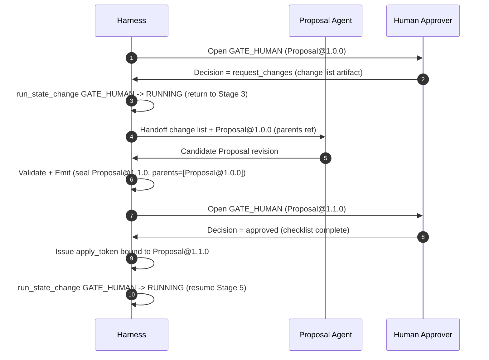

# DYOGAS Harness Specification

**Version:** 2.0.0
**Status:** Binding — Execution Law
**Effective:** 2026-07-22
**Owner:** Chief Systems Architect
**Supersedes:** Harness Specification v1.0.0 (completeness rewrite; all binding rules preserved and expanded)
**Related:** [`/CONSTITUTION.md`](../CONSTITUTION.md) Article XIII, [`/docs/ARCHITECTURE.md`](../docs/ARCHITECTURE.md), [`/contracts`](../contracts), [`/pipelines`](../pipelines), [`/artifacts`](../artifacts), [`/schemas`](../schemas), [`SKILL_SPECIFICATION.md`](./SKILL_SPECIFICATION.md), [`ADR-0010`](../docs/adr/0010-pipeline-execution-host.md), [`execution-host/`](../execution-host/)

---

## Purpose

This document is the **complete execution law** for how multi-agent work runs in DYOGAS. It defines the Pipeline Engine, the Agent Lifecycle, the State Machine (with every transition — legal and illegal — and every timeout), Artifact Flow, the Handoff Protocol, Retry Rules, Failure Recovery, Human Approval Gates, Review Gates, Acceptance Criteria, the Audit Trail event catalog, and Versioning rules. It exists so that no pipeline, contract, or ad hoc script needs to (or may) invent its own execution semantics — this is the one place execution semantics are defined, per Constitution Article I (Single Source of Truth) and Article XIII (Harness-First Execution).

Every rule in this document is binding. Sections marked "(illustrative)" for diagrams are non-normative visualizations of the normative rules stated in prose and tables — the prose and tables are the law; the diagrams are a memory aid.

## Global Definitions

| Term | Definition |
|------|------------|
| **Harness** | The sole production execution **law** for multi-agent work: Pipeline Engine semantics + Agent Lifecycle + State Machine + Handoff Protocol + Retry Policy + Failure Recovery + Human Approval Gates + Review Gates + Audit Trail. Defined in this document. |
| **Pipeline Engine (role)** | The Harness responsibility that schedules stages, validates handoffs, enforces gates, applies retry policy, and emits audit events. **Law** is this Spec; **software implementation** is `MOD-EXECUTION-HOST` (`@dyogas/execution-host`, ADR-0010). |
| **Execution Host** | Platform module that implements the Pipeline Engine role by composing Runtime + Agent SDK + `/pipelines` under this Spec. Does not redefine Harness law. |
| **Runtime** | Platform module (`MOD-RUNTIME`) providing execution **primitives**: admit, state transitions, seal/handoff, retry helpers, audit sink attach. Consumed by Execution Host. |
| **Agent SDK** | Platform module (`MOD-AGENT-SDK`) for contract bind, skill invoke, candidate emit. Does not orchestrate pipelines. |
| **Pipeline Run** | One execution instance of a named, versioned pipeline, identified by a `run_id`, pinned to specific pipeline/contract/schema versions at creation. |
| **Stage** | A named step in a pipeline with exactly one producer (agent or human gate), a declared primary consumer, and explicit Exit Criteria. |
| **Invocation** | One attempt by one agent (or human gate) to execute within a stage; a stage may have multiple invocations across retries. |
| **Handoff** | The Harness-mediated, schema-gated transfer of a sealed artifact from a producing stage to a consuming stage. |
| **Gate** | A checkpoint the Harness evaluates before allowing advancement: either a **Review Gate** (automated) or a **Human Approval Gate** (attributable human decision). |
| **Artifact** | A structured, schema-validated deliverable. **Candidate** while still mutable within an incomplete `EMITTING` phase; **sealed/immutable** once accepted, carrying `artifact_id`, `artifact_version`, and content `digest`. |
| **Apply token** | A single-use authorization, bound to one `artifact_id@version`, issued only on a Human Approval Gate `approved` outcome, required for any Knowledge Plane SoR apply that a pipeline spec marks as requiring one. |
| **Fail closed** | On ambiguity, missing authorization, or detected risk, the Harness stops the run/invocation and denies further progress rather than proceeding optimistically. |
| **Tenancy** | The isolation boundary between distinct customers/organizations/workspaces that the Harness must never allow a handoff, retry, or gate decision to cross without explicit authorization. |

## Scope

This specification governs every pipeline run, every agent invocation launched through the Harness, every artifact handoff, every retry, every failure, every Human Approval Gate, and every audit event, for all pipelines defined under `/pipelines`. It does not define any specific agent's role or I/O (`/contracts`), any specific pipeline's stage topology (`/pipelines`), any specific artifact's field-level meaning (`/artifacts`, `/schemas`), or any specific skill's internal procedure (`SKILL_SPECIFICATION.md`) — those layers reference and must comply with this one.

## Responsibilities

| Role | Responsibility |
|------|-----------------|
| **Harness (as a system)** | Sole admitting authority for pipeline runs and agent invocations; sole issuer of apply tokens; sole writer of Audit Trail events; enforces every rule in this document without exception, including under operational pressure. |
| **Chief Systems Architect (Owner)** | Maintains this specification; approves amendments; is the escalation point for interpretation disputes about execution semantics. |
| **Agent Contract Owners** | Ensure their contract's retry strategy, preconditions, and postconditions are expressible under this specification's State Machine and Retry Rules. |
| **Pipeline Authors** | Ensure every stage's Exit Criteria are checkable against this specification's Review Gate and Acceptance Criteria rules. |
| **Human Approvers** | Exercise the non-delegable judgment required at Human Approval Gates per §9; never accept an incomplete checklist. |
| **Any Contributor** | Reports any observed illegal transition, missing audit event, or Harness behavior inconsistent with this document as a Harness defect, not a one-off bug to route around. |

---

## 1. Harness Philosophy

The Harness is the **only** production execution path for multi-agent work in DYOGAS. It is not a chatbot loop, not an ad-hoc agent swarm, and not an implementation framework.

**Beliefs:**

1. **Contracts before cognition** — An agent without a published contract does not run.
2. **Artifacts before conversation** — Durable value is an immutable artifact with schema and provenance.
3. **Pipelines before improvisation** — Canonical jobs follow declared stages and exit criteria.
4. **Gates before trust** — Review Gates and Human Approval protect the Knowledge Plane.
5. **State before hope** — Every run and invocation has an explicit state; no implicit "still working."
6. **Audit before amnesia** — Every transition is attributable and reconstructable.
7. **Fail closed** — Ambiguity on ownership, security, or SoR mutation stops the pipeline.

The Harness adopts engineering principles of disciplined agency systems (Agent Contract, Artifact-based Development, Handoff Protocol, Acceptance Criteria, Pipeline-driven Execution, Review Gates, Human Approval, Immutable Deliverables, State Machine, Retry Policy, Audit Trail). It does **not** copy external prompts, personas, or implementations.

**Non-goals:** LangGraph graphs, API servers, application code, vendor lock-in.

### 1.1 Why These Beliefs, Not Others

Each belief exists to close a specific, observed failure mode of undisciplined multi-agent systems:

| Belief | Failure mode it prevents |
|--------|-----------------------------|
| Contracts before cognition | Unbounded, unaccountable agent capability creep ("it can also do X now, nobody decided that") |
| Artifacts before conversation | Decisions and knowledge that exist only in an ephemeral, unsearchable chat log |
| Pipelines before improvisation | Ad hoc stage orderings that differ run-to-run, making failures unreproducible |
| Gates before trust | Silent, unreviewed mutation of the Knowledge Plane by an agent that "seemed confident" |
| State before hope | Runs that are "probably still working" with no way to distinguish stuck from progressing |
| Audit before amnesia | Incident review that cannot reconstruct what actually happened |
| Fail closed | Optimistic continuation past a security, ownership, or SoR-integrity ambiguity |

### 1.2 Decision Rules

1. When a new capability seems to require bypassing one of the seven beliefs "just this once," treat that as a signal the Harness itself needs an amendment — propose it, don't route around it.
2. When two beliefs appear to conflict in a specific situation (e.g., "Fail closed" vs. a business urgency to proceed), **Fail closed always wins** — urgency is never a valid override for ambiguity on ownership, security, or SoR mutation.
3. Any execution mechanism proposed for DYOGAS is evaluated against this Philosophy first; if it cannot be explained in terms of Contracts, Artifacts, Pipelines, Gates, State, and Audit, it does not belong in the Harness.

### 1.3 Examples

- **Compliant**: A new "urgent correction" workflow is still expressed as a pipeline run with a Human Approval Gate, just with an expedited (but still attributable and audited) reviewer SLA — the seven beliefs remain intact.
- **Violation**: An engineer argues that a specific integration is "too fast-moving for full contracts" and wires it directly — this is a Philosophy violation regardless of technical convenience, and is treated as a Critical Constitution Article XIII violation.

### 1.4 Acceptance Criteria

- [ ] Every production execution path can be described using only Contracts, Artifacts, Pipelines, Gates, State, Retry, and Audit concepts from this specification.
- [ ] No agent invocation exists in the Audit Trail without a resolvable Agent Contract id + version.
- [ ] No Knowledge Plane mutation exists without a traceable pipeline run and, where required, a Human Approval Gate decision.

### 1.5 Failure Cases

- A "quick internal tool" is found writing to the Knowledge Plane without going through a pipeline → Critical, revert, incident review.
- A new agent type is added to production without a contract "temporarily, to unblock a demo" → Critical, disable until contracted.

### 1.6 Best Practices

- When under deadline pressure, treat that as a reason to expedite the *human review SLA*, never as a reason to skip the *review itself*.
- Re-read this Philosophy section whenever a new pipeline or agent type is proposed, before designing its mechanics.

### 1.7 Anti-patterns

- "We'll formalize the contract after we validate the idea works" — validation *is* a pipeline run and needs a contract from the first invocation.
- Treating Review Gates as advisory warnings rather than hard blockers.

---

## 2. Pipeline Engine

### 2.1 Role

The Pipeline Engine schedules stages, validates handoffs, enforces gates, applies retry policy, and emits audit events. Stage topology is defined in `/pipelines` — not invented at runtime.

### 2.1a Implementation layers (normative clarification)

This Spec defines **what** the Pipeline Engine must do. It does **not** claim that `@dyogas/runtime` alone is the full Pipeline Engine.

| Layer | Responsibility |
|-------|----------------|
| **Harness (this Spec)** | Execution **law** — states, gates, handoffs, retry, audit semantics |
| **Execution Host** (`MOD-EXECUTION-HOST`) | Pipeline Engine **implementation** — loads pinned `/pipelines`, drives stages, Host-level Human Gate overlay, lineage, compose Runtime + SDK |
| **Runtime** (`MOD-RUNTIME`) | Execution **primitives** — admit, transitions, seal/accept handoff, retry helpers |
| **Agent SDK** (`MOD-AGENT-SDK`) | Bind contracts, invoke allowlisted skills, emit unsealed candidates |

Canonical control flow:

```text
Experience Product
        ↓
Execution Host
        ↓
Runtime (primitives)
        ↓
Agent SDK
        ↓
Agents
```

Experience products **request** Execution Host. They must not reimplement pipeline orchestration (Constitution Art. XIII).

### 2.2 Run Model

| Concept | Definition |
|---------|------------|
| **Pipeline Run** | One execution instance of a named pipeline with a `run_id` |
| **Stage** | Named step with producer, consumer, input/output artifacts, exit criteria |
| **Invocation** | One agent (or human gate) attempt within a stage |
| **Handoff** | Transfer of an accepted artifact from producer to consumer under protocol |
| **Gate** | Automated Review Gate or Human Approval Gate that may block advancement |

### 2.3 Advancement Rule

A stage advances **only if**:

1. Input artifact(s) validate against `/schemas`
2. Preconditions in the producer Agent Contract hold
3. Producer reaches a success terminal state
4. Output artifact validates and meets Acceptance Criteria / Exit Criteria
5. Review Gates pass
6. Human Approval Gate passes when the stage (or downstream SoR apply) requires it
7. Handoff is recorded in the Audit Trail

Otherwise the run enters failure or waiting states per §8–§9.

### 2.4 Canonical Pipeline

See [/pipelines/knowledge-ingestion.md](../pipelines/knowledge-ingestion.md):

`Research → Validation → Proposal → Human Review → Markdown → Graph → Embedding → Memory`

### 2.5 Engine Operational Rules (Expanded)

1. **Single active pipeline definition per run.** A run pins the pipeline's version at `CREATED` (§13) and never reads a mutated definition of that same pipeline mid-run, even if the pipeline spec is amended while the run is in flight.
2. **No implicit stage skipping.** A stage may only be skipped if the pipeline spec explicitly marks it optional/conditional for a given input shape; the Engine must record a `stage_skipped` audit event with the reason when it does.
3. **No concurrent conflicting mutation of the same artifact lineage.** Two invocations must not be allowed to both attempt to seal a new version descending from the same parent artifact at the same time without one being rejected as a version conflict.
4. **Deterministic stage ordering.** For a given pipeline version and a given input, the sequence of stages a run passes through (absent retries/`request_changes`) is deterministic and matches the pipeline spec's declared order exactly.
5. **The Engine is the only writer of run-level state.** No agent, skill, or human interface writes `RUNNING`/`SUCCEEDED`/`FAILED` etc. directly; they request transitions, and the Engine records the resulting state.

### 2.6 Decision Rules

1. If a stage's Exit Criteria cannot be evaluated (e.g., missing data needed to check a criterion), the Engine treats this as Exit Criteria unmet — it does not default to "assume pass."
2. If two candidate handoffs target the same consumer stage from the same producer stage in the same run, only the first to pass all Review Gates is accepted; the second is rejected as a duplicate/idempotency conflict per §6.5.
3. If the pipeline spec and this specification's default rules conflict on a cross-cutting mechanic (e.g., retry ceiling), this specification's defaults apply unless the pipeline spec explicitly and validly overrides them within bounds this specification allows.

### 2.7 Examples

- **Compliant**: A `knowledge-ingestion` run pinned at `pipeline_version=1.0.0` continues to use that version's stage topology even if `pipeline_version=1.1.0` is published mid-run; a new run started after publication uses `1.1.0`.
- **Violation**: A running pipeline's Stage 4 (Human Review) is skipped because "the proposal looked obviously fine," with no explicit conditional-skip rule in the pipeline spec and no `stage_skipped` audit event — this is an illegal transition (§4.3) and a Critical Constitution Article III/XIII violation.

### 2.8 Acceptance Criteria

- [ ] Every run's stage sequence matches its pinned pipeline version's declared topology, modulo explicitly audited skips/retries/request_changes.
- [ ] No two sealed artifacts in the same run share the same parent lineage pointer without one being marked superseded/rejected.
- [ ] Every stage transition in the Audit Trail can be replayed and matches what the pipeline spec at the pinned version would produce.

### 2.9 Failure Cases

- A run silently continues using an old cached pipeline definition after a fix was published, reproducing a known-bad topology → Major, restart the run with the corrected version once safe.
- An engine bug allows two invocations to both seal version `1.0.1` of the same artifact id → Critical, treat as a data-integrity incident; quarantine both, reconcile manually, and add a regression test.

### 2.10 Best Practices

- Pin versions explicitly and log them at `CREATED` so any later dispute about "which rules applied" is answered by the Audit Trail, not memory.
- Keep pipeline specs' Exit Criteria phrased so they are mechanically checkable (booleans, thresholds, presence/absence), not subjective judgment calls disguised as automated checks.

### 2.11 Anti-patterns

- Mid-run "hot patching" of a pipeline's behavior to fix a bug, rather than letting the current run fail/restart and fixing the definition for future runs.
- Exit Criteria written as vague prose ("looks complete") that cannot actually be automated.

---

## 3. Agent Lifecycle

| Phase | Description |
|-------|-------------|
| **Bind** | Resolve Agent Contract + schemas; deny if missing/mismatched version |
| **Admit** | Check preconditions, policy, tenancy, budget |
| **Execute** | Produce candidate outputs within tool/skill allowances |
| **Validate** | Schema-validate outputs; evaluate Acceptance Criteria |
| **Emit** | Seal immutable artifact version; prepare handoff |
| **Complete** | Terminal success or failure; emit audit events |
| **Release** | Drop working memory unless Memory stage authorizes persist |

Agents never self-admit to a pipeline. Only the Harness admits.

### 3.1 Phase-by-Phase Rules

1. **Bind**: The Harness resolves the calling identity to exactly one Agent Contract at a specific version, checks that version is compatible with the pinned pipeline/schema versions for this run, and denies (state `REJECTED`) on any mismatch, absence, or ambiguity.
2. **Admit**: The Harness checks the resolved contract's declared preconditions, the tenancy of the input artifact against the run's tenancy, applicable policy/egress tokens, and any budget ceilings; failing any check yields `REJECTED`, not `RUNNING`.
3. **Execute**: The agent may only use tools/skills declared as dependencies in its contract or in the invoked skill's own dependency list (`SKILL_SPECIFICATION.md` §3.3); undeclared tool use is a contract violation to be caught at Validate, and repeated occurrences are a Harness defect if not caught.
4. **Validate**: The Harness schema-validates the candidate output against the declared output schema and evaluates the stage's Acceptance Criteria (§11) and the contract's postconditions; any failure moves to `FAILED` (or `WAITING_RETRY` if the failure class is retryable per §7).
5. **Emit**: Only after Validate passes does the Harness assign `artifact_id`/`artifact_version`/`digest` and seal the artifact as immutable; no agent seals its own output.
6. **Complete**: The invocation reaches a terminal state (`SUCCEEDED` or `FAILED`); the Harness emits the corresponding audit events.
7. **Release**: Working memory/context used during Execute is discarded unless the Memory stage of the pipeline explicitly authorizes persistence (per `/harness/SKILL_SPECIFICATION.md` §5.14, Memory Update) — this is the default-deletion rule that operationalizes Constitution Article X's local-first, non-duplicative memory principle.

### 3.2 Decision Rules

1. If Bind fails, no further lifecycle phase executes — there is no partial admission.
2. If Admit fails due to a budget ceiling being zero or exhausted with no results yet, the invocation is `REJECTED`, not silently retried indefinitely.
3. If Execute produces a partial result and the contract explicitly allows partial success (e.g., research skills' "explicit empty pack + gaps" pattern), Validate evaluates the partial result against Acceptance Criteria as-is — partial is not automatically failing, but it must be explicitly labeled partial, never presented as complete.

### 3.3 Examples

- **Compliant**: A Research Agent invocation is Bound to `research-agent.md v1.0.0`, Admitted with a budget of 50 fetches and a valid egress token, Executes using only the Web Research and Summarization skills declared in its contract, produces a `ResearchReport` candidate, passes Validate, is Emitted as a sealed artifact, and Completes as `SUCCEEDED`.
- **Violation**: An agent's Execute phase calls an undeclared external API not listed among its contract's dependencies "because it happened to have credentials configured" — this is caught at Validate (postcondition/dependency mismatch) and must fail the invocation, not merely get logged as a warning.

### 3.4 Acceptance Criteria

- [ ] Every invocation's Bind phase resolves to exactly one contract id + version, recorded in the Audit Trail.
- [ ] No invocation reaches `RUNNING` without a passed Admit phase.
- [ ] No artifact is sealed by anything other than the Harness's Emit phase.
- [ ] Working memory from Execute is absent after Release unless a Memory stage authorization is recorded.

### 3.5 Failure Cases

- An agent's output is accepted without passing Validate due to an Engine bug → Critical, quarantine the artifact, audit for downstream contamination.
- Working memory persists after Release with no Memory stage authorization → Critical, treat as a local-first/ownership violation (Constitution Article X); purge and incident review.

### 3.6 Best Practices

- Keep contracts' declared dependency lists tight and current — a stale, overly broad dependency list makes Validate's job harder and increases the chance of unnoticed scope creep.
- Log the Bind decision (contract id + version resolved) even on success, not just on failure — it is essential for later audit and version-compatibility debugging.

### 3.7 Anti-patterns

- Treating Admit's precondition checks as a formality that can be "fixed up after the fact" if something looks wrong later.
- Allowing an agent's Execute phase to reach for tools "just in case they're useful," rather than declaring exactly what it needs in the contract.

---

## 4. Agent State Machine

### 4.1 Invocation States

```
PENDING → ADMITTED → RUNNING → VALIDATING → EMITTING → SUCCEEDED
                              ↘ FAILED
              ↘ REJECTED (precondition/policy)
RUNNING → WAITING_RETRY → RUNNING (bounded)
RUNNING → WAITING_HUMAN → RUNNING | FAILED | CANCELLED
ANY non-terminal → CANCELLED (policy/operator)
```

| State | Meaning |
|-------|---------|
| `PENDING` | Queued, not admitted |
| `ADMITTED` | Preconditions passed |
| `RUNNING` | Executing |
| `VALIDATING` | Checking schema + acceptance |
| `EMITTING` | Sealing artifact |
| `SUCCEEDED` | Terminal success |
| `FAILED` | Terminal failure (see Failure Recovery) |
| `REJECTED` | Never started meaningfully; contract/policy deny |
| `WAITING_RETRY` | Awaiting retry backoff |
| `WAITING_HUMAN` | Blocked on Human Approval Gate |
| `CANCELLED` | Operator/policy cancellation |

### 4.2 Pipeline Run States

```
CREATED → RUNNING → GATE_REVIEW → GATE_HUMAN → RUNNING → SUCCEEDED
                 ↘ FAILED
                 ↘ CANCELLED
GATE_* → FAILED (rejected/expired) | RUNNING (approved)
```

Illegal transitions are Harness defects and must fail closed.

### 4.3 Complete Transition Table (Invocation States)

| From | To | Trigger | Legal? |
|------|----|---------|--------|
| `PENDING` | `ADMITTED` | Bind + Admit checks pass | Legal |
| `PENDING` | `REJECTED` | Bind or Admit check fails | Legal |
| `ADMITTED` | `RUNNING` | Execute phase begins | Legal |
| `RUNNING` | `VALIDATING` | Agent signals candidate output ready | Legal |
| `VALIDATING` | `EMITTING` | Schema + Acceptance Criteria pass | Legal |
| `VALIDATING` | `FAILED` | Schema invalid or Acceptance Criteria unmet, non-retryable | Legal |
| `VALIDATING` | `WAITING_RETRY` | Failure class is retryable and ceiling not exceeded | Legal |
| `EMITTING` | `SUCCEEDED` | Artifact sealed and handoff recorded | Legal |
| `EMITTING` | `FAILED` | Sealing fails (e.g., digest collision, storage failure) | Legal |
| `RUNNING` | `WAITING_RETRY` | Retryable runtime failure (timeout, rate limit) | Legal |
| `WAITING_RETRY` | `RUNNING` | Backoff elapsed, ceiling not exceeded | Legal |
| `WAITING_RETRY` | `FAILED` | Retry ceiling exceeded | Legal |
| `RUNNING` | `WAITING_HUMAN` | Contract/pipeline declares a human-bound dependency mid-stage | Legal |
| `WAITING_HUMAN` | `RUNNING` | Human decision resolves and permits continuation | Legal |
| `WAITING_HUMAN` | `FAILED` | Human decision is `rejected` or gate `expired` | Legal |
| `WAITING_HUMAN` | `CANCELLED` | Operator cancels while waiting | Legal |
| Any non-terminal state | `CANCELLED` | Operator/policy cancellation request | Legal |
| `SUCCEEDED` | *(any)* | — | **Illegal** — terminal states are immutable |
| `FAILED` | *(any)* | — | **Illegal** — terminal states are immutable |
| `REJECTED` | *(any)* | — | **Illegal** — terminal states are immutable |
| `CANCELLED` | *(any)* | — | **Illegal** — terminal states are immutable |
| `PENDING` | `RUNNING` | Skipping Admit | **Illegal** — must pass through `ADMITTED` |
| `RUNNING` | `EMITTING` | Skipping Validate | **Illegal** — must pass through `VALIDATING` |
| `ADMITTED` | `SUCCEEDED` | Skipping Execute/Validate/Emit | **Illegal** |
| `WAITING_RETRY` | `EMITTING` | Skipping re-Execute/Validate | **Illegal** |

Any occurrence of an "Illegal" transition in the Audit Trail is, by definition, a Harness defect (not an agent error) and must be treated as a Critical finding per Constitution Enforcement — it means the Engine itself allowed a state change it must never allow.

### 4.4 Complete Transition Table (Pipeline Run States)

| From | To | Trigger | Legal? |
|------|----|---------|--------|
| `CREATED` | `RUNNING` | First stage invocation admitted | Legal |
| `RUNNING` | `GATE_REVIEW` | Stage output ready for automated Review Gate evaluation | Legal |
| `GATE_REVIEW` | `RUNNING` | Review Gate passes; next stage invocation admitted | Legal |
| `GATE_REVIEW` | `FAILED` | Review Gate fails, non-recoverable | Legal |
| `RUNNING` | `GATE_HUMAN` | Stage requires Human Approval Gate | Legal |
| `GATE_HUMAN` | `RUNNING` | Gate outcome `approved` | Legal |
| `GATE_HUMAN` | `FAILED` | Gate outcome `rejected` or `expired` | Legal |
| `GATE_HUMAN` | `RUNNING` (prior stage) | Gate outcome `request_changes` | Legal (returns to a named prior stage with a new artifact version) |
| Any non-terminal state | `CANCELLED` | Operator/policy cancellation | Legal |
| `RUNNING` | `SUCCEEDED` | Final stage (Memory) completes successfully | Legal |
| `SUCCEEDED` | *(any)* | — | **Illegal** |
| `FAILED` | *(any)* | — | **Illegal** |
| `CANCELLED` | *(any)* | — | **Illegal** |
| `CREATED` | `GATE_HUMAN` | Skipping `RUNNING`/stage execution entirely | **Illegal** |
| `GATE_HUMAN` | `SUCCEEDED` | Skipping remaining stages after approval | **Illegal** — approval resumes the pipeline, it does not complete it |

### 4.5 Timeouts

| State | Default timeout | On timeout |
|-------|-------------------|------------|
| `ADMITTED` (awaiting Execute start) | 60 seconds | → `FAILED` (`ADMIT_TIMEOUT`) |
| `RUNNING` (no progress signal) | Per contract; default 10 minutes | → `WAITING_RETRY` if retryable class, else `FAILED` (`EXECUTION_TIMEOUT`) |
| `VALIDATING` | 30 seconds | → `FAILED` (`VALIDATION_TIMEOUT`, treated as Harness-side defect if it recurs) |
| `EMITTING` | 30 seconds | → `FAILED` (`EMIT_TIMEOUT`, treated as Harness-side defect if it recurs) |
| `WAITING_RETRY` | Backoff schedule per §7; capped at contract's max total wait, default 1 hour aggregate | → `FAILED` (`RETRY_CEILING_EXCEEDED`) once ceiling or aggregate wait is exceeded |
| `WAITING_HUMAN` | Per Human Approval Gate policy (§9); default 72 hours | → `expired` outcome → `FAILED` (`GATE_EXPIRED`) unless escalated before expiry |

Default timeouts apply unless a contract or pipeline spec declares a different value within bounds this specification allows (bounds: no timeout may be defined as infinite/unbounded for any non-`WAITING_HUMAN` state, and `WAITING_HUMAN` timeouts must never exceed the policy-defined maximum for the applicable Human Approval Gate).

### 4.6 Decision Rules

1. Any transition not listed as "Legal" in §4.3/§4.4 is illegal by default — the tables are allow-lists, not example lists.
2. A terminal state (`SUCCEEDED`, `FAILED`, `REJECTED`, `CANCELLED`) is immutable; "reopening" a terminal invocation/run means creating a new invocation/run, never mutating the old one's state.
3. `request_changes` is the only outcome that returns a pipeline run to an earlier stage; it always does so with a new artifact version at that stage's input, never by rewinding the sealed history.
4. Timeout-driven transitions are Harness-initiated, not agent-initiated, and are audited as such (`actor=harness`).

### 4.7 Examples

- **Compliant**: A Research Agent invocation hits a rate limit, transitions `RUNNING → WAITING_RETRY`, backs off per §7, retries `WAITING_RETRY → RUNNING`, succeeds, and proceeds normally.
- **Violation**: An invocation observed jumping directly from `PENDING` to `SUCCEEDED` in the Audit Trail with no intermediate states — this is an illegal transition and a Critical Harness defect requiring immediate investigation and a regression test, regardless of whether the resulting artifact happened to look correct.

### 4.8 Acceptance Criteria

- [ ] Every invocation's recorded state sequence is a legal path per §4.3.
- [ ] Every pipeline run's recorded state sequence is a legal path per §4.4.
- [ ] No terminal state has any subsequent transition recorded against it.
- [ ] Every timeout-driven transition has `actor=harness` in its audit event.

### 4.9 Failure Cases

- An invocation is found stuck in `RUNNING` for days with no timeout firing → Critical, treat as an Engine defect (missing/misconfigured timeout); fix and add monitoring.
- A `WAITING_HUMAN` state resolves via a transition that is not `RUNNING`, `FAILED`, or `CANCELLED` → Critical illegal transition; investigate immediately.

### 4.10 Best Practices

- Alert on any state observed longer than 2x its default timeout even before the hard timeout fires — this catches Engine-side scheduling problems early.
- When designing a new pipeline stage, walk its expected states through §4.3/§4.4 explicitly before implementation to confirm no new state is needed.

### 4.11 Anti-patterns

- Adding a new ad hoc state (e.g., `PAUSED`, `SKIPPED`) to a specific pipeline's mental model without formally amending this specification's state tables.
- Suppressing timeout alerts because "that stage is usually just slow" instead of tuning the declared timeout or fixing the underlying slowness.

---

## 5. Artifact Flow

1. Producer creates a **candidate** artifact (mutable only while `EMITTING` is incomplete).
2. On acceptance, Harness seals an **immutable deliverable**: `artifact_id` + `artifact_version` + content digest.
3. Downstream stages consume sealed versions only.
4. Corrections create a **new version** (or compensating artifact) — never edit history in place.
5. Knowledge Plane applies only artifacts authorized by Human Approval (when required) plus apply token semantics defined in artifact/approval schemas.

Artifact meanings: `/artifacts`. Shapes: `/schemas/artifacts`.

### 5.1 Lineage Rules

1. Every sealed artifact records its `parents[]` (per the envelope schema in `/schemas/common/artifact-envelope.schema.json`) pointing to the artifact(s) it was derived from, by `artifact_id` + `artifact_version` + `artifact_type`.
2. A new version of an artifact type in response to `request_changes` must set its `parents[]` to include the artifact version that triggered the change request, preserving a fully walkable lineage graph from any sealed artifact back to the run's origin input.
3. Compensating artifacts (§8) must reference the artifact(s) they compensate for in `parents[]` and must never be confused with a superseding version — a compensating artifact corrects a downstream effect; a new version corrects the artifact itself.

### 5.2 Decision Rules

1. If an artifact fails schema validation at Emit, it is never sealed — there is no such thing as a sealed artifact that later "needs a schema fix"; the correct path is a new candidate, validated and sealed as a new version.
2. If a consumer stage receives a reference to an unsealed (candidate) artifact, it must reject the handoff — consumers only ever operate on sealed versions.
3. If two valid corrections to the same parent artifact are proposed concurrently, only one may be sealed as the accepted next version; the other is rejected as a version conflict and must be resubmitted against the new head version if still needed.

### 5.3 Examples

- **Compliant**: A `Proposal` receives `request_changes` from Human Review; the Proposal Agent produces `Proposal@1.1.0` with `parents=[{artifact_id: proposal-123, artifact_version: 1.0.0}]`, and the run resumes Human Review against the new version.
- **Violation**: A markdown fix is applied by directly editing the sealed `Knowledge@2.0.0` artifact's stored content in place, with no new version and no digest change — this breaks immutability and is a Critical violation of Constitution Article XIII item 2 ("immutable deliverables").

### 5.4 Acceptance Criteria

- [ ] Every sealed artifact has a `parents[]` field consistent with its actual derivation, except for true run-origin artifacts.
- [ ] No sealed artifact's content or digest ever changes after sealing.
- [ ] Every correction to a sealed artifact exists as a new, distinct sealed version, never an in-place edit.

### 5.5 Failure Cases

- A sealed artifact's digest is found to differ between two reads of "the same version" → Critical, integrity incident; investigate storage/transport layer immediately.
- A downstream stage is found to have consumed a candidate (unsealed) artifact due to a race condition → Critical, quarantine downstream outputs derived from it, re-run from the correct sealed input.

### 5.6 Best Practices

- Always resolve artifacts by `artifact_id@artifact_version`, never by "latest," to keep handoffs deterministic and replayable.
- Keep the lineage graph queryable so any Human Approver or auditor can trace a Knowledge Plane change all the way back to its originating research question.

### 5.7 Anti-patterns

- Treating "just this one hotfix" as an excuse to mutate a sealed artifact in place instead of sealing a new version.
- Losing lineage information during a migration or storage change, breaking the ability to audit provenance.

---

## 6. Handoff Rules

1. **Named edge only** — Producer/consumer pairs must match the pipeline stage spec.
2. **Schema gate** — Handoff payload must validate against the declared output/input schemas.
3. **One primary artifact** — Each stage declares primary input/output; auxiliary refs must be listed.
4. **No side channels** — Agents may not pass "notes" that substitute for artifacts.
5. **Idempotent accept** — Re-delivering the same `artifact_id@version` is a no-op success.
6. **Reject explicit** — Failed validation produces a handoff rejection audit event, not silent drop.
7. **Tenancy intact** — Cross-tenant handoff is forbidden.

Handoff event minimum fields: `run_id`, `stage`, `from_agent`, `to_agent`, `artifact_type`, `artifact_id`, `artifact_version`, `digest`, `timestamp`, `result`.

### 6.1 Handoff Evaluation Order

When a candidate handoff is presented, the Harness evaluates, in this exact order, short-circuiting on the first failure:

1. **Edge legality** — is `(from_agent/stage, to_agent/stage)` a declared edge in the pinned pipeline version?
2. **Tenancy match** — does the artifact's tenancy match the run's tenancy?
3. **Schema validity** — does the payload validate against the declared schema for this edge?
4. **Idempotency check** — has this exact `artifact_id@version` already been successfully handed off on this edge? If so, return the prior success result as a no-op, do not re-process.
5. **Primary/auxiliary shape** — is exactly one primary artifact present, with any auxiliary references explicitly labeled as such?
6. **Review Gate evaluation** (§10).
7. **Human Approval Gate evaluation**, if the edge requires one (§9).

A failure at any step produces an explicit rejection audit event citing the step that failed; it never silently drops the handoff attempt.

### 6.2 Decision Rules

1. An edge not declared in the pipeline spec is always illegal, even if the artifact types involved happen to be schema-compatible — topology is not inferred from schema compatibility.
2. Tenancy mismatch is always a hard rejection with no retry path — this is a `TENANCY_VIOLATION`, non-retryable per §7.
3. "Notes" or free-text context passed alongside a handoff that are not part of the declared schema are ignored by consumers for decision-making purposes; if a consumer's behavior is found to depend on such notes, that is a Harness/contract defect to fix, not a feature to formalize retroactively without a schema change.

### 6.3 Examples

- **Compliant**: The `ResearchReport` produced by Research Agent is handed off to Source Validation Agent exactly as declared in `pipelines/knowledge-ingestion.md` Stage 1→2, validated against `/schemas/artifacts/research-report.schema.json`, and recorded with all seven minimum audit fields.
- **Violation**: A Markdown Agent receives an informal Slack message summarizing what the Proposal "really meant" and incorporates that instead of relying solely on the sealed `Proposal` + `HumanReviewDecision` artifacts — this is a side-channel violation (Rule 4) and must be rejected/ignored by design.

### 6.4 Acceptance Criteria

- [ ] Every handoff in the Audit Trail matches a declared edge in the pinned pipeline version.
- [ ] Every handoff's payload passed schema validation before being recorded as accepted.
- [ ] No handoff crosses a tenancy boundary.
- [ ] Every rejected handoff has an explicit rejection audit event with a citable reason.

### 6.5 Idempotency Detail

Re-delivering the same `artifact_id@version` to the same edge must be recognized and treated as a no-op success returning the original result — this protects against duplicate handoffs caused by retried network calls or duplicate triggers, and prevents duplicate downstream side effects (e.g., double-applying a Knowledge Plane mutation).

### 6.6 Failure Cases

- A handoff is accepted across two different tenants due to a missing tenancy check → Critical, halt, quarantine affected artifacts, incident review, notify affected tenants per policy.
- A duplicate handoff is processed twice, causing a downstream artifact to be sealed twice with different versions from the same input → Major, reconcile, add/repair idempotency key handling.

### 6.7 Best Practices

- Always evaluate handoffs in the fixed order in §6.1 so failures are diagnosed precisely (a tenancy failure should never be reported as a "schema error").
- Make rejection audit events specific enough that a human debugging a stuck run can identify the exact failing rule without reading Engine source code.

### 6.8 Anti-patterns

- Allowing a consumer stage to "helpfully" accept an artifact type close to, but not exactly, the declared schema.
- Silently coalescing duplicate handoffs without emitting the no-op audit event, making later audits unable to distinguish "no duplicate occurred" from "duplicate silently absorbed."

---

## 7. Retry Rules

| Class | Examples | Policy |
|-------|----------|--------|
| **Retryable** | Rate limit, transient network, compute timeout, temporary lock | Exponential backoff; max attempts per contract; jitter allowed |
| **Non-retryable** | Schema invalid, policy deny, fabrication risk, tenancy violation, unmet preconditions | Fail immediately |
| **Human-bound** | Approval required, ambiguous high-impact conflict | Enter `WAITING_HUMAN`; do not busy-retry |

Rules:

1. Retry strategy is declared on the Agent Contract; Harness enforces ceilings.
2. Each attempt is a new invocation id under the same stage, audited.
3. Exceeding max attempts → stage `FAILED` → Failure Recovery.
4. Retries must not duplicate sealed artifacts; emit new candidate or reuse per idempotency key.
5. Poison messages (repeat identical non-retryable failure) are quarantined.

Default ceiling if contract omits: **3** attempts for retryable classes; **0** for non-retryable.

### 7.1 Backoff Schedule (Default)

| Attempt | Delay before this attempt | Jitter |
|---------|------------------------------|--------|
| 1 (initial) | 0 | — |
| 2 | 2 seconds | ±20% |
| 3 | 8 seconds | ±20% |
| 4 (if contract raises ceiling above default 3) | 32 seconds | ±20% |

Contracts may declare a different schedule, but it must remain monotonically non-decreasing and must respect the aggregate `WAITING_RETRY` wait cap in §4.5.

### 7.2 Worked Examples

**Example A — Retryable, succeeds within ceiling:**
Research Agent invocation attempt 1 fails with `RATE_LIMIT` (retryable). Harness records attempt 1 as `FAILED` at the invocation level is *not* used here — instead the invocation transitions `RUNNING → WAITING_RETRY` (attempt 1 failure), waits 2s±jitter, creates invocation attempt 2 (`WAITING_RETRY → RUNNING`), which succeeds (`RUNNING → VALIDATING → EMITTING → SUCCEEDED`). Total attempts: 2. Stage advances normally.

**Example B — Retryable, exceeds ceiling:**
Web Research invocation fails with `FETCH_FAILED` three times (attempts 1–3, default ceiling 3). After attempt 3's failure, the Harness does not schedule a 4th attempt; the invocation transitions to `FAILED` with reason `RETRY_CEILING_EXCEEDED`, and the stage enters Failure Recovery (§8) — typically `escalate` for a research stage, since it may still complete with declared gaps depending on contract semantics.

**Example C — Non-retryable, fails immediately:**
Markdown Agent invocation produces output that fails schema validation (`SCHEMA_INVALID`, non-retryable). The invocation transitions directly `VALIDATING → FAILED` with zero retries, per the "0 attempts for non-retryable" default ceiling — the Harness must not attempt a second try hoping the same input validates differently.

**Example D — Human-bound, does not busy-retry:**
Knowledge Approval reaches an incomplete checklist state requiring a named approver's judgment. The invocation transitions `RUNNING → WAITING_HUMAN` and the Harness does not poll/retry the "approval decision" as if it were a transient failure; it waits for an explicit human-triggered transition or the Gate's timeout (§4.5, §9).

**Example E — Poison message quarantine:**
An invocation repeatedly fails with the exact same non-retryable error code (`FABRICATION_RISK`) across three independently triggered runs on structurally similar input. The Harness flags this input pattern for quarantine, requiring human unblock before any further automatic run creation against that input class (§8, Quarantine mode).

### 7.3 Decision Rules

1. Retry classification (retryable/non-retryable/human-bound) is fixed per error code in the Agent Contract's Failure Conditions table; an Engine or agent may not reclassify an error code's retry class at runtime based on "it feels different this time."
2. The retry ceiling is evaluated per stage-invocation lineage, not per run — a run with two different stages each failing transiently gets each stage's own ceiling, not one shared budget, unless the contract explicitly declares a shared budget.
3. A retry attempt must never re-use a previously sealed artifact version's identity; if the retried attempt succeeds, it seals a new candidate under a fresh Emit, even if the content happens to be byte-identical to a hypothetical earlier attempt.

### 7.4 Acceptance Criteria

- [ ] Every retried invocation has a distinct invocation id per attempt, all linked to the same stage and logical work item.
- [ ] No non-retryable failure class is ever retried.
- [ ] No `WAITING_HUMAN` state is resolved by an automatic retry rather than an explicit human/gate-timeout transition.
- [ ] Every quarantined poison-message pattern has a recorded human unblock event before further automatic runs against it.

### 7.5 Failure Cases

- A non-retryable `POLICY_DENY` is retried three times before failing → Critical Engine defect; fix retry classification immediately and audit for other misclassifications.
- A poison-message pattern runs unattended 50 times overnight because quarantine logic did not trigger → Major, add/repair quarardantine detection, review resulting cost/noise impact.

### 7.6 Best Practices

- Keep retry ceilings conservative by default; raising a ceiling should be a deliberate contract change with a stated reason, not a knob turned up to make alerts go away.
- Log the specific error code driving each retry decision so post-hoc analysis can distinguish "the world was flaky" from "our classification is wrong."

### 7.7 Anti-patterns

- "Just retry a few more times and see if it works" applied to a non-retryable class because the underlying issue is annoying to fix properly.
- Treating `WAITING_HUMAN` as equivalent to a long retry backoff rather than a fundamentally different, non-automatic state.

---

## 8. Failure Recovery

| Mode | When | Action |
|------|------|--------|
| **Fail closed** | Security, ownership, SoR integrity | Stop run; no downstream handoff |
| **Compensate** | Partial downstream apply after gate | Emit compensating artifact; never silent rollback of sealed history |
| **Rebase** | Input artifact superseded | Cancel stale run or restart from stage with new input version |
| **Escalate** | Repeated failure or critical severity | Notification + human incident path |
| **Quarantine** | Poison/non-retryable loops | Isolate payload; require human unblock |

Failed runs retain full Audit Trail. Working memory is discarded unless policy seals a failure report artifact.

### 8.1 Mode Selection Rules

1. **Fail closed** is selected whenever the failure touches security, ownership, or SoR integrity — this mode takes precedence over all others even if a compensating or escalating path seems technically available.
2. **Compensate** is selected only when a downstream effect has already partially landed (e.g., a partial Knowledge Graph apply) and a sealed-history-preserving corrective artifact can fully describe the correction; it is never used to hide or silently reverse a mistake.
3. **Rebase** is selected when the failure's root cause is that the input artifact the run depended on has since been superseded by a newer sealed version — the correct fix is a fresh run/stage restart against the new version, not forcing the stale run to completion.
4. **Escalate** is selected for repeated failures (see §7.2 Example B) or any Critical-severity failure per Constitution Enforcement, routing to the human incident path via the Notification Agent.
5. **Quarantine** is selected for poison-message patterns (§7.2 Example E) to stop further automatic churn against a structurally bad input until a human unblocks it.

These modes are not mutually exclusive in sequence: a run may first attempt Compensate, and if that itself fails, escalate to a human incident path.

### 8.2 Decision Rules

1. If more than one mode appears applicable, Fail closed is chosen whenever security/ownership/SoR integrity is even plausibly implicated — the burden of proof is on ruling it out, not on assuming safety.
2. A compensating artifact must always reference (via `parents[]`, §5.1) exactly what it is compensating for; a compensating artifact with no clear target reference is itself invalid and must not be sealed.
3. Escalation must always name a human incident owner or role; "escalated to nobody in particular" is not a valid terminal state for a Critical failure.

### 8.3 Examples

- **Compliant (Compensate)**: A `GraphUpdate` partially applies before an Engine crash; recovery emits a compensating `GraphUpdate` artifact that fully describes and reverses exactly the partial nodes/edges that landed, referencing the original in `parents[]`, and the run resumes cleanly from a consistent state.
- **Compliant (Rebase)**: While Stage 3 (Proposal) is running, the underlying `ValidationReport` it depends on is superseded by a corrected version (discovered defect); the stale Stage 3 run is cancelled and a new Stage 3 invocation starts against the corrected `ValidationReport`.
- **Violation**: A partial SoR apply is "fixed" by directly deleting the partially-applied rows from the Knowledge Plane storage rather than emitting a compensating artifact — this violates immutable-history and audit requirements (Article XIII item 2) even though the end-state data might look correct.

### 8.4 Acceptance Criteria

- [ ] Every Compensate action has a sealed compensating artifact referencing what it corrects.
- [ ] Every Rebase action results in the stale run being explicitly cancelled (not left ambiguously alive) before the new attempt begins.
- [ ] Every Escalate action names a human incident owner/role and is tracked to resolution.
- [ ] Every Quarantine action requires an explicit human unblock event before the same input pattern can run again automatically.
- [ ] Failed runs retain a complete, unmodified Audit Trail regardless of which recovery mode was used.

### 8.5 Failure Cases

- A Fail-closed situation is instead "worked around" by an operator manually forcing the run forward → Critical, treat the override itself as a new incident requiring review, independent of the original failure.
- A compensating artifact is created but never actually applied, leaving the Knowledge Plane in the partially-applied state indefinitely → Major, track to resolution with an owner and SLA.

### 8.6 Best Practices

- Design pipelines so that partial-apply scenarios are rare (e.g., batch graph/embedding applies as atomically as the storage layer allows) to minimize how often Compensate mode is needed.
- Keep a runbook per pipeline for common Escalate scenarios so human incident responders are not starting from zero each time.

### 8.7 Anti-patterns

- Silent rollback of sealed artifact history to "undo" a mistake instead of a compensating artifact.
- Treating Quarantine as equivalent to permanent deletion — quarantine isolates and waits for a human decision, it does not unilaterally discard the input.

---

## 9. Human Approval Gates

### 9.1 Purpose

Enforce Constitution Art. III / XIII for consequential transitions — especially Knowledge Plane mutation and material proposals that authorize downstream SoR writes.

### 9.2 Gate Semantics

| Outcome | Effect |
|---------|--------|
| `approved` | Issue apply/continue token; resume pipeline |
| `rejected` | Stage/run fails closed; no SoR apply |
| `request_changes` | Return to prior producer stage with change list artifact |
| `expired` | Fail closed; require new run or explicit reopen |
| `escalated` | Route to higher approver set |

### 9.3 Rules

1. Approval must be attributable (identity from Trust & Control).
2. Checklist/Acceptance Criteria incomplete → no approve.
3. Apply tokens are single-use, bound to `artifact_id@version`.
4. Agents may prepare packages; agents may not self-approve.
5. Canonical Human Review stage: see pipeline spec.

### 9.4 Full Gate Path (End-to-End)

1. **Package preparation.** The producing agent (e.g., Proposal Agent) assembles everything a human needs: the artifact under review, its provenance, a checklist derived from the stage's Acceptance Criteria, and any risk notes. It sets `requires_human_approval=true` on the artifact and stops — it does not, and cannot, set an approval outcome itself.
2. **Gate opening.** The Harness transitions the pipeline run `RUNNING → GATE_HUMAN`, opens the gate with a timeout per §4.5 (default 72 hours), and notifies eligible approvers via the Notification Agent.
3. **Approver review.** A named, identity-resolved human opens the package, works through the checklist, and reaches one of the five outcomes in §9.2.
4. **Outcome recording.** The Harness records the outcome, actor identity, timestamp, and (for `approved`) issues a single-use apply token bound to `artifact_id@version`.
5. **Resolution.**
   - `approved` → `GATE_HUMAN → RUNNING`, pipeline resumes at the next stage, apply token available for the specific downstream SoR-apply step that requires it.
   - `rejected` → `GATE_HUMAN → FAILED`, no apply token issued, no downstream handoff occurs.
   - `request_changes` → the Harness routes a change-list artifact back to the named prior producer stage, which must produce a new artifact version before Human Review can be re-entered; the run does not silently retry with the same artifact.
   - `expired` → if no outcome is recorded before the timeout, `GATE_HUMAN → FAILED` with reason `GATE_EXPIRED`; a brand-new run or an explicit, logged reopen is required to proceed — the system never "assumes approval" on expiry.
   - `escalated` → the gate remains open but routes notification to a higher-authority approver set; the timeout clock's behavior on escalation is defined per gate policy and must not silently reset without a logged reason.
6. **Apply token use.** The specific downstream step that performs a Knowledge Plane SoR apply validates the token is unspent, matches the exact `artifact_id@version` it is being asked to apply, and marks it spent atomically with the apply — a token must never be usable twice (`DOUBLE_APPLY` prevention).

### 9.5 Decision Rules

1. An approval package with an incomplete checklist can never receive `approved` — the Harness itself should refuse to accept an `approved` submission against an incomplete checklist, not merely rely on the approver's diligence.
2. An apply token is valid for exactly one `artifact_id@version`; if that artifact is superseded by a new version before the token is used, the token becomes void and must not be usable against the new version.
3. `request_changes` never mutates the sealed artifact under review; it always produces a new version at the prior stage.
4. No agent identity may appear as the `actor` on an `approved`, `rejected`, or `escalated` decision — only a human identity resolved through Trust & Control.

### 9.6 Examples

- **Compliant**: A `Proposal` reaches Stage 4 (Human Review); the assigned approver reviews pain statement, evidence, citations, and metrics against the checklist, records `approved`, and receives a token bound to `Proposal@1.0.0`, which the Markdown stage later spends exactly once to authorize the resulting `Knowledge` artifact's path toward the Knowledge Plane.
- **Violation**: An approver clicks "approve" without opening the linked evidence, and later cannot explain what was approved when asked — this is an "LGTM by default" violation under Constitution Article III, discovered via post-hoc audit review, and triggers a Major-severity remediation (re-review the change, retrain/reassign the approver).

### 9.7 Acceptance Criteria

- [ ] Every `GATE_HUMAN` resolution has a named, identity-resolved human actor (or `harness` for `expired`).
- [ ] No `approved` outcome exists with an incomplete checklist.
- [ ] Every apply token is used at most once and only against its exact bound `artifact_id@version`.
- [ ] Every `request_changes` outcome results in a new artifact version at the correct prior stage, never an in-place edit.

### 9.8 Failure Cases

- An apply token is reused for a second Knowledge Plane apply → Critical, void the second apply immediately, investigate for double-application damage, incident review.
- A `GATE_HUMAN` gate expires with no notification ever having reached an eligible approver (notification failure) → Major, treat as a Notification Agent defect; fix and consider whether the expired run should be reopened given the process failure was not the approver's fault.

### 9.9 Best Practices

- Keep approval packages concise and complete enough that a diligent approver can genuinely evaluate them within the gate's timeout window — a package that requires hours of independent research to review is a process design failure.
- Track approver response-time metrics to catch systemic gate-expiry risk before it causes repeated `expired` outcomes.

### 9.10 Anti-patterns

- Batch-approving multiple unrelated artifacts in one action without reviewing each individually.
- Treating `escalated` as a way to indefinitely defer a decision rather than genuinely routing to a higher-authority approver.

---

## 10. Review Gates (Automated)

Before handoff to the next stage, Harness evaluates:

1. Schema validity
2. Contract postconditions
3. Stage Exit Criteria
4. Policy/egress constraints
5. Required provenance fields present
6. No undeclared artifact types

Failure → `FAILED` or `request_changes` path; not silent continue.

### 10.1 Decision Rules

1. Review Gates evaluate strictly in the order listed above; the first failing check determines the reported failure reason, even if later checks would also have failed — this keeps failure diagnosis unambiguous.
2. A Review Gate never "waives" a failing check based on the artifact's apparent overall quality — each of the six checks is independently mandatory.
3. Review Gate failures on a stage that has a `request_changes`-capable human stage downstream may route there instead of hard-failing the run, but only if the pipeline spec declares that routing explicitly for that stage; absent such a declaration, Review Gate failure means `FAILED`.

### 10.2 Examples

- **Compliant**: A `ValidationReport` handoff is checked for schema validity, then Source Validation Agent's postconditions (every evidence id covered), then Stage 2's Exit Criteria (rubric applied, no accepted item without provenance), then policy/egress (n/a for this stage), then provenance completeness, then artifact-type declaration — all six pass, handoff proceeds.
- **Violation**: A stage's Review Gate is configured to skip the "required provenance fields present" check "temporarily" for a specific agent while a bug is being fixed — this is a Critical violation; the correct response is to fix the agent or fail the stage, never to weaken the gate.

### 10.3 Acceptance Criteria

- [ ] Every handoff's Review Gate evaluation is recorded with the result of all six checks, not just the first failure.
- [ ] No Review Gate check is disabled/bypassed for a specific agent, run, or time window without an ADR-backed, time-boxed exception (Constitution Article VIII/IX analog).

### 10.4 Failure Cases

- A stage silently continues despite a failed provenance check due to a misconfigured gate → Critical, treat as a Harness defect; halt affected downstream artifacts pending re-validation.

### 10.5 Best Practices

- Surface Review Gate check results (all six, pass/fail) in any human-facing run status view, not just the final pass/fail — this helps engineers debug failing pipelines quickly.

### 10.6 Anti-patterns

- Treating Review Gates as a single opaque pass/fail boolean rather than six independently auditable checks.

---

## 11. Acceptance Criteria

Acceptance Criteria are the stage's **Exit Criteria** plus contract postconditions. They must be:

- Declarative
- Testable (future automated checks)
- Bound to artifact fields

Global minimum for any accepted artifact:

- Validates against schema
- Carries `artifact_id`, `artifact_version`, `produced_by`, `run_id`, `created_at`, `digest`
- Provenance sufficient for its type
- No fabricated sources/citations

### 11.1 Decision Rules

1. An Acceptance Criterion that cannot be phrased as a declarative, testable, field-bound statement is not a valid Acceptance Criterion — it must be rewritten or the stage spec is incomplete.
2. The global minimum list applies in addition to, never instead of, any stage-specific Acceptance Criteria.
3. "No fabricated sources/citations" is evaluated conservatively: if provenance cannot be verified, the artifact is treated as failing this criterion, not passing by default.

### 11.2 Examples

- **Compliant**: Stage 7 (Embedding)'s Exit Criteria — "authorized profile; complete chunk map; policy egress OK; status succeeded or explicit partial with issues" — are each checkable against fields in the `EmbeddingJob` schema.
- **Violation**: A stage's Exit Criteria include "output should feel complete and high quality," which cannot be mechanically checked and must be rewritten into concrete, field-bound criteria before the stage spec is considered valid.

### 11.3 Failure Cases

- An artifact is accepted despite missing `digest` due to a schema that incorrectly marks it optional → Major, fix schema immediately, treat all artifacts accepted under the bad schema as needing revalidation.

### 11.4 Best Practices

- Write Acceptance Criteria as executable-sounding assertions ("field X is non-empty AND field Y ∈ {a,b,c}") even before automated checks exist, so the translation to automation is mechanical when it happens.

### 11.5 Anti-patterns

- Vague Exit Criteria that different reviewers would interpret differently.

---

## 12. Audit Trail

Every state transition, handoff, retry, gate decision, and artifact seal emits an audit event.

Minimum event fields:

`event_id`, `timestamp`, `run_id`, `stage`, `agent`, `invocation_id`, `from_state`, `to_state`, `artifact_refs[]`, `decision`, `actor` (agent|human|harness), `severity`, `details_digest`

Properties:

- Append-only for a run
- Tamper-evident digests preferred
- Retained per Trust & Control policy
- Readable for incident review without private agent memory

### 12.1 Event Catalog

| Event type | Emitted when | Key fields beyond minimum |
|------------|----------------|------------------------------|
| `invocation_bind` | Bind phase resolves (success or failure) | `contract_id`, `contract_version`, `bind_result` |
| `invocation_admit` | Admit phase evaluated | `admit_result`, `denied_reason?` |
| `invocation_state_change` | Any invocation state transition (§4.3) | `from_state`, `to_state`, `trigger` |
| `run_state_change` | Any pipeline run state transition (§4.4) | `from_state`, `to_state`, `trigger` |
| `stage_skipped` | A stage is legitimately skipped per pipeline spec | `reason`, `condition_evaluated` |
| `handoff_attempt` | A handoff is evaluated (§6.1) | `edge`, `evaluation_step_reached`, `result` |
| `handoff_rejected` | A handoff fails any evaluation step | `failing_step`, `reason` |
| `handoff_accepted` | A handoff passes all evaluation steps | `artifact_id`, `artifact_version`, `digest` |
| `artifact_sealed` | Emit phase seals a new immutable artifact | `artifact_id`, `artifact_version`, `artifact_type`, `parents[]`, `digest` |
| `retry_scheduled` | A retryable failure schedules a next attempt | `attempt_number`, `backoff_ms`, `error_code` |
| `retry_ceiling_exceeded` | Retry attempts exhausted | `attempts_made`, `error_code` |
| `quarantine_opened` | Poison-message pattern detected | `pattern_signature`, `related_run_ids[]` |
| `quarantine_cleared` | Human unblocks a quarantined pattern | `cleared_by`, `justification` |
| `gate_review_result` | A Review Gate evaluates (§10) | `checks[]` (all six with pass/fail) |
| `gate_human_opened` | A Human Approval Gate opens (§9) | `eligible_approvers[]`, `timeout_at` |
| `gate_human_decision` | A Human Approval Gate resolves | `outcome`, `approver_identity`, `apply_token_id?` |
| `gate_human_expired` | A Human Approval Gate times out unresolved | `elapsed_ms` |
| `apply_token_issued` | An apply token is created on `approved` | `token_id`, `bound_artifact_id`, `bound_artifact_version` |
| `apply_token_spent` | An apply token is consumed for a SoR apply | `token_id`, `spent_at`, `apply_target` |
| `apply_token_reuse_blocked` | A spent/invalid token is attempted again | `token_id`, `attempted_at` |
| `failure_recovery_action` | Any Failure Recovery mode is invoked (§8) | `mode` (`fail_closed`/`compensate`/`rebase`/`escalate`/`quarantine`), `related_artifact_refs[]` |
| `cancellation` | A run or invocation is cancelled | `cancelled_by`, `reason` |
| `version_pin` | A run is created and pins versions (§13) | `pipeline_version`, `contract_versions{}`, `schema_versions{}` |

### 12.2 Decision Rules

1. Every row in the Event Catalog is mandatory where its triggering condition occurs — an implementation that omits any of these event types is an incomplete Harness implementation.
2. `severity` on every event must be one of the Constitution Enforcement severities (`Critical`, `Major`, `Minor`) or `Info` for routine successful transitions; illegal transitions (§4.3/§4.4) are always at least `Critical`.
3. Audit events are never deleted, even for cancelled or failed runs; retention/redaction (e.g., for a right-to-be-forgotten request) may remove *content* referenced by `details_digest` per Trust & Control policy, but the event's existence and metadata skeleton remain for audit continuity, per policy-defined redaction rules.

### 12.3 Examples

- **Compliant**: A full run's Audit Trail can be read start to finish and exactly reproduces the sequence of states, handoffs, and gate decisions that occurred, including every retry attempt and its backoff.
- **Violation**: A `gate_human_decision` event is missing the `approver_identity` field because the identity system returned a service-account id instead of a human identity — this must be treated as if the approval never validly occurred (§9.3 rule 1) and blocks any downstream apply until corrected.

### 12.4 Acceptance Criteria

- [ ] Every state transition in §4.3/§4.4 has a corresponding audit event.
- [ ] Every event contains all minimum fields plus its type-specific key fields from §12.1.
- [ ] No audit event for a given run is ever mutated after being written (append-only holds).
- [ ] An incident reviewer can reconstruct the full causal chain from run creation to any Knowledge Plane apply using only the Audit Trail.

### 12.5 Failure Cases

- A run's Audit Trail is missing the `handoff_rejected` event for a handoff that is known (from other logs) to have failed → Major, treat as an audit-completeness defect; fix the Engine's event emission for that path.
- An audit event is found modified after the fact (digest mismatch) → Critical, tamper incident; treat all events after the tampering point as suspect pending investigation.

### 12.6 Best Practices

- Make the Audit Trail the first place any debugging or incident review starts — if it cannot answer "what happened and why," treat that as a Harness defect to fix, not a reason to go digging through raw logs instead.
- Compute and store `details_digest` at write time so any later tampering is detectable by recomputing and comparing.

### 12.7 Anti-patterns

- Logging to a general-purpose application log instead of the structured Audit Trail for anything listed in the Event Catalog.
- Treating audit event emission as "best effort" / fire-and-forget such that events can be silently dropped under load.

---

## 13. Versioning

| Surface | Versioning rule |
|---------|-----------------|
| This Harness Spec | Semver; breaking execution semantics bump MAJOR |
| Agent Contracts | Contract `version` must match schema bundle |
| Artifacts | Immutable `artifact_version`; content digest bound |
| Pipelines | Pipeline `version`; runs pin pipeline version at `CREATED` |
| Schemas | Schema `$id` + version; producers/consumers pin compatible range |

Runs **pin** versions at start. Mid-run governance upgrades do not silently mutate an in-flight run's rules; restart required for new major harness/pipeline versions.

### 13.1 Decision Rules

1. A run's pinned versions (recorded via the `version_pin` audit event, §12.1) are the sole source of truth for "which rules applied to this run" — later disputes are resolved by reading that event, not by re-deriving from current repository state.
2. A MAJOR version bump to this Harness Specification never retroactively changes the semantics of already-completed runs; it only affects runs created after the bump (or, for in-flight runs, requires an explicit restart decision per pipeline operator policy).
3. Contract and schema version compatibility is checked at Bind (§3.1) using a declared compatible range, not "latest wins."

### 13.2 Examples

- **Compliant**: A run created under Harness Specification v1.0.0 and Pipeline v1.0.0 continues to be governed by those pinned rules even after this document is bumped to v2.0.0 mid-run; a new run created after the bump uses v2.0.0 semantics.
- **Violation**: An in-flight run's retry ceiling is silently changed because the underlying contract was hot-patched to a new version without restarting the run — this violates version pinning and is a Major-severity Engine defect.

### 13.3 Acceptance Criteria

- [ ] Every run has a `version_pin` audit event recorded at `CREATED` naming pipeline, contract, and schema versions.
- [ ] No in-flight run's behavior changes as a result of a mid-run governance document update.
- [ ] Every MAJOR version bump to this specification has a corresponding Decision Log entry and, if topology/trust changes, an ADR.

### 13.4 Failure Cases

- Two runs created moments apart, one before and one after a MAJOR Harness bump, are found to have been governed by inconsistent, blended rules → Critical, treat as a pinning defect; audit both runs for correctness.

### 13.5 Best Practices

- Treat version pinning as non-negotiable infrastructure, not an optimization — it is what makes "which rules applied" answerable months later.
- Communicate MAJOR bumps broadly before they take effect for new runs, so pipeline/contract owners can plan restarts of any long-lived in-flight runs if needed.

### 13.6 Anti-patterns

- "Latest wins" version resolution for any surface listed in the table above.
- Treating a PATCH-level documentation clarification as requiring the same ceremony as a MAJOR breaking change (over-versioning is its own anti-pattern — match ceremony to actual semantic impact).

---

## 14. Sequence Diagrams (Illustrative)

These diagrams visualize the normative rules stated in §2–§13. They are non-normative; if a diagram and the prose ever appear to disagree, the prose and tables above are authoritative and the diagram must be corrected.

### 14.1 Happy Path — Full Canonical Pipeline

```mermaid
sequenceDiagram
    autonumber
    participant T as Trigger (Human/System)
    participant H as Harness
    participant RA as Research Agent
    participant SVA as Source Validation Agent
    participant PA as Proposal Agent
    participant HA as Human Approver
    participant MA as Markdown Agent
    participant KGA as Knowledge Graph Agent
    participant EA as Embedding Agent
    participant MEM as Memory Agent

    T->>H: Create run (ResearchBrief)
    H->>H: version_pin (pipeline, contracts, schemas)
    H->>RA: Bind + Admit (Stage 1: Research)
    RA->>H: Candidate ResearchReport
    H->>H: Validate + Emit (seal ResearchReport@1.0.0)
    H->>SVA: Handoff ResearchReport@1.0.0 (Stage 2: Validation)
    SVA->>H: Candidate ValidationReport
    H->>H: Validate + Emit (seal ValidationReport@1.0.0)
    H->>PA: Handoff ValidationReport@1.0.0 (Stage 3: Proposal)
    PA->>H: Candidate Proposal (requires_human_approval=true)
    H->>H: Validate + Emit (seal Proposal@1.0.0)
    H->>HA: Open GATE_HUMAN (Stage 4: Human Review)
    HA->>H: Decision = approved (checklist complete)
    H->>H: Issue apply_token bound to Proposal@1.0.0
    H->>MA: Handoff Proposal@1.0.0 + HumanReviewDecision (Stage 5: Markdown)
    MA->>H: Candidate Knowledge
    H->>H: Validate + Emit (seal Knowledge@1.0.0)
    H->>KGA: Handoff Knowledge@1.0.0 (Stage 6: Graph)
    KGA->>H: Candidate GraphUpdate
    H->>H: Validate + Emit (seal GraphUpdate@1.0.0)
    H->>EA: Handoff Knowledge@1.0.0 + GraphUpdate@1.0.0 (Stage 7: Embedding)
    EA->>H: Candidate EmbeddingJob
    H->>H: Validate + Emit (seal EmbeddingJob@1.0.0)
    H->>MEM: Handoff Knowledge + EmbeddingJob (+ GraphUpdate) (Stage 8: Memory)
    MEM->>H: Candidate MemoryUpdate (spends apply_token)
    H->>H: Validate + Emit (seal MemoryUpdate@1.0.0); apply_token_spent
    H->>T: run SUCCEEDED
```

### 14.2 Retry Path — Transient Failure Then Recovery

```mermaid
sequenceDiagram
    autonumber
    participant H as Harness
    participant RA as Research Agent (Web Research skill)

    H->>RA: Invocation attempt 1 (RUNNING)
    RA-->>H: Failure: RATE_LIMIT (retryable)
    H->>H: invocation_state_change RUNNING -> WAITING_RETRY
    H->>H: retry_scheduled (attempt=2, backoff=2s +/-20%)
    Note over H: wait backoff window
    H->>RA: Invocation attempt 2 (WAITING_RETRY -> RUNNING)
    RA-->>H: Failure: RATE_LIMIT (retryable)
    H->>H: retry_scheduled (attempt=3, backoff=8s +/-20%)
    Note over H: wait backoff window
    H->>RA: Invocation attempt 3 (WAITING_RETRY -> RUNNING)
    RA->>H: Success: candidate ResearchReport
    H->>H: VALIDATING -> EMITTING -> SUCCEEDED
    Note over H,RA: Ceiling was 3; attempt 3 succeeded just within it.
```

### 14.3 Human Approval Path — Request Changes Then Approve



### 14.4 Cancellation Path — Operator Cancels Mid-Run

```mermaid
sequenceDiagram
    autonumber
    participant O as Operator
    participant H as Harness
    participant KGA as Knowledge Graph Agent

    H->>KGA: Invocation RUNNING (Stage 6: Graph)
    O->>H: Cancel run (reason: superseded input detected)
    H->>H: invocation_state_change RUNNING -> CANCELLED
    H->>H: run_state_change RUNNING -> CANCELLED
    H->>H: cancellation audit event (cancelled_by=O, reason)
    Note over H: Audit Trail retained in full; no downstream handoff occurs.
    H->>O: run CANCELLED (terminal; new run required to proceed)
```

### 14.5 Decision Rules for Diagram Use

1. Diagrams illustrate one legal path each; they must never be read as exhaustive of all legal paths (see §4.3/§4.4 tables for the exhaustive, authoritative list).
2. Any implementation behavior that matches a diagram but violates a table/rule elsewhere in this document is still non-compliant — diagrams do not create exceptions.
3. New diagrams added in future amendments must cite which sections' rules they illustrate.

### 14.6 Best Practices

- Use these diagrams for onboarding and incident-review walkthroughs, but always resolve disputes by citing the prose/tables, not the diagram.
- Keep diagrams updated whenever the corresponding section's rules change in a MAJOR amendment.

### 14.7 Anti-patterns

- Adding new "convenience" transitions to a diagram that are not reflected in §4.3/§4.4's authoritative tables.

---

## 15. Skills Under the Harness

Reusable procedures are specified in [SKILL_SPECIFICATION.md](./SKILL_SPECIFICATION.md). Skills are invoked **inside** contracted agent executions; they are not alternate orchestrators and must not write SoR without Approval gates.

### 15.1 Decision Rules

1. A skill invocation inherits its calling agent's Bind/Admit/tenancy context — it never establishes its own independent identity or bypasses the calling agent's contract boundaries.
2. A skill that would need to write to the Knowledge Plane SoR must route through Knowledge Approval (`SKILL_SPECIFICATION.md` §5.13) and the corresponding Human Approval Gate — no skill has an independent SoR-write path.

### 15.2 Examples

- **Compliant**: A Markdown Agent invocation uses the Markdown Builder and Citation Builder skills internally, both operating within the agent's already-Admitted tenancy and budget context.

### 15.3 References

`SKILL_SPECIFICATION.md` §2 (Skill Law), §3 (Shared Contract)

---

## 16. Global Decision Rules (Cross-Cutting)

1. **Fail closed wins ties.** Whenever two rules in this document could both plausibly apply and one is more conservative (denies/stops) than the other, the more conservative rule governs.
2. **Tables are authoritative; prose explains.** Where a table (state transitions, event catalog, retry classes) and surrounding prose could be read differently, the table is definitive.
3. **Illegal is the default.** Anything not explicitly enumerated as legal (a transition, an edge, a skipped stage) is illegal by default.
4. **Version pinning is inviolable.** No in-flight run is ever governed by a version of this specification other than the one it pinned at `CREATED`.
5. **Audit before action, where feasible; audit immediately after, always.** Every rule in this document assumes its enforcement is reconstructable from the Audit Trail.

---

## 17. Global Examples (Cross-Cutting)

- **End-to-end compliant run**: see §14.1 — every stage Bind/Admit/Execute/Validate/Emit, every handoff schema-gated, one Human Approval Gate with a single-use apply token, complete Audit Trail from `version_pin` to final `SUCCEEDED`.
- **End-to-end violation**: a "fast path" script directly calls an LLM to draft `Knowledge` content and writes it to the Knowledge Plane storage layer, skipping Research/Validation/Proposal/Human Review entirely — this violates nearly every section of this specification simultaneously (Philosophy §1, Lifecycle §3, State Machine §4, Handoff §6, Human Approval §9, Audit §12) and is a Critical Constitution Article XIII violation requiring immediate revert and incident review.

---

## 18. Global Acceptance Criteria (Repository-Wide, Harness Layer)

- [ ] Every pipeline run in production can be fully explained by this specification's states, gates, retries, and audit events with zero unexplained transitions.
- [ ] Every Agent Contract's retry strategy and failure conditions map cleanly onto §7's classes.
- [ ] Every Human Approval Gate in every pipeline spec matches the full path in §9.4.
- [ ] The Audit Trail event catalog in §12.1 is fully populated for every run, with no missing mandatory event types.
- [ ] No open Critical-severity Harness finding (illegal transition, tampered audit event, bypassed gate) exists unremediated.

---

## 19. Global Failure Cases (Repository-Wide, Harness Layer)

- A pipeline is found to have a stage with no declared Exit Criteria → Major, treat the pipeline spec as invalid until fixed; halt new runs of that pipeline version.
- An agent contract declares a retry ceiling of 100 for a non-retryable error class → Major, reject the contract as non-compliant with §7; fix before the contract may bind any invocation.
- A Human Approval Gate is found with no timeout configured (unbounded wait) → Critical, this violates §4.5's bound on `WAITING_HUMAN` timeouts; fix immediately and audit any currently-open gates for the same defect.

---

## 20. Global Best Practices

- Treat this specification as the first document any new pipeline, contract, or skill author reads, and the first document consulted during any incident review.
- Prefer expanding an existing mechanic (state, gate type, retry class, event type) via amendment over inventing a parallel, pipeline-specific mechanism.
- Keep the Audit Trail queryable and human-readable enough that "what happened" is always answerable without reading Engine source code.

---

## 21. Global Anti-patterns

- Building pipeline-specific or contract-specific execution semantics that diverge from this specification "just for one special case."
- Treating Review Gates, Human Approval Gates, retry ceilings, or version pinning as configurable away under deadline pressure.
- Using diagrams (§14) as if they were the authoritative rule set instead of the prose/tables they illustrate.

---

## 22. Amendment

Changes to philosophy, states, handoff, retry, gates, or audit require:

1. Version bump of this document
2. Decision Log entry
3. ADR if topology/trust/SoR boundaries change
4. Human approval

MAJOR version bump: any change to the State Machine tables (§4.3–§4.4), Retry classes (§7), Human Approval Gate semantics (§9.2–§9.4), or the Audit Trail Event Catalog (§12.1) that changes existing behavior. MINOR version bump: additive clarification (new Examples, new Decision Rules, new diagrams) that does not change any table's contents or any binding rule's meaning. PATCH version bump: editorial fixes only.

---

## References

- [`/CONSTITUTION.md`](../CONSTITUTION.md) — Article XIII (Harness-First Execution) and all Articles cross-referenced throughout this specification
- [`/docs/ARCHITECTURE.md`](../docs/ARCHITECTURE.md) — the plane structure this specification orchestrates across
- [`/contracts/README.md`](../contracts/README.md) — Agent Contracts this specification binds
- [`/pipelines/knowledge-ingestion.md`](../pipelines/knowledge-ingestion.md) — the canonical pipeline this specification's mechanics are illustrated against
- [`/artifacts/README.md`](../artifacts/README.md), [`/schemas/README.md`](../schemas/README.md) — artifact meaning and shape referenced throughout §5–§6
- [`SKILL_SPECIFICATION.md`](./SKILL_SPECIFICATION.md) — reusable procedures invoked inside contracted agent executions per §15

**End of Harness Specification v2.0.0**
