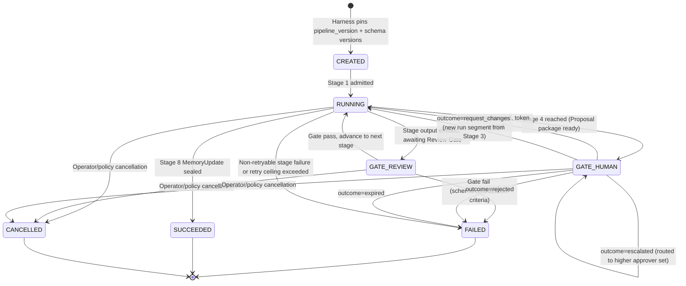
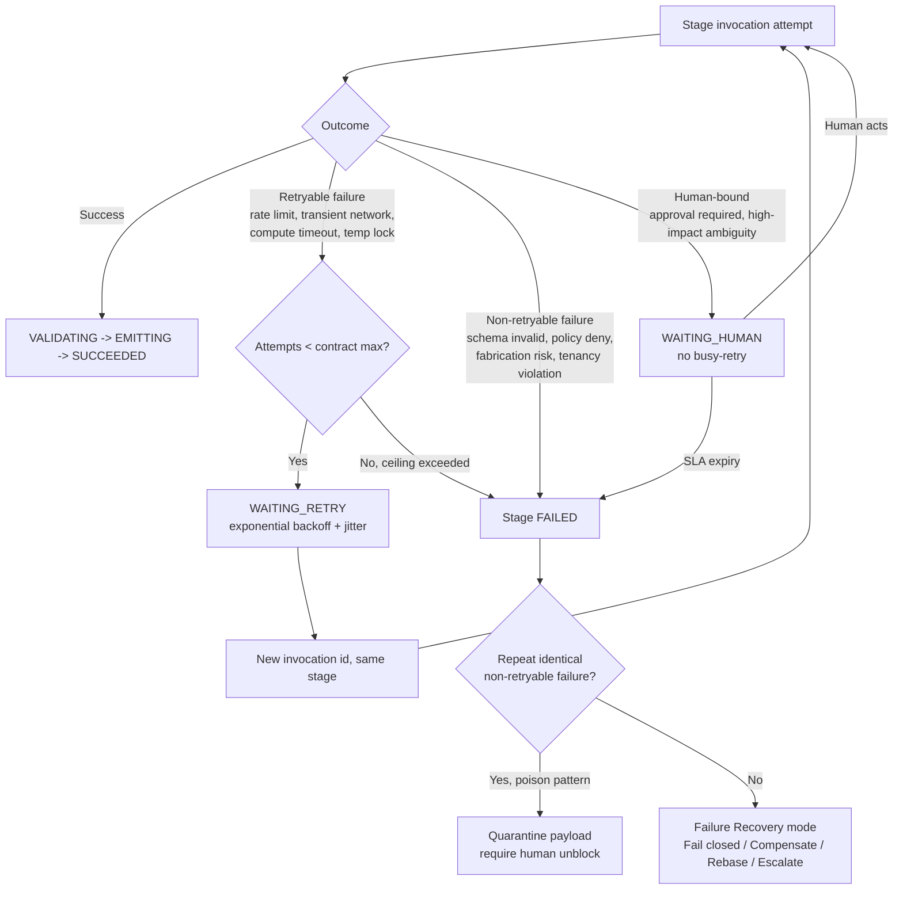
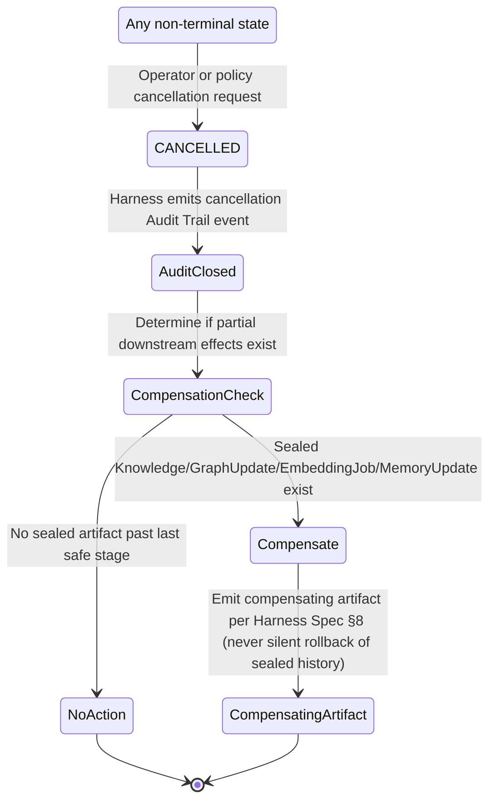
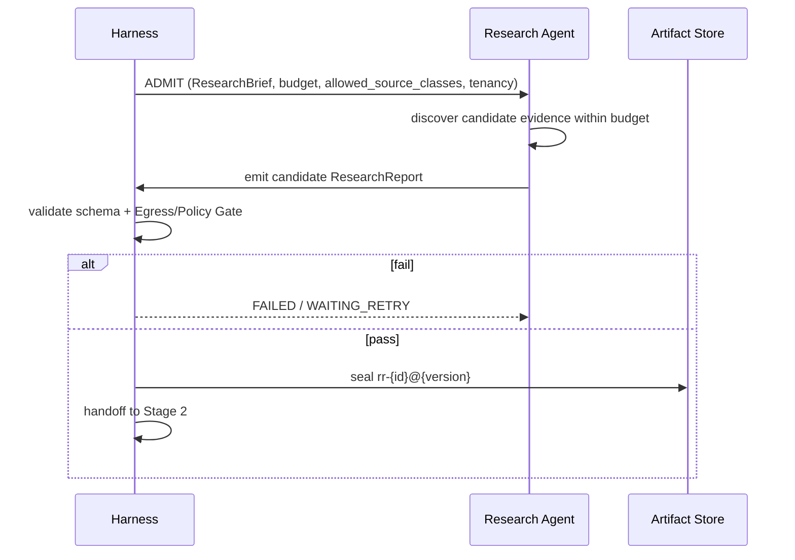
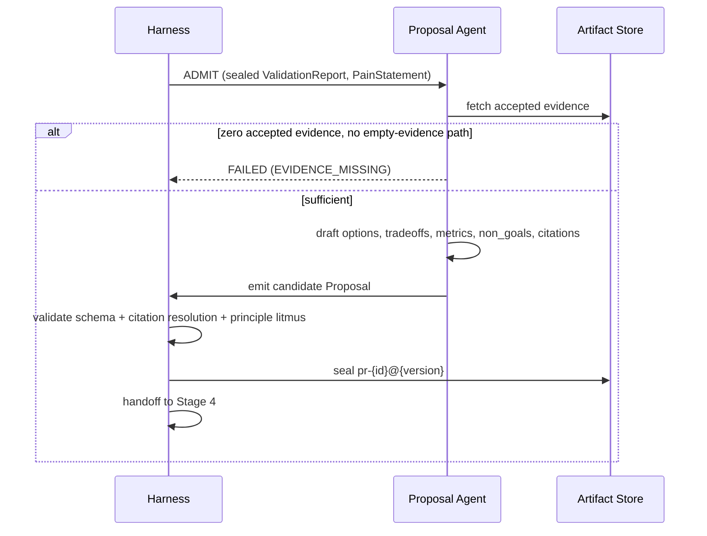
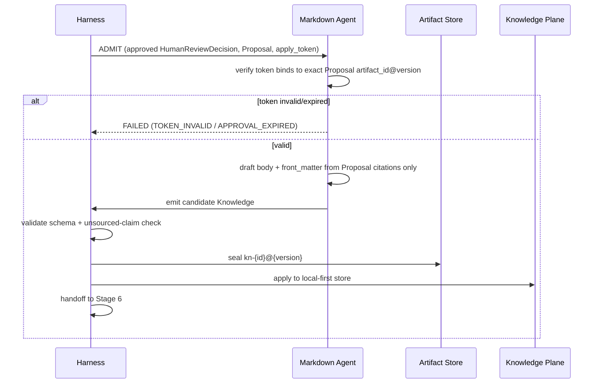
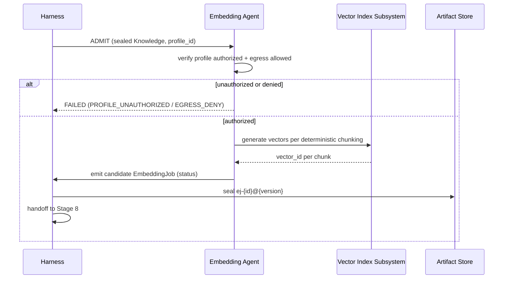

# Pipeline: Knowledge Ingestion

**Version:** 2.0.0
**Status:** Canonical — Binding
**Pipeline id:** `knowledge-ingestion`
**Harness:** [`/harness/HARNESS_SPECIFICATION.md`](../harness/HARNESS_SPECIFICATION.md)
**Related:** [`/pipelines/README.md`](./README.md) · [`/artifacts/README.md`](../artifacts/README.md) · [`/contracts/README.md`](../contracts/README.md)

```
Research → Validation → Proposal → Human Review → Markdown → Graph → Embedding → Memory
```

---

## 1. Purpose

The Knowledge Ingestion pipeline is the canonical, production-grade path that transforms a research question into approved, durable, retrievable organizational knowledge. It exists to guarantee that nothing enters the Knowledge Plane without: traceable evidence, independent credibility judgment, an honest decision-ready proposal, an attributable human approval, faithful authoring, provenance-complete derived structures, and an auditable memory record. Every stage is a Harness-governed handoff of an immutable artifact — never a side-channel conversation.

---

## 2. Definitions

| Term | Definition |
|------|------------|
| `ResearchBrief` | Run-bootstrap input: `question`, `scope`, `constraints`, `allowed_source_classes`, `budget`, `run_id`, `tenancy`. Not itself a sealed Knowledge Plane artifact. |
| `PainStatement` | Input to Stage 3 stating who hurts and how; required by Constitution Article XII. |
| `apply_token` / continue token | Single-use, version-bound token minted only by the Human Approval Gate on `approved`; the sole key that unlocks Stage 5's Knowledge Plane mutation. |
| **Stage** | Named step with one producer, one primary consumer, declared input/output artifact, and Exit Criteria (see [`/pipelines/README.md#2-definitions`](./README.md#2-definitions)). |
| **Review Gate** | Automated gate evaluated at every stage handoff (Harness Spec §10). |
| **Human Approval Gate** | The mandatory human-attributable gate at Stage 4 (Harness Spec §9). |
| **Run segment** | A sub-sequence of stages replayed after `request_changes` or a Rebase failure recovery — never a mutation of prior sealed artifacts. |
| **Supporting agent** | Notification Agent, Learning Agent — observe or branch around the canonical flow; never replace a canonical stage. |

---

## 3. Scope

### In scope
- The eight canonical stages, their producer/consumer wiring, and Exit Criteria.
- Full-pipeline and per-stage sequence diagrams, state transitions, retry flow, timeout behavior, human approval path, and cancellation path.
- Cross-cutting gates and how they apply per stage.

### Out of scope
- Artifact field-level schemas → `/schemas/artifacts`.
- Agent contract internals (retry ceilings, failure codes) beyond what is needed to wire stages together → `/contracts/agents`.
- Harness invocation lifecycle internals → `/harness/HARNESS_SPECIFICATION.md`.
- Notification/Learning Agent internals — referenced only where they touch the canonical flow → `/contracts/agents/notification-agent.md`, `/contracts/agents/learning-agent.md`.

---

## 4. Responsibilities (RACI)

| Role | Responsibility |
|------|-----------------|
| **Chief Systems Architect** | Accountable for pipeline topology; approves ADRs for any structural change. |
| **Knowledge Platform Engineering** | Responsible for day-to-day stage health, Exit Criteria calibration, and this spec's maintenance. |
| **Human Approver Roster** | Accountable for every Stage 4 outcome; the only role permitted to move an artifact past the Human Approval Gate. |
| **Site Reliability / Platform Operations** | Responsible for retry ceilings, timeout SLAs, run cancellation mechanics, and incident response. |
| **Trust & Control Team** | Responsible for tenancy isolation and Egress/Policy Gate enforcement at every stage that touches Cloud AI Compute or cross-tenant data. |
| **Notification Agent** | Informed party — delivers pending/critical state notifications; never a decision-maker. |
| **Learning Agent** | Consulted party — proposes lessons as `Proposal(kind=lesson)` that re-enter at Stage 3/4; never auto-applies. |

---

## 5. Pipeline-Level Workflow

### 5.1 Full happy-path sequence

```mermaid
sequenceDiagram
    autonumber
    participant H as Harness Pipeline Engine
    participant R as Research Agent
    participant V as Source Validation Agent
    participant P as Proposal Agent
    participant KR as Knowledge Review Agent
    participant HU as Human Approver
    participant M as Markdown Agent
    participant G as Knowledge Graph Agent
    participant E as Embedding Agent
    participant MEM as Memory Agent
    participant N as Notification Agent

    H->>H: CREATE run (pin pipeline_version=2.0.0 + contract/schema versions)
    H->>R: ADMIT Stage 1 (ResearchBrief)
    R->>H: emit ResearchReport candidate
    H->>H: Review Gate (Stage 1)
    H->>V: handoff sealed ResearchReport
    V->>H: emit ValidationReport candidate
    H->>H: Review Gate (Stage 2)
    H->>P: handoff sealed ValidationReport
    P->>H: emit Proposal candidate
    H->>H: Review Gate (Stage 3)
    H->>KR: handoff sealed Proposal
    KR->>H: emit HumanReviewDecision candidate (pending)
    H->>H: Review Gate (Stage 4, package)
    H->>N: notify pending review
    N->>HU: deliver review package
    HU->>H: outcome = approved (checklist complete)
    H->>H: mint apply_token; seal HumanReviewDecision (approved)
    H->>M: handoff approved HumanReviewDecision + Proposal + token
    M->>H: emit Knowledge candidate
    H->>H: Review Gate (Stage 5); apply to Knowledge Plane
    H->>G: handoff sealed Knowledge
    G->>H: emit GraphUpdate candidate
    H->>H: Review Gate (Stage 6)
    H->>E: handoff sealed Knowledge (+ GraphUpdate optional)
    E->>H: emit EmbeddingJob candidate
    H->>H: Review Gate (Stage 7)
    H->>MEM: handoff Knowledge + EmbeddingJob (+ GraphUpdate optional)
    MEM->>H: emit MemoryUpdate candidate
    H->>H: Review Gate (Stage 8)
    H->>H: run SUCCEEDED; close Audit Trail
    H->>N: notify run succeeded
```

### 5.2 Run-level state machine



### 5.3 Retry flow (per Harness Spec §7)



Default retry ceilings if a contract omits one: **3** attempts for retryable classes, **0** for non-retryable (Harness Spec §7). Per-stage contract-declared ceilings are listed in §7–§14 below.

### 5.4 Timeout behavior

| Stage | Invocation timeout | On timeout |
|-------|--------------------|------------|
| 1 — Research | Bounded by `budget` (time/cost units declared in `ResearchBrief`) | Treated as retryable transient timeout up to contract ceiling (3); beyond ceiling → `FAILED` with `BUDGET_EXHAUSTED_EMPTY` semantics if evidence is empty, else seal partial coverage with `coverage_gaps` |
| 2 — Validation | Bounded by rubric-declared compute budget | Retryable transient compute (3) → `FAILED` beyond ceiling |
| 3 — Proposal | Bounded by contract compute budget | Retryable transient compute (2) → `FAILED` beyond ceiling |
| 4 — Human Review | SLA window declared by `checklist_id` policy (e.g., 72h default) | `outcome` transitions to `expired`; run `FAILED` closed; requires new run/reopen |
| 5 — Markdown | Bounded by contract compute budget; also bounded by the approval's own expiry window | `APPROVAL_EXPIRED` if token window elapses mid-draft; retryable transient compute (2) otherwise |
| 6 — Graph | Bounded by contract compute budget + store lock timeout | Retryable transient store lock (3) → `FAILED` beyond ceiling |
| 7 — Embedding | Bounded by Cloud AI Compute call timeout | Retryable rate limit/compute timeout (3) → seal `status=partial` or `FAILED` beyond ceiling |
| 8 — Memory | Bounded by contract compute budget + subsystem lock timeout | Retryable transient lock (3) → `FAILED` beyond ceiling |

All timeouts are enforced by the Harness Pipeline Engine, not by individual agents self-reporting — an agent that does not respond within its stage's bound is treated identically to one that returns a transient failure.

### 5.5 Human approval path

```mermaid
sequenceDiagram
    autonumber
    participant H as Harness
    participant KR as Knowledge Review Agent
    participant N as Notification Agent
    participant HU as Human Approver
    participant M as Markdown Agent

    H->>KR: ADMIT Stage 4 with sealed Proposal
    KR->>KR: apply checklist_id; flag conflicts/duplicates
    KR->>H: emit HumanReviewDecision (outcome=pending)
    H->>H: seal hrd-{id}@1.0.0
    H->>N: notify pending (+ critical findings if any)
    N->>HU: deliver package
    alt approved
        HU->>H: outcome=approved (checklist confirmed complete)
        H->>H: verify checklist complete; mint single-use apply_token bound to Proposal artifact_id@version
        H->>H: seal hrd-{id}@1.1.0 (approved, approver, apply_token)
        H->>M: handoff — Stage 5 begins
    else rejected
        HU->>H: outcome=rejected
        H->>H: seal hrd-{id}@1.1.0 (rejected, approver, no token)
        H->>H: run FAILED closed — no downstream handoff
    else request_changes
        HU->>H: outcome=request_changes (change_requests[])
        H->>H: seal hrd-{id}@1.1.0 (request_changes)
        H->>H: return control to Stage 3 — new Proposal version, new run segment
    else escalated
        HU->>H: outcome=escalated
        H->>H: seal hrd-{id}@1.1.0 (escalated)
        H->>N: notify higher approver set
        Note over H,HU: loop resumes at "alt approved" with the escalated approver
    else expired (no action within SLA)
        H->>H: transition outcome=expired (Harness-driven, no human input)
        H->>H: run FAILED closed — requires new run/reopen
    end
```

Rules (Harness Spec §9.3, restated in pipeline context):

1. Approval must be attributable — `approver.actor_id` resolves to an authenticated identity.
2. Checklist incomplete ⇒ no `approved`.
3. `apply_token` is single-use and bound to `Proposal artifact_id@version`.
4. Knowledge Review Agent may prepare the package; it may never self-approve or mint a token.
5. Self-approval by the proposal's own author is forbidden.

### 5.6 Cancellation path



Rules:

1. Cancellation is available from any non-terminal invocation or run state (Harness Spec §4.1).
2. Cancellation never deletes or edits sealed artifacts — if a cancellation occurs after Stage 5 (Knowledge sealed and applied), a compensating flow (e.g., a governed retraction) must be initiated explicitly, never inferred.
3. `WAITING_HUMAN` (Stage 4 pending) is cancellable; a cancelled pending review seals `outcome` as effectively terminated via the run's `CANCELLED` state — no `apply_token` is ever issued for a cancelled run.
4. Cancellation is always audited with actor, reason, and the run state at time of cancellation.

---

## 6. Cross-Cutting Gates

| Gate | Applies | Reference |
|------|---------|-----------|
| Schema Review Gate | Every stage handoff | Harness Spec §10 |
| Contract postcondition Gate | Every agent emission | Harness Spec §10, per-agent contract |
| Human Approval Gate | Stage 4 (mandatory for SoR-authorizing path) | Harness Spec §9 |
| Egress/Policy Gate | Research, Embedding, any Cloud AI Compute | Harness Spec §10, Constitution Article XI |

---

## 7. Stage 1 — Research

| Field | Specification |
|-------|----------------|
| **Producer** | Research Agent |
| **Consumer** | Source Validation Agent |
| **Input Artifact** | `ResearchBrief` (run bootstrap; not a sealed Knowledge Plane artifact) |
| **Output Artifact** | `ResearchReport` ([spec](../artifacts/research-report.md)) |
| **Exit Criteria** | Schema-valid report; ≥0 evidence items with provenance **or** explicit empty pack + gaps; no fabricated pointers; budget respected; Review Gate pass |
| **Who owns** | Knowledge Platform Engineering (stage health) |
| **Who approves** | Automated Review Gate only — no human approval required at this stage |
| **Retry ceiling** | 3 (rate limit/transient fetch, exponential backoff); 0 (policy/fabrication/schema/budget-exhausted-empty) |

**Sequence diagram**



**Review checklist**

- [ ] Every `evidence_items[].provenance.pointer` resolves.
- [ ] No source class outside `allowed_source_classes`.
- [ ] `coverage_gaps[]` populated whenever scope is not fully covered.
- [ ] No recommendation/synthesis content present.

**Exit checklist**

- [ ] Schema valid (`ResearchReport`).
- [ ] Budget respected.
- [ ] Review Gate passed.
- [ ] Handoff recorded in Audit Trail.

**Rollback**

No downstream mutation exists yet at this stage; rollback is simply discarding the candidate and, if retried, issuing a new invocation. No compensating artifact is needed.

**Metrics**

Brief coverage ratio; % items with resolvable provenance; noise/duplicate rate; time within budget; downstream validation accept rate (per Research Agent contract).

---

## 8. Stage 2 — Validation

| Field | Specification |
|-------|----------------|
| **Producer** | Source Validation Agent |
| **Consumer** | Proposal Agent |
| **Input Artifact** | `ResearchReport` ([spec](../artifacts/research-report.md)) |
| **Output Artifact** | `ValidationReport` ([spec](../artifacts/validation-report.md)) |
| **Exit Criteria** | Every evidence id covered; statuses assigned; rubric applied; no accepted item without provenance; Review Gate pass |
| **Who owns** | Knowledge Platform Engineering |
| **Who approves** | Automated Review Gate only |
| **Retry ceiling** | 3 (transient compute, backoff); 0 (rubric/provenance/schema/policy) |

**Sequence diagram**

```mermaid
sequenceDiagram
    participant H as Harness
    participant V as Source Validation Agent
    participant Store as Artifact Store
    H->>V: ADMIT (sealed ResearchReport, rubric_id)
    V->>Store: fetch ResearchReport; verify digest
    alt digest mismatch
        V-->>H: FAILED (INPUT_DIGEST_MISMATCH)
    else verified
        V->>V: apply rubric to every evidence_id
        V->>H: emit candidate ValidationReport (full coverage)
        H->>Store: seal vr-{id}@{version}
        H->>H: handoff to Stage 3
    end
```

**Review checklist**

- [ ] `results[]` covers 100% of input evidence ids.
- [ ] Every non-`accepted` result has a rationale.
- [ ] `needs_human` used for high-impact ambiguity, not forced verdicts.
- [ ] `research_report_ref.digest` matches stored sealed artifact.

**Exit checklist**

- [ ] Schema valid (`ValidationReport`).
- [ ] Full coverage confirmed.
- [ ] Review Gate passed.
- [ ] Handoff recorded.

**Rollback**

No downstream SoR mutation exists yet. Rollback discards the candidate; a corrected pass produces a new `ValidationReport`, never an edit to a sealed one.

**Metrics**

Accept/reject precision vs. human audit; false-accept rate on high-impact items (target = 0); rubric coverage; SLA time-to-report (per Source Validation Agent contract).

---

## 9. Stage 3 — Proposal

| Field | Specification |
|-------|----------------|
| **Producer** | Proposal Agent (also Learning Agent for `kind=lesson`) |
| **Consumer** | Knowledge Review Agent (Human Review stage) |
| **Input Artifact** | `ValidationReport` (+ `PainStatement` in stage input) ([spec](../artifacts/validation-report.md)) |
| **Output Artifact** | `Proposal` ([spec](../artifacts/proposal.md)) |
| **Exit Criteria** | Pain + metrics + non-goals present; citations to accepted sources only; `requires_human_approval` set when authorizing SoR path; Review Gate pass |
| **Who owns** | Knowledge Platform Engineering |
| **Who approves** | Automated Review Gate only (human approval happens downstream at Stage 4, against this stage's *output*) |
| **Retry ceiling** | 2 (transient compute, backoff); 0 (principle/citation/pain) |

**Sequence diagram**



**Review checklist**

- [ ] `pain_statement` names who hurts and how.
- [ ] Every citation resolves to an `accepted` evidence id.
- [ ] `success_metrics[]` measurable.
- [ ] `non_goals[]` present.
- [ ] `requires_human_approval` correctly set.

**Exit checklist**

- [ ] Schema valid (`Proposal`).
- [ ] No Constitution/Product Principles violation.
- [ ] Review Gate passed.
- [ ] Handoff recorded.

**Rollback**

No downstream SoR mutation exists yet. If a defect is found after handoff but before Stage 4 completes, the correct remedy is a `request_changes` outcome at Stage 4, not an in-place edit.

**Metrics**

Acceptance/revision rate; % with measurable metrics; principle litmus pass rate; downstream outcome hit rate (per Proposal Agent contract).

---

## 10. Stage 4 — Human Review

| Field | Specification |
|-------|----------------|
| **Producer** | Knowledge Review Agent (findings package) + **Human Approver** (final outcome) |
| **Consumer** | Markdown Agent |
| **Input Artifact** | `Proposal` ([spec](../artifacts/proposal.md)) |
| **Output Artifact** | `HumanReviewDecision` ([spec](../artifacts/human-review-decision.md)) |
| **Exit Criteria** | Outcome ∈ {approved, rejected, request_changes, expired, escalated}; if `approved` then checklist complete + single-use `apply_token`; if `rejected`/`expired` then no token and pipeline stop/fail closed; Notification Agent informed on pending/critical |
| **Who owns** | Knowledge Platform Engineering (package quality); Site Reliability (SLA/expiry mechanics) |
| **Who approves** | **Human Approver Roster** — this is the pipeline's mandatory Human Approval Gate (Constitution Article III, XIII) |
| **Retry ceiling** | 2 (transient compute for package prep, backoff); 0 (critical conflict/policy — escalate to human instead of retrying) |

**Sequence diagram** — see §5.5 Human Approval Path (full detail).

**Review checklist**

- [ ] `checklist_id` fully applied; blockers explicitly listed if incomplete.
- [ ] Conflicts/duplicates flagged when detectable.
- [ ] `outcome` remains `pending` until a human acts.
- [ ] No `apply_token` minted by the Knowledge Review Agent itself.

**Exit checklist**

- [ ] `approved` ⇒ `approver` + `apply_token` present, token bound to exact `Proposal artifact_id@version`.
- [ ] `rejected`/`expired` ⇒ no token present.
- [ ] Actor identity present for every non-`pending` outcome.
- [ ] Notification Agent informed of pending/critical states.

**Rollback**

- `rejected`/`expired`: run fails closed; no rollback needed since no SoR mutation occurred.
- `request_changes`: not a rollback — a new `Proposal` version and new run segment are created; the changes-requested decision remains sealed as history.
- `approved` discovered in error post-hoc (e.g., wrong subject approved): requires a governance-level compensating action (new Human Review cycle explicitly superseding the erroneous approval's downstream effects) — never a silent artifact edit.

**Metrics**

Defect escape rate post-apply; escalation-upheld rate; review turnaround time; duplicate-introduction rate (per Knowledge Review Agent contract); approval SLA adherence (Site Reliability).

---

## 11. Stage 5 — Markdown

| Field | Specification |
|-------|----------------|
| **Producer** | Markdown Agent |
| **Consumer** | Knowledge Graph Agent |
| **Input Artifact** | `HumanReviewDecision` (`approved`) + `Proposal` ([specs](../artifacts/human-review-decision.md)) |
| **Output Artifact** | `Knowledge` ([spec](../artifacts/knowledge.md)) |
| **Exit Criteria** | Valid token bound to proposal version; schema-valid Knowledge; claim provenance present under strict policy; Review Gate pass |
| **Who owns** | Knowledge Platform Engineering |
| **Who approves** | Automated Review Gate only (human approval already occurred at Stage 4; this stage consumes its result) |
| **Retry ceiling** | 2 (transient compute, backoff); 0 (token/template/unsourced-claim) |

**Sequence diagram**



**Review checklist**

- [ ] Every factual claim has a `claim_provenance[]` entry (strict policy).
- [ ] `front_matter` conforms to the resolved template.
- [ ] `approval_ref.outcome = "approved"`.
- [ ] Token single-use, not previously consumed.

**Exit checklist**

- [ ] Schema valid (`Knowledge`).
- [ ] Sealed only via Harness.
- [ ] Applied to Knowledge Plane.
- [ ] Review Gate passed.

**Rollback**

Once applied to the Knowledge Plane, rollback is a governed retraction: a subsequent human-approved cycle produces a new `Knowledge` version (or an explicit erasure workflow per Constitution Article X) — the sealed `Knowledge` artifact and its Stage 4 approval record are never deleted or edited.

**Metrics**

Template conformance rate; broken-link rate; review churn attributable to formatting; time-to-seal (per Markdown Agent contract).

---

## 12. Stage 6 — Graph

| Field | Specification |
|-------|----------------|
| **Producer** | Knowledge Graph Agent |
| **Consumer** | Embedding Agent |
| **Input Artifact** | `Knowledge` ([spec](../artifacts/knowledge.md)) |
| **Output Artifact** | `GraphUpdate` ([spec](../artifacts/graph-update.md)) |
| **Exit Criteria** | Provenance on nodes/edges; ontology profile satisfied; consistency report present; apply mode only with authorization when required; Review Gate pass |
| **Who owns** | Knowledge Platform Engineering |
| **Who approves** | Automated Review Gate only; `mode=apply` additionally requires a valid authorization token per policy (not a new human gate, but a policy-token check) |
| **Retry ceiling** | 3 (transient store lock, backoff); 0 (schema/provenance/collision) |

**Sequence diagram**

```mermaid
sequenceDiagram
    participant H as Harness
    participant G as Knowledge Graph Agent
    participant Store as Artifact Store
    participant GraphStore as Graph Snapshot
    H->>G: ADMIT (sealed Knowledge, ontology_profile_id)
    G->>GraphStore: check existing equivalent nodes
    G->>G: derive nodes/edges with provenance; run consistency self-check
    alt unresolved collision or provenance gap
        G-->>H: FAILED (IDENTITY_COLLISION_UNRESOLVED / PROVENANCE_GAP)
    else consistent
        G->>H: emit candidate GraphUpdate (mode)
        H->>H: validate schema + ontology profile + authorization if apply
        H->>Store: seal gu-{id}@{version}
        alt mode=apply
            H->>GraphStore: mutate snapshot
        end
        H->>H: handoff to Stage 7
    end
```

**Review checklist**

- [ ] Every node/edge has resolvable provenance to `Knowledge`.
- [ ] Ontology profile fully satisfied (no undeclared types/relations).
- [ ] `consistency_report.ok=true` for any `apply`-mode seal.
- [ ] Identity collisions resolved per deterministic rule or escalated.

**Exit checklist**

- [ ] Schema valid (`GraphUpdate`).
- [ ] Authorization token present for `mode=apply` when required.
- [ ] Review Gate passed.
- [ ] Handoff recorded (optional forward to Embedding).

**Rollback**

`mode=apply` mutations are compensated by a new, sealed `GraphUpdate` that explicitly documents and reverses the prior delta in `consistency_report.issues` — never a direct edit of the graph snapshot outside a new sealed artifact.

**Metrics**

Schema violation rate; orphan-node rate; collision-mishandle rate; sync lag vs. `Knowledge` versions (per Knowledge Graph Agent contract).

---

## 13. Stage 7 — Embedding

| Field | Specification |
|-------|----------------|
| **Producer** | Embedding Agent |
| **Consumer** | Memory Agent |
| **Input Artifact** | `Knowledge` (primary); `GraphUpdate` optional ([specs](../artifacts/knowledge.md)) |
| **Output Artifact** | `EmbeddingJob` ([spec](../artifacts/embedding-job.md)) |
| **Exit Criteria** | Authorized profile; complete chunk map; policy egress OK; status succeeded or explicit partial with issues; Review Gate pass |
| **Who owns** | Knowledge Platform Engineering (job correctness); Trust & Control (egress policy) |
| **Who approves** | Automated Review Gate + Egress/Policy Gate only |
| **Retry ceiling** | 3 (rate limit/compute timeout, backoff); 0 (profile/egress/tenancy) |

**Sequence diagram**



**Review checklist**

- [ ] `profile_id` authorized for this tenancy and egress-cleared.
- [ ] `chunk_map[]` deterministic and complete for declared sources.
- [ ] `invalidations[]` populated for every superseded vector.
- [ ] `status` accurately reflects actual completion (no false `succeeded`).

**Exit checklist**

- [ ] Schema valid (`EmbeddingJob`).
- [ ] Egress policy satisfied.
- [ ] Review Gate passed.
- [ ] Handoff recorded.

**Rollback**

A defective embedding job is compensated by a new `EmbeddingJob` whose `invalidations[]` names every vector produced by the defective job — never a silent in-place vector replacement.

**Metrics**

Job success rate; staleness after source change; retrieval evaluation quality; egress incidents (target = 0) (per Embedding Agent contract).

---

## 14. Stage 8 — Memory

| Field | Specification |
|-------|----------------|
| **Producer** | Memory Agent |
| **Consumer** | End of pipeline (audit + future recall) |
| **Input Artifact** | `Knowledge` + `EmbeddingJob` (+ optional `GraphUpdate`) ([specs](../artifacts/knowledge.md)) |
| **Output Artifact** | `MemoryUpdate` ([spec](../artifacts/memory-update.md)) |
| **Exit Criteria** | Authorized op result explicit; no covert SoR; token validated when required; Audit Trail complete for run |
| **Who owns** | Knowledge Platform Engineering; Trust & Control (retention/tenancy) |
| **Who approves** | Automated Review Gate only; `persist` of material knowledge-linked memory requires a valid token per policy (policy-token check, not a new human gate) |
| **Retry ceiling** | 3 (transient lock, backoff); 0 (policy/token/tenancy); 0 for partial forget — escalate, never retry blindly |

**Sequence diagram**

```mermaid
sequenceDiagram
    participant H as Harness
    participant MEM as Memory Agent
    participant MemSubsys as Memory Subsystem
    participant Store as Artifact Store
    H->>MEM: ADMIT (op request, source_refs, apply_token if required)
    MEM->>MEM: verify op allowed + token if required
    alt invalid/denied
        MEM-->>H: FAILED / result=denied (TOKEN_INVALID / POLICY_DENY / TENANCY_VIOLATION)
    else authorized
        MEM->>MemSubsys: execute op
        MemSubsys-->>MEM: result + memory_ids (+ incomplete_forget_ids if partial)
        MEM->>H: emit candidate MemoryUpdate
        H->>Store: seal mu-{id}@{version}
        H->>H: run SUCCEEDED; close Audit Trail
    end
```

**Review checklist**

- [ ] `result` explicit (`succeeded`/`denied`/`partial`).
- [ ] `forget` partials flagged via `incomplete_forget_ids[]`.
- [ ] No duplicate SoR created in the memory layer.
- [ ] Token validated when policy requires it for `persist`.

**Exit checklist**

- [ ] Schema valid (`MemoryUpdate`).
- [ ] Audit Trail complete for the run.
- [ ] Review Gate passed.
- [ ] Run transitions to `SUCCEEDED`.

**Rollback**

A defective `persist` is compensated by a new `MemoryUpdate` performing the inverse `forget`/`persist` operation — this is the Memory Agent contract's explicit "compensating forget/persist = new Memory Update" rule; never edit the original transaction record.

**Metrics**

Unauthorized-persist-blocked rate (target = 100%); forget-completeness audit results; recall precision; duplicate-SoR incidents (target = 0) (per Memory Agent contract).

---

## 15. Decision Rules (Cross-Stage)

| Situation | Rule |
|-----------|------|
| A stage's Review Gate fails | Run enters `FAILED` unless the specific stage's contract declares a `request_changes`-style recovery (only Stage 4 has this) |
| `request_changes` at Stage 4 | Control returns to Stage 3 with a new `Proposal` version; prior sealed `Proposal`/`HumanReviewDecision` remain immutable history |
| A stage discovers its input artifact's digest does not match the handoff record | Fail immediately (`INPUT_DIGEST_MISMATCH`-class); never proceed on unverified input |
| Notification/Learning Agent activity | Never gates advancement of the canonical flow; Notification informs, Learning proposes a new `Proposal(kind=lesson)` that re-enters at Stage 3/4 like any other proposal |
| A run's pinned `pipeline_version` differs from the currently published version | The in-flight run keeps its pinned version through completion; only new runs pick up a new major version (Harness Spec §13) |
| Egress/Policy Gate denies at Research or Embedding | Fail closed immediately; no retry across the denial itself, only around transient causes |

---

## 16. Examples

### 16.1 End-to-end artifact lineage (happy path)

A single successful run produces a chain of sealed artifacts, each referencing its predecessor via `parents[]`:

```
run-01J8Z0X9W8V7U6T5S4R3Q2P1O0
 └─ rr-01J8Z1A2B3C4D5E6F7G8H9J0K1@1.0.0        (Stage 1: ResearchReport)
     └─ vr-01J8Z3P4Q5R6S7T8U9V0W1X2Y3@1.0.0     (Stage 2: ValidationReport)
         └─ pr-01J8Z5S6T7U8V9W0X1Y2Z3A4B5@1.0.0     (Stage 3: Proposal)
             └─ hrd-01J8Z7U8V9W0X1Y2Z3A4B5C6D7@1.0.0 (Stage 4: pending)
                 └─ hrd-01J8Z7U8V9W0X1Y2Z3A4B5C6D7@1.1.0 (Stage 4: approved, apply_token minted)
                     └─ kn-01J8Z9X0Y1Z2A3B4C5D6E7F8G9@1.0.0  (Stage 5: Knowledge, applied to SoR)
                         ├─ gu-01J8ZA1B2C3D4E5F6G7H8I9J0K@1.0.0  (Stage 6: GraphUpdate, mode=propose)
                         └─ ej-01J8ZC3D4E5F6G7H8I9J0K1L2M@1.0.0  (Stage 7: EmbeddingJob, status=succeeded)
                             └─ mu-01J8ZE5F6G7H8I9J0K1L2M3N4O@1.0.0 (Stage 8: MemoryUpdate, op=persist, succeeded)
```

Full JSON examples for every artifact in this chain are in the corresponding `/artifacts/*.md` spec's §13 Examples section (linked in each stage table above).

### 16.2 `request_changes` example lineage

```
pr-{id}@1.0.0  --Stage 4 outcome=request_changes-->  hrd-{id}@1.0.0 (pending) -> hrd-{id}@1.1.0 (request_changes)
                                                       │
                                                       ▼ new run segment from Stage 3
pr-{id}@2.0.0 (MAJOR bump, addresses change_requests[]) --> hrd-{id2}@1.0.0 (new lineage, pending) -> ... -> approved
```

---

## 17. Acceptance Criteria (Pipeline-Level)

- [ ] Every stage's Exit Criteria (see §7–§14) is satisfied before advancement.
- [ ] Every handoff is schema-valid and recorded in the Audit Trail (`run_id`, `stage`, `from_agent`, `to_agent`, `artifact_type`, `artifact_id`, `artifact_version`, `digest`, `timestamp`, `result`).
- [ ] Stage 4's Human Approval Gate semantics are honored exactly — no artifact reaches Stage 5 without a valid, version-bound `apply_token` minted from an `approved` outcome.
- [ ] No stage bypasses the Harness Pipeline Engine.
- [ ] The run's `pipeline_version` and every pinned contract/schema version are recorded at `CREATED` and remain stable through run completion.

---

## 18. Failure Cases (Pipeline-Level)

| Failure | Trigger | Outcome |
|---------|---------|---------|
| Stage Review Gate failure | Schema/contract/exit-criteria violation at any stage | Run `FAILED`; full Audit Trail retained |
| Human Approval Gate `rejected` | Human decision | Run `FAILED` closed; no downstream handoff; artifact/decision history retained |
| Human Approval Gate `expired` | SLA elapsed with no human action | Run `FAILED` closed; requires new run or explicit reopen |
| Retry ceiling exceeded | Repeated retryable failure at any stage | Stage `FAILED` → run `FAILED`; Failure Recovery mode selected per Harness Spec §8 |
| Poison/non-retryable loop | Identical non-retryable failure repeats | Quarantine payload; require human unblock |
| Input digest mismatch at any stage | Tamper or storage inconsistency | Non-retryable `FAILED`; Trust & Control incident |
| Cross-tenant reference detected | Any stage | Non-retryable `FAILED`; Trust & Control incident; fail closed per Constitution Article IX |

---

## 19. Best Practices

- Treat every stage's Exit Criteria as the single source of truth for "is this stage actually done" — do not infer completion from agent self-reporting alone.
- Keep Stage 4 packages tight and specific; a bloated review package increases both approval latency and the risk of "LGTM by default" behavior the Constitution explicitly forbids.
- Track per-stage metrics (§7–§14) continuously, not just at incident time — early drift in acceptance/revision rates is the cheapest signal that an upstream stage's quality is degrading.
- Prefer `request_changes` over `rejected` whenever a proposal is directionally right but needs specific fixes — it preserves lineage and avoids re-deriving evidence from scratch.

---

## 20. Anti-Patterns

- Skipping Stage 2 (Validation) "because the Research Agent seemed confident" — credibility judgment is a separate, mandatory stage regardless of producer confidence signals.
- Allowing a stage to retry indefinitely by manually resetting its attempt counter — retry ceilings are a Harness-enforced safety property, not a convenience limit to route around.
- Treating `escalated` as a way to avoid making a decision — it must route to a genuinely higher-authority approver set, not loop back to the same approver.
- Building a "fast path" that skips the Human Approval Gate for "obviously fine" proposals — no such fast path exists in this pipeline by design (Constitution Article III, XIII).

---

## 21. Version Pinning

Runs pin `pipeline_version=2.0.0` plus every stage's contract and schema versions at `CREATED` (Harness Spec §13). Mid-run governance upgrades never silently mutate an in-flight run's rules; a new major pipeline version requires a fresh run.

---

## 22. References

- [`/pipelines/README.md`](./README.md)
- [`/harness/HARNESS_SPECIFICATION.md`](../harness/HARNESS_SPECIFICATION.md) — §2–§13
- [`/CONSTITUTION.md`](../CONSTITUTION.md) — Articles III, IV, VI, VIII, IX, X, XII, XIII
- [`/contracts/README.md`](../contracts/README.md) and each linked `/contracts/agents/*.md`
- [`/artifacts/README.md`](../artifacts/README.md) and each linked `/artifacts/*.md`
- [`/schemas/README.md`](../schemas/README.md)

**End of Pipeline knowledge-ingestion v2.0.0**
