# DYOGAS Schemas

**Version:** 2.0.0
**Status:** Canonical — Binding
**Effective:** 2026-07-22
**Owner:** Chief Systems Architect
**Related:** [`/CONSTITUTION.md`](../CONSTITUTION.md) · [`/artifacts`](../artifacts) · [`/contracts`](../contracts) · [`/harness/HARNESS_SPECIFICATION.md`](../harness/HARNESS_SPECIFICATION.md)

---

## 1. Purpose

This tree is the **machine-checkable Single Source of Truth** for the shape of every artifact payload and every Agent Contract's input/output. Where `/artifacts` defines *meaning* and `/contracts` defines *obligations*, `/schemas` defines the exact JSON Schema (draft 2020-12) that a candidate payload must validate against before the Harness will seal it. If a schema and a spec ever disagree, the schema is corrected to match the spec's intent — specs describe meaning; schemas enforce it mechanically, but specs are the authority on what *should* be enforced (Constitution Article I: one authoritative location per domain, with `/artifacts` + `/schemas` jointly owning "artifact meaning").

---

## 2. Definitions

| Term | Definition |
|------|------------|
| **Envelope schema** | The shared wrapper every artifact instance validates against — [`common/artifact-envelope.schema.json`](./common/artifact-envelope.schema.json). |
| **Payload schema** | The artifact-type-specific schema for the content inside `envelope.payload` — one file per type in `artifacts/`. |
| **Contract schema bundle** | One file per agent in `agents/`, containing `contract_version`, `input`, and `output` (the latter typically a `$ref` to the relevant payload schema). |
| **`$id`** | The globally unique URI identifying a schema, used for `$ref` resolution across files (all under the `https://dyogas.local/schemas/...` namespace — a stable, non-resolving identifier scheme, not a live network address). |
| **`additionalProperties: false`** | The strict-closure convention applied to every object in this tree — unknown fields are rejected, never silently ignored, so schema drift is always visible at validation time. |

---

## 3. Scope

### In scope
- JSON Schema definitions for the artifact envelope, every artifact payload, and every agent contract's input/output.
- Enrichment of those schemas with `description` and `examples` to make them self-documenting for tooling and humans (this repository's schemas MAY be enriched with `description`/`examples`; no new schema files are added by this document).

### Out of scope
- Artifact meaning, lifecycle, retention, decision rules → `/artifacts`.
- Agent pre/postconditions, retry ceilings, failure codes → `/contracts/agents`.
- Pipeline stage wiring → `/pipelines`.
- A live schema registry, runtime validator service, or code generation — none exist in this repository by design.

---

## 4. Responsibilities

| Actor | Responsibility |
|-------|-----------------|
| Knowledge Platform Engineering | Own schema correctness, `$id` stability, and version bumps in lockstep with `/artifacts` and `/contracts` changes. |
| Harness Pipeline Engine (conceptual, per Harness Spec) | The only consumer authorized to validate candidates against these schemas at seal time; agents do not self-certify. |
| Chief Systems Architect | Approves any breaking schema change (new required field, tightened enum, removed property) via ADR (Constitution Article VIII). |
| Contributors | Update the schema and its corresponding `/artifacts` or `/contracts` doc in the same change set (Constitution Article IV). |

---

## 5. Directory Layout

```
schemas/
├── README.md                              (this file)
├── common/
│   └── artifact-envelope.schema.json      (shared envelope for all 8 artifact types)
├── artifacts/
│   ├── research-report.schema.json
│   ├── validation-report.schema.json
│   ├── proposal.schema.json
│   ├── human-review-decision.schema.json
│   ├── knowledge.schema.json
│   ├── graph-update.schema.json
│   ├── embedding-job.schema.json
│   ├── memory-update.schema.json
│   └── task-plan.schema.json
└── agents/
    ├── research-agent.schema.json
    ├── source-validation-agent.schema.json
    ├── proposal-agent.schema.json
    ├── knowledge-review-agent.schema.json
    ├── markdown-agent.schema.json
    ├── knowledge-graph-agent.schema.json
    ├── embedding-agent.schema.json
    ├── learning-agent.schema.json
    ├── notification-agent.schema.json
    ├── memory-agent.schema.json
    └── task-agent.schema.json
```

One payload schema file per artifact type; one contract bundle file per agent; exactly one shared envelope. No parallel or duplicate schema files for the same capability (Constitution Article VI).

---

## 6. Naming Convention

| Element | Convention | Example |
|---------|------------|---------|
| Payload schema file | `{kebab-case-artifact-type}.schema.json` | `human-review-decision.schema.json` |
| Agent contract schema file | `{kebab-case-agent-name}.schema.json` | `knowledge-graph-agent.schema.json` |
| `$id` | `https://dyogas.local/schemas/{path}` mirroring the file's repo-relative path | `https://dyogas.local/schemas/artifacts/knowledge.schema.json` |
| `title` | PascalCase artifact/type name matching the envelope `artifact_type` enum value where applicable | `"Knowledge"`, `"GraphUpdate"` |
| `contract_version` (agent bundles) | Exact semver string matching the corresponding `/contracts/agents/*.md` **Version** field | `"1.0.0"` |

---

## 7. Versioning

1. Each schema file's meaningful version is tracked via the corresponding artifact/contract doc's **Version** field and the envelope's `schema_version` field at runtime — this repository does not embed a separate `version` key inside every schema file; the authoritative version pairing is: `/artifacts/<name>.md` **Version** ⇔ `/schemas/artifacts/<name>.schema.json` content ⇔ envelope `schema_version` at emission.
2. **Non-breaking** changes (adding an optional property, widening an enum, adding `description`/`examples`) do not require a MAJOR bump of the owning doc but do require a Decision Log entry if they affect validation behavior.
3. **Breaking** changes (new required property, narrowed enum, removed property, `additionalProperties` tightened further) require an ADR, a MAJOR bump of the owning artifact/contract doc, and coordinated update of every producer/consumer that pins a compatible range (Harness Spec §13).
4. `contract_version` inside an agent schema bundle is a JSON Schema `const` — it is intentionally rigid; bumping it is itself a breaking change to that bundle.

---

## 8. Lifecycle

```mermaid
stateDiagram-v2
    [*] --> Draft: Proposed schema change alongside spec update
    Draft --> Review: PR opened; Constitution Article IV requires spec+schema in same change set
    Review --> Rejected: Breaking change without ADR, or spec/schema mismatch
    Review --> Accepted: Non-breaking, or breaking change with ADR + human approval
    Accepted --> Active: Merged; becomes the pinned schema_version for new runs
    Active --> Superseded: A newer schema_version accepted for the same artifact/contract
    Superseded --> [*]: Retained for runs still pinned to it (Harness Spec §13)
```



---

## 9. Retention Policy

Schema files themselves are version-controlled source (git history is the retention mechanism for superseded schema text). Sealed **artifact instances** validated against a given `schema_version` retain their own retention per [`/artifacts/README.md#11-retention-policy`](../artifacts/README.md#11-retention-policy) regardless of whether the schema file itself is later superseded — an in-flight or historical run's pinned schema version must remain resolvable for as long as any artifact sealed under it is retained.

---

## 10. Workflow

```mermaid
sequenceDiagram
    participant Dev as Contributor
    participant Repo as Schema Tree
    participant Harness as Harness Pipeline Engine (conceptual)
    participant Agent as Producing Agent

    Dev->>Repo: propose schema + matching /artifacts or /contracts doc change
    Repo->>Repo: review (breaking? needs ADR?)
    Repo->>Repo: merge; schema becomes Active
    Agent->>Harness: emit candidate payload
    Harness->>Repo: resolve pinned schema_version for this run
    Harness->>Harness: validate candidate against resolved schema ($id + $ref chain)
    alt invalid
        Harness-->>Agent: SCHEMA_INVALID (non-retryable)
    else valid
        Harness->>Harness: proceed to Acceptance Criteria / Review Gate
    end
```

---

## 11. Decision Rules

| Situation | Rule |
|-----------|------|
| A new field is needed on an existing artifact payload | Add as optional first if possible; only make required after a coordinated migration across all producers |
| Two artifact types need overlapping structure | Factor the shared shape into `common/` and `$ref` it — never copy-paste the same object shape into two payload schemas |
| A contract's `output` needs to reference an artifact payload schema | Use `$ref` to the canonical file in `artifacts/`; never inline a duplicate copy of the artifact shape inside `agents/` |
| A schema enrichment (description/examples) would change validation behavior | It must not — `description` and `examples` are non-normative; if a proposed "enrichment" changes what validates, it is a breaking/non-breaking change per §7, not a mere enrichment |

---

## 12. Validation

Every schema file in this tree is itself validated for:

1. Valid JSON Schema draft 2020-12 syntax (`$schema` present and correct).
2. A resolvable, unique `$id`.
3. `additionalProperties: false` on every object definition unless a documented, explicit reason for openness exists (none currently do in this tree).
4. `required[]` matching exactly what the corresponding `/artifacts` or `/contracts` doc declares as required content.
5. Every `$ref` resolves within the repository (no dangling references).
6. `enum` values matching exactly the vocabulary declared in the corresponding spec doc (e.g., `HumanReviewDecision.outcome` enum matches the outcomes documented in `/artifacts/human-review-decision.md`).

---

## 13. Examples

Enriched schema fragment pattern (illustrative — see the actual files in `artifacts/` and `agents/` for the currently enriched content):

```json
{
  "$schema": "https://json-schema.org/draft/2020-12/schema",
  "$id": "https://dyogas.local/schemas/artifacts/knowledge.schema.json",
  "title": "Knowledge",
  "description": "Review-ready, approval-authorized knowledge unit destined for the local-first Knowledge Plane SoR. See /artifacts/knowledge.md for full meaning.",
  "type": "object",
  "required": ["title", "format", "body", "front_matter", "claim_provenance", "proposal_ref", "approval_ref"],
  "additionalProperties": false,
  "properties": {
    "title": {
      "type": "string",
      "minLength": 1,
      "description": "Human-readable title for the knowledge unit.",
      "examples": ["Retry Backoff Guideline: Jittered Exponential Backoff Defaults"]
    }
  },
  "examples": [
    {
      "title": "Retry Backoff Guideline: Jittered Exponential Backoff Defaults",
      "format": "markdown",
      "body": "## Guideline\n\nAll agent-to-agent retries SHOULD use jittered exponential backoff...",
      "front_matter": { "category": "engineering-guideline", "tags": ["retry", "resilience"] },
      "claim_provenance": [{ "claim_id": "claim-01", "citation_keys": ["cit-01"] }],
      "proposal_ref": { "artifact_id": "pr-01J8Z5S6T7U8V9W0X1Y2Z3A4B5", "artifact_version": "1.0.0" },
      "approval_ref": { "artifact_id": "hrd-01J8Z7U8V9W0X1Y2Z3A4B5C6D7", "artifact_version": "1.1.0", "outcome": "approved" }
    }
  ]
}
```

Full envelope + payload JSON examples for every artifact type live in each artifact's own spec (e.g., [`/artifacts/knowledge.md#13-examples`](../artifacts/knowledge.md#13-examples)) rather than duplicated here, to keep this document meaning-agnostic and schema-tree-focused.

---

## 14. Acceptance Criteria

- [ ] Every payload schema in `artifacts/` has a corresponding, version-aligned spec in `/artifacts`.
- [ ] Every contract bundle in `agents/` has a corresponding, version-aligned contract in `/contracts/agents`.
- [ ] No schema file duplicates a shape already defined elsewhere in the tree without a `$ref`.
- [ ] Every `enum` and `required[]` list matches its owning spec exactly.
- [ ] `$id` values are unique and internally resolvable.

---

## 15. Failure Cases

| Situation | Outcome |
|-----------|---------|
| Schema and spec disagree on a required field | Non-conformant; block merge until reconciled (Constitution Article I, IV) |
| Breaking schema change merged without an ADR | Revertible by default (Constitution Article VIII) |
| Duplicate shape introduced instead of a `$ref` | Treated as a duplicate-system violation (Constitution Article VI); consolidate |
| A run pins a `schema_version` that has since been deleted from the tree | Harness defect — historical schema versions must remain resolvable per §9 |

---

## 16. Best Practices

- Add `description` fields liberally — they cost nothing at validation time and make the schema tree usable as documentation on its own.
- Add `examples` arrays that mirror the canonical examples in the corresponding `/artifacts/*.md` spec, so the two never drift apart in meaning.
- Prefer `$ref` over duplication for any shape used in more than one place (e.g., the `{artifact_id, artifact_version}` reference shape appears across many payload schemas — factor it once if introducing further schemas).
- Keep `enum` lists alphabetized or logically ordered consistently across files for easier diffing.

---

## 17. Anti-Patterns

- Loosening `additionalProperties: false` to "make integration easier" — this defeats the entire point of a machine-checkable SoR for shape.
- Adding a field to a schema without updating the corresponding spec's Required Content / Definitions section in the same change set.
- Inlining a copy of another schema's object shape instead of `$ref`-ing it, creating two sources of truth for one shape.
- Treating `examples` as a place to sneak in behavior-changing hints (e.g., an example implying a field is optional when `required[]` says otherwise).

---

## 18. References

- [`/artifacts/README.md`](../artifacts/README.md)
- [`/contracts/README.md`](../contracts/README.md)
- [`/harness/HARNESS_SPECIFICATION.md`](../harness/HARNESS_SPECIFICATION.md) — §13 Versioning
- [`/CONSTITUTION.md`](../CONSTITUTION.md) — Articles I, IV, VI, VIII
- [`common/artifact-envelope.schema.json`](./common/artifact-envelope.schema.json)

**End of Schemas Index v2.0.0**
