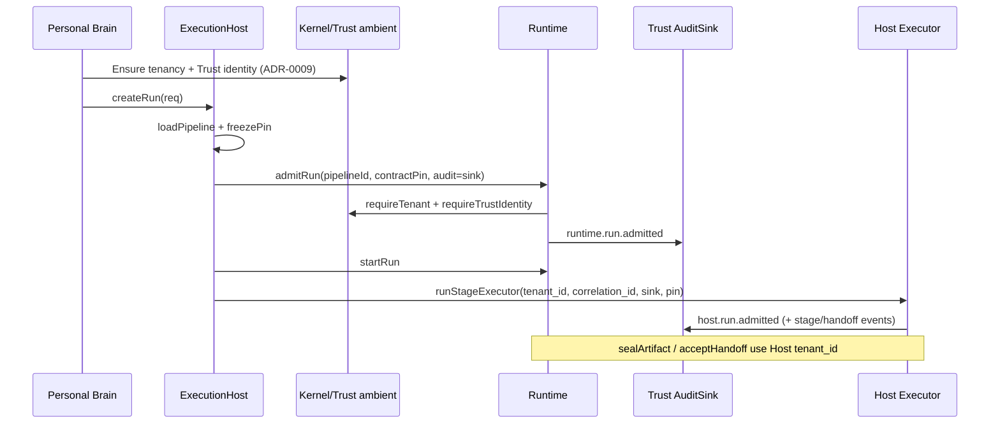

# B3 — Host createRun → Runtime.admitRun Tenancy / Contract / Audit Flow

**Task:** T-B3  
**Sprint:** SPRINT-PB-HARNESS-BRIDGE-001  
**Trace:** TRACE-PB-BRIDGE-001  
**Spec:** SPEC-PROD-004-HARNESS-BRIDGE (`accepted`)  
**ADR:** ADR-0010 (Accepted) — Host = Pipeline Engine; Runtime = primitives  
**Depends on:** T-B1 (B1 inventory); inputs A3, Trust audit, Kernel tenancy  
**Mode:** Implementation Mode (verification / investigation — **no** Runtime/SDK/Harness/Host edits)  
**Date:** 2026-07-24  
**Status:** DONE  

---

## Purpose

Verify and document how **tenancy**, **caller identity**, **contract pins**, and **audit** flow when Personal Brain calls **`ExecutionHost.createRun()`**, which alone calls **`Runtime.admitRun()`** and subsequent Runtime primitives.

---

## Boundary (ADR-0010)

```text
Personal Brain
        ↓  CreateRunRequest (tenant_id, caller_id, correlation_id, bootstrap, pin, audit_sink?)
ExecutionHost.createRun()          ← sole product execution entry
        ↓  Host-internal only
Runtime.admitRun({ pipelineId, contractPin, audit })
Runtime.startRun / seal / acceptHandoff / …
        ↓
Pipeline stages (Host executor + SDK bind)
```

| Rule | Status |
|------|--------|
| Product does **not** call Runtime | **Required** — Bridge honors |
| Host is **only** execution entry | **Required** — ADR-0010 |
| Runtime receives context **through Host** | **Yes** (see gaps below for ambient Kernel/Trust) |
| No new schemas / auth model | **Honored** |

---

## End-to-end flow



---

## 1. Tenancy propagation

| Layer | Field / mechanism | Source | Notes |
|-------|-------------------|--------|-------|
| Product | `CreateRunRequest.tenant_id` | A3 / Kernel `TenantId` | Must match `bootstrap.tenancy.tenant_id` |
| Product | `bootstrap.tenancy` | ResearchBrief shape | `{ tenant_id, workspace_id? }` — no new schema |
| Host | `runStageExecutor` deps `tenant_id` | `req.tenant_id` (`host.ts`) | Lineage context, Human Gate, Host audit fields |
| Host | `sealArtifact` / `acceptHandoff` | `deps.tenant_id` (`executor.ts`) | Cross-tenant handoff rejected by Runtime |
| Runtime | `ExecutionContext.tenantId` | **Ambient** Kernel `requireTenant()` at `createExecutionContext` | **Not** taken from `AdmitRequest` (Runtime `AdmitRequest` has no `tenantId`) |
| Runtime | Trust check | `requireTrustIdentity()`; must match Kernel tenant | Fail closed on mismatch |

### Product obligation (fail closed before createRun)

Per A3 / ADR-0009:

1. Resolve workspace → Kernel `tenant_id` (no child-scope invention).  
2. Establish Kernel tenancy + Trust identity for that tenant **before** `createRun` (Runtime admit reads ambient context).  
3. Set `CreateRunRequest.tenant_id` equal to Brief `tenancy.tenant_id`.  
4. Do **not** call Runtime APIs directly.

### Observed Host behavior (no rewrite proposed)

Host passes `req.tenant_id` into the executor but **does not** currently assert `req.tenant_id === runtime.ctx.tenantId` after admit. Bridge product **must** keep ambient Kernel/Trust tenant aligned with `CreateRunRequest.tenant_id`. Misalignment risk is mitigated by product fail-closed + Runtime’s Kernel/Trust pairing — escalate as Host hardening only via future Spec if needed (**out of this sprint**; do not patch Host here).

---

## 2. Caller identity binding

| Surface | Role |
|---------|------|
| `CreateRunRequest.caller_id` | Required on Host API (`api.ts`) — owner attribution (A3) |
| Runtime `AdmitRequest` | **No** caller/actor field — identity not part of admit primitive |
| Host `createRun` body | Accepts `caller_id` on the request type; **does not** pass it into `admitRun` / executor deps today |
| Human Gate later | `HumanDecision.actor_id` must be attributable human (never agent) — product uses owner / `caller_id` class at `resumeHuman` |

**Bridge rule:** Product **always** supplies `caller_id` = owner on createRun (API contract). Product **retains** owner for gate resume. Do **not** invent a new authentication model. Do **not** treat missing Host stamping of `caller_id` into Runtime as license to call Runtime or to invent identity APIs.

| Concern | Disposition |
|---------|-------------|
| caller_id → Runtime admit | **N/A** (Runtime primitive has no field) |
| caller_id → Host executor storage | **GAP-BR-CALLER-001** (observation): not stored on `StoredRun` today; product holds owner for `resumeHuman` |
| New IdP / auth | **Forbidden** this sprint |

---

## 3. Contract boundary

| Step | Who pins | Value | File |
|------|----------|-------|------|
| Initial admit | **Host** (not product) | `contractPin: "research-agent@2.0.0"` | `host.ts` → `admitRun` |
| Per stage | **Host** via SDK adapter | `resolveStageContract(stage)` → existing `/contracts/agents/*` @ 2.0.0 | `contracts/stage-map.ts` |
| Product | **None** | Must not select / invent contract pins | SPEC-PROD-004 |

Admit refuses without contract pin (`RuntimeError` `CONTRACT_PIN_MISSING` — `runtime/src/run.ts`). Unknown pipeline producer → Host `CONTRACT_MAPPING_MISSING` (fail closed; no invented contract).

---

## 4. Audit handoff (preserved)

Single Trust **`AuditSink`** path — Host does not create a parallel audit store (`host-audit.ts` header).

| Phase | Emitter | Event examples |
|-------|---------|----------------|
| Admit | Runtime | `runtime.run.admitted` (`run_id`, `pipeline_id`, `contract_pin`) |
| Transitions | Runtime | `runtime.run.transition` |
| Host executor | Host | `host.run.admitted`, `host.stage.*`, `host.handoff`, `host.review_gate`, Human Gate / apply / `host.run.completed` |

```text
req.audit_sink ?? Host default MemoryAuditSink
        ↓
admitRun({ audit: sink })     → Runtime events on same sink
createHostAudit(sink)         → Host events on same sink
```

Product may pass `audit_sink` on createRun; omission uses Host default. Audit continuity = same sink instance through Host → Runtime.

---

## 5. Fail-closed matrix

| Condition | Where | Behavior |
|-----------|-------|----------|
| Missing / empty contract pin | Runtime `admitRun` | `CONTRACT_PIN_MISSING` |
| No Kernel tenancy / Trust identity | Runtime `createExecutionContext` | Throws — admit fails |
| Kernel tenant ≠ Trust tenant | Runtime | `RuntimeError` mismatch |
| Bad / unpinned pipeline | Host `loadPipeline` | `PIPELINE_*` HostError |
| Definition/pin mismatch mid-exec | Host executor | `PIPELINE_PIN_IMMUTABLE` |
| Cross-tenant lineage append | Host lineage | `LINEAGE_TENANCY_VIOLATION` |
| Cross-tenant handoff | Runtime `acceptHandoff` | Handoff reject |
| Unbound owner / workspace / tenant (product) | Personal Brain (A3) | **Do not** `createRun` |
| Product calls Runtime as orchestrator | Architecture | **Forbidden** — Bridge tests / policy |

---

## Propagation summary table

| Concern | Product → Host | Host → Runtime | Host → Executor / Lineage / Audit |
|---------|----------------|----------------|-----------------------------------|
| Tenancy | `tenant_id` + Brief tenancy | Ambient Kernel/Trust at admit → `ctx.tenantId` | Explicit `tenant_id` on lineage, seal, handoff, Host audit |
| Caller | `caller_id` (required) | Not on AdmitRequest | Not stamped in createRun today; product retains for Human Gate |
| Contract | None (Host owns) | Initial `research-agent@2.0.0` | Per-stage map via SDK |
| Correlation | `correlation_id` | Not on AdmitRequest | Lineage + Brief bootstrap id |
| Audit | Optional `audit_sink` | Same sink on admit | Same sink via `createHostAudit` |
| Pipeline pin | `pipeline_id` / `pipeline_version` (B2) | `pipelineId` on admit | Frozen pin on executor |

---

## Verdict

| Acceptance criterion | Met? |
|----------------------|------|
| Product does not call Runtime directly | **Yes** (path + rule) |
| Host remains only execution entry | **Yes** (ADR-0010) |
| Runtime receives required context through Host | **Yes** — pipelineId, contractPin, audit via Host; tenancy via ambient Kernel/Trust that product must align before Host call |
| Audit flow preserved | **Yes** — single Trust sink |
| Fail-closed behavior noted | **Yes** |
| Evidence document created | **Yes** (this file) |
| No platform edits | **Yes** |

---

## Verification

| Test ID | Check | Result |
|---------|-------|--------|
| T-B3-T1 | Flow cites Host `createRun` → `admitRun` only (no product Runtime) | **PASS** |
| T-B3-T2 | Tenancy: Host executor + Runtime ambient Kernel/Trust documented | **PASS** |
| T-B3-T3 | Contract pin Host-owned (`research-agent@2.0.0` + stage-map) | **PASS** |
| T-B3-T4 | Audit: same `AuditSink` Runtime + Host | **PASS** |
| T-B3-T5 | Fail-closed matrix present; caller_id gap noted without Host rewrite | **PASS** |
| T-B3-T6 | Scope: no Runtime/SDK/Harness/Host/schema/auth changes | **PASS** |

### Scope boundary

- **In:** Documentation / verification of existing Host→Runtime flow for Bridge.  
- **Out:** Modifying Host to assert tenant equality or persist `caller_id`; new auth; new schemas; product→Runtime orchestration.

---

## Evidence

`personal-brain/stage/bridge/B3-host-tenancy-audit-flow.md` (this file)

Read-only inputs: `execution-host/src/host.ts`, `adapters/runtime.ts`, `executor/executor.ts`, `audit/host-audit.ts`, `contracts/stage-map.ts`, `lineage/context.ts`; `runtime/src/run.ts`, `context.ts`; ADR-0010; A3; B1; SPEC-PROD-004.

---

## Next

**T-B4** — Host entry contract note (depends on T-B2, T-B3, T-A3).

---

**End of B3-host-tenancy-audit-flow**
